> The analysis generated with help of GitHub Copilot CLI with multiple models.

## 0) Scope and evidence base

This report analyzes:

- **Android Studio source**: `~/android-toolchains/studio-main`
  - `tools/adt/idea/layout-inspector/`
  - `tools/base/dynamic-layout-inspector/agent/appinspection/`
  - `tools/adt/idea/app-inspection/`
- **Jetpack Compose inspector source**: `~/android-toolchains/androidx-main/frameworks/support/compose/ui/ui-inspection/`
- **Android platform/emulator source subset**: `~/android-toolchains/emu-master-dev`
- **Running device verification**:
  - emulator: `emulator-5554`, a local running Emulator instance made and started manually
  - Android: `16`
  - API level: `36`

Analysis focus:

1. legacy + modern approaches
2. embedded (streaming) + separate-window modes together
3. API-level and sequence detail
4. click/input response and highlight (View + Compose)
5. snapshot mode vs interactive mode
6. how Compose injects into Layout Inspector

---

## Executive summary

- On modern devices (API 29+), Layout Inspector is primarily an App Inspection pipeline with two device-side inspectors: View + Compose.
- Selection/highlight is a single host-side state flow (`setSelection`) fed by either IDE clicks or device `UserInputEvent`.
- Live mode is continuous fetch (`StartFetchCommand{continuous=true}`); snapshot mode is cached-state analysis plus explicit snapshot capture.
- Compose integration is runtime-hook based (`WrappedComposition.setContent`) and exports virtual nodes with anchor-stable identity.

### Evidence legend used in this report

- **Verified in source**: directly supported by classes/proto definitions in this workspace.
- **Verified on device**: confirmed via adb checks on the connected emulator.
- **Inferred from implementation flow**: high-confidence behavior derived from code paths spanning host and agent modules.

---

## 1) High-level architecture (old + new)

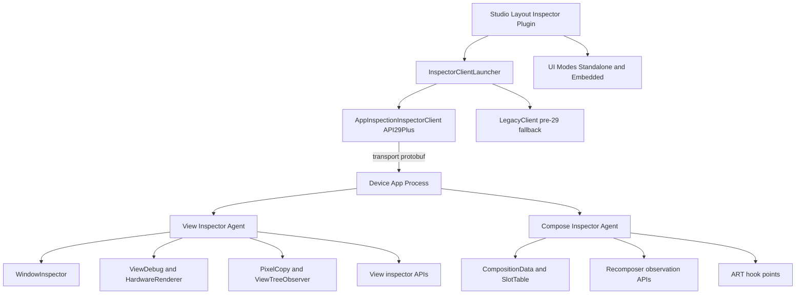

---

### Working terminology

- **Live/interactive mode**: continuous streaming from device (`StartFetchCommand{continuous=true}`).
- **Snapshot/paused mode**: no continuous streaming; inspect cached state and optionally capture explicit snapshot payloads.
- **Standalone mode**: classic Layout Inspector tool window.
- **Embedded mode**: Layout Inspector integrated in Running Devices.
- **On-device rendering**: highlight/overlay rendering performed on the device surface via draw/intercept commands.

---

## 2) Old vs new technical approaches

### 2.1 Legacy approach (pre-API 29 path in Studio)

**Host classes** (Studio):
- `LegacyClient`
- `LegacyTreeLoader`
- `LegacyTreeParser`
- `LegacyPropertiesProvider`

**Transport/data approach**:
- DDM/ddmlib based
- `Client.dumpViewHierarchy(...)`
- `Client.captureView(...)`
- `DebugViewDumpHandler`
- shell commands (`am get-config`, `dumpsys activity activities`)

**Characteristics**:
- no App Inspection agent pipeline
- older hierarchy/image dump flow
- pre-Q compatibility fallback

---

### 2.2 Modern approach (API 29+)

**Host classes**:
- `AppInspectionInspectorClient` (orchestrator)
- `ViewLayoutInspectorClient` (View protocol)
- `ComposeLayoutInspectorClient` (Compose protocol)
- `AppInspectionTreeLoader`

**On-device agents**:
- View agent from Studio repo (`dynamic-layout-inspector`)
- Compose agent from AndroidX repo (`compose/ui/ui-inspection`)

**Characteristics**:
- command/response/event protocol via protobuf
- continuous/live mode + snapshot support
- supports on-device rendering path (overlay drawing/input)
- supports Compose tree + parameters + recomposition/state-read features

---

## 3) Android platform API mapping by mode (core)

| Mode / feature | Key Android / runtime APIs | Purpose |
|---|---|---|
| Legacy hierarchy dump | ddmlib `Client.dumpViewHierarchy`, `DebugViewDumpHandler` | Old tree capture |
| Legacy image capture | ddmlib `Client.captureView` | Old screenshot path |
| Root discovery (modern) | `android.view.inspector.WindowInspector.getGlobalWindowViews()` | Discover top-level roots/windows |
| Continuous SKP capture | `ViewDebug.startRenderingCommandsCapture()` | Stream rendering commands (SKP path) |
| Q workaround for SKP | hidden renderer callback wiring (`HardwareRenderer.PictureCapturedCallback`) + reflection | Stabilize Android Q behavior |
| Bitmap capture | `PixelCopy.request(Surface, Rect, Bitmap)` | Bitmap fallback/screenshot path |
| Per-frame callback | `ViewTreeObserver.registerFrameCommitCallback(...)` | Trigger capture with frame lifecycle |
| Property extraction | `android.view.inspector.InspectionCompanion`, `PropertyReader`, `StaticInspectionCompanionProvider` | Typed property readout |
| Bounds transforms | `View.transformMatrixToGlobal`, layout/render bounds logic | Correct hit-test and overlays |
| On-device click interception | protocol commands + overlay view handling in agent | Select from real device surface |
| Compose tree extraction | `CompositionData.mapTree()` and `CompositionGroup` traversal | Build virtual Compose tree |
| Compose recomposition signals | hooks around `ComposerImpl.startRestartGroup`, `skipToGroupEnd` | Recompose/skips metrics |
| Compose state reads | `Recomposer.runningRecomposers` + observer APIs | State read diagnostics |

### Evidence anchors for Section 3 claims

- **Verified in source**:
  - modern host/client selection: `studio-main/tools/adt/idea/layout-inspector/.../InspectorClientLauncher.kt`
  - legacy DDM capture path: `.../pipeline/legacy/LegacyTreeLoader.kt`
  - view agent APIs (`WindowInspector`, `ViewDebug`, `PixelCopy`): `studio-main/tools/base/dynamic-layout-inspector/agent/appinspection/src/main/...`
  - compose protocol usage in host: `.../pipeline/appinspection/compose/ComposeLayoutInspectorClient.kt`
  - compose runtime extraction logic: `androidx-main/frameworks/support/compose/ui/ui-inspection/src/main/java/...`
- **Verified on device**:
  - API level and runtime checks were observed via adb (`ro.build.version.sdk`, `dumpsys window`, debug settings).
- **Inferred from implementation flow**:
  - cross-module timing/ordering behavior (for example, exact end-to-end event interleaving under load) is inferred from host+agent code paths rather than a single traced run.

---

## 4) Protocol surfaces used by Layout Inspector

### 4.1 View protocol (`view_layout_inspection.proto`)

### Commands (host -> device)

**Must-know commands (core workflow)**
- `StartFetchCommand { continuous }`
- `StopFetchCommand`
- `GetPropertiesCommand { root_view_id, view_id }`
- `CaptureSnapshotCommand { screenshot_type }`
- `UpdateScreenshotTypeCommand { type, scale }`

**Advanced/feature commands (mode-dependent)**
- `EnableBitmapScreenshotCommand`
- `EnableXrInspectionCommand`
- `EnableOnDeviceRenderingCommand`
- `DrawCommand { draw_instructions, type }`
- `InterceptTouchEventsCommand { intercept }`
- `DrawOverlayCommand { image }`
- `SetOverlayAlphaCommand { alpha }`

### Events (device -> host)
- `WindowRootsEvent`
- `LayoutEvent`
- `PropertiesEvent`
- `ProgressEvent`
- `FoldEvent`
- `UserInputEvent` (selection/hover/right-click/double-click)
- `ErrorEvent`

### Data payload highlights
- `ViewNode`
- `Bounds` (`layout` + transformed `render` quad)
- `Screenshot` (`SKP` / `BITMAP`)
- `PropertyGroup`
- `DrawInstruction`

---

### 4.2 Compose protocol (`compose_layout_inspection.proto`)

### Commands

**Must-know commands (core Compose inspection)**
- `GetComposablesCommand`
- `GetParametersCommand`

**Advanced commands (deep diagnostics)**
- `GetAllParametersCommand`
- `GetParameterDetailsCommand`
- settings commands for recomposition/state-read support

### Payload highlights
- `ComposableRoot`
- `ComposableNode`
- `Parameter`
- references/anchors for node identity and parameter expansion

---

### 4.3 Skia parser protocol (`skia.proto`)

- service `SkiaParserService`
  - `GetViewTree(...)`
  - `GetViewTree2(stream ...)`
- used for SKP parsing + per-node images

---

## 5) Embedded mode vs separate window mode

| Area | Embedded mode (Running Devices) | Separate window mode |
|---|---|---|
| Integration point | Running Devices tab wrapping/injection | Dedicated LI tool window/panel |
| Key UI classes | `LayoutInspectorManager`, `StudioRendererPanel`, `OnDeviceRendererPanel`, `EmbeddedRendererModel` | `DeviceViewContentPanel`, standalone render model/panels |
| Display source | running-device streaming display surface | LI-owned panel rendering |
| Selection source | IDE clicks + optional device click interception | primarily IDE-panel interaction |
| Highlight rendering | Studio overlay or device overlay path | Studio-side rendering path |
| Inspector client policy | embedded prefers App Inspection modern path | standalone can include legacy fallback path |

### Why the two modes can look similar

Both modes look identical at first -- they share the same inspector model, node selection logic, and highlight semantics.
The difference is the **base image layer** and coordinate pipeline:

- **Embedded mode** draws on top of the Running Devices stream surface (`AbstractDisplayView`) and applies stream-specific transforms (`displayRectangle`, `screenScalingFactor`, orientation correction).
- **Standalone mode** renders in LI-owned panels without depending on the Running Devices display widget tree.

### Embedded mode rendering stack (streaming path)

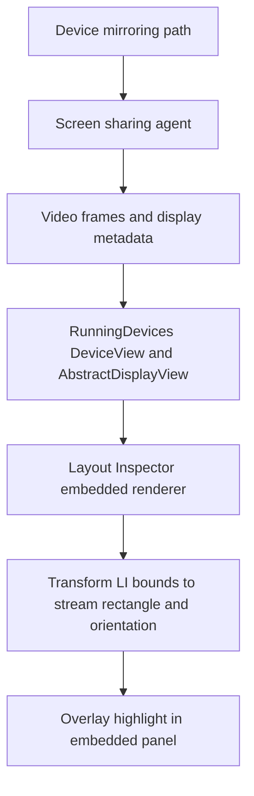

### Embedded mode and virtual display details

For **streamed physical devices**, the screen-sharing agent path includes virtual-display style capture setup in the agent implementation:

- `DisplayManager::CreateVirtualDisplay(...)` path for newer feature levels.
- Fallback display token path (`SurfaceControl::CreateDisplay(...)`) on older paths.
- Running Devices passes frame metadata used by LI embedded renderer (for example, orientation correction and display rectangle alignment).

For emulators, the code path documents that Running Devices orientation correction is typically `0`, while streamed physical-device paths may carry non-zero correction that LI must reconcile.

That is why your recollection is correct: embedded mode is tied to the streaming/mirroring stack, and that stack can use virtual display mechanisms on device side.

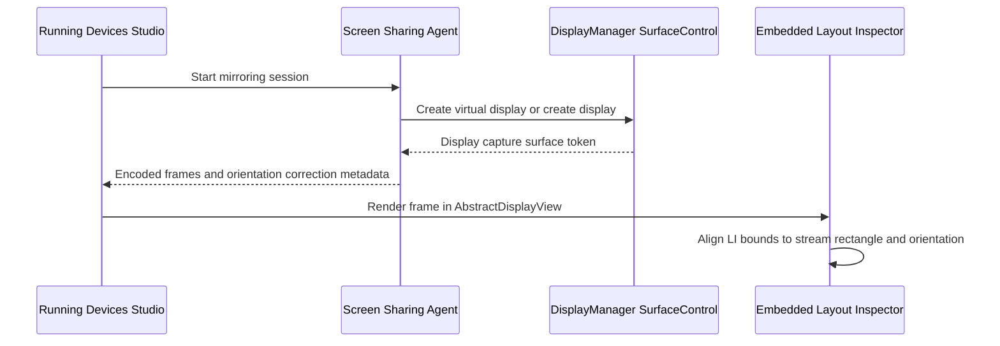

### Evidence

- **Verified in source**:
  - LI embedded integration over Running Devices display components: `layout-inspector/.../runningdevices/LayoutInspectorManager.kt`
  - stream-space transform inputs in embedded renderer: `StudioRendererPanel.kt` (`displayRectangleProvider`, `screenScaleProvider`, orientation correction)
  - stream metadata consumed by Running Devices display view: `streaming/device/DeviceView.kt`
  - virtual display creation in screen-sharing agent: `streaming/screen-sharing-agent/.../display_streamer.cc`, `.../accessors/display_manager.cc`
- **Inferred from implementation flow**:
  - exact visual differences depend on whether embedded rendering is Studio-side overlay or on-device overlay path, plus device/emulator stream behavior.

---

## 6) Click/input response and highlight path (View + Compose)

### 6.1 Click in Studio panel -> selected node -> highlighted node

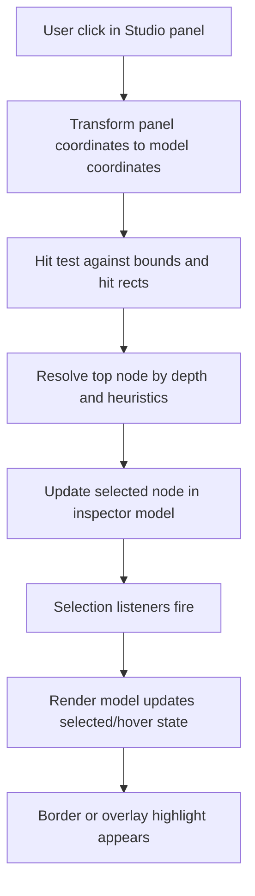

### Important implementation behavior
- hit testing is not just first-contains; it resolves ordering/depth
- Compose-aware prioritization exists (draw-modifier-related heuristics)
- selection event fans out to tree/properties/preview/overlay components

### 6.2 View node vs Compose node selection

**View node**:
- maps directly to actual View hierarchy entries
- property retrieval via view inspector property caches/providers

**Compose node**:
- virtual node (not 1:1 Android View)
- resolved through Compose tree data produced by compose agent
- anchored by compose identity/anchor mapping; can still be selected/highlighted in Studio

### 6.3 On-device click interception path (embedded on-device rendering mode)

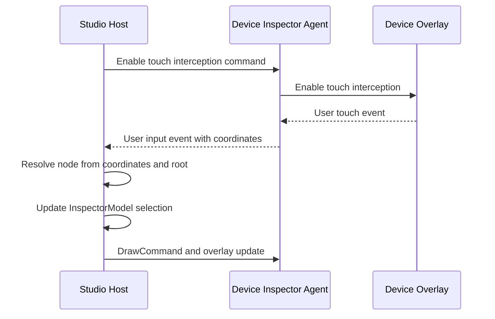

With touch interception enabled, device taps are emitted as `UserInputEvent` and resolved through the same host selection pipeline used for IDE clicks.

---

## 7) How highlight drawing is performed

There are two primary rendering patterns:

1. **Studio-side highlight rendering**
   - paint borders/hover outlines in Studio renderer panels
   - colors/style differ by selected/hovered/recomposing states

2. **On-device highlight rendering**
   - host computes `DrawInstruction`(bounds,color,label,stroke)
   - sends `DrawCommand`
   - device overlay draws highlight directly on device frame

So highlighting can be host-rendered, device-rendered, or hybrid depending on mode/settings.

---

## 8) Interactive/live mode vs snapshot mode

### 8.1 Live (interactive) mode

- host starts fetch with `StartFetchCommand { continuous=true }`
- agent continuously emits `LayoutEvent`/`PropertiesEvent` and related events
- model updates in near real-time
- suitable for interaction, immediate response to UI changes

### 8.2 Snapshot/paused mode

- host issues `StopFetchCommand`
- model uses latest cached data
- no continuous live stream updates
- user can inspect properties/tree from captured state

### 8.3 Refresh in paused mode

- one-shot refresh path (`refresh()` flow)
- pulls a single update round without switching to full continuous streaming

### 8.4 Snapshot capture to disk

- `CaptureSnapshotCommand` used to collect complete snapshot payloads
- persisted using `snapshot.proto` structures (`Metadata`, `Snapshot`, compose info, fold info, etc.)
- can include view tree + properties + compose payloads + screenshot data

### Snapshot format highlights (`snapshot.proto`)
- `Metadata`: api level, process name, source/version, dpi/font scale, etc.
- `Snapshot.view_snapshot`: view-capture payload
- compose sections for composables + parameters
- optional fold/device state data

---

## 9) Compose injection into Layout Inspector (deep dive)

### 9.1 Registration/discovery

- Compose inspector provides `ComposeLayoutInspectorFactory`
- discovered via ServiceLoader/inspection framework using inspector ID

### 9.2 Injection/hook strategy

Compose inspection initializes through the following runtime path:

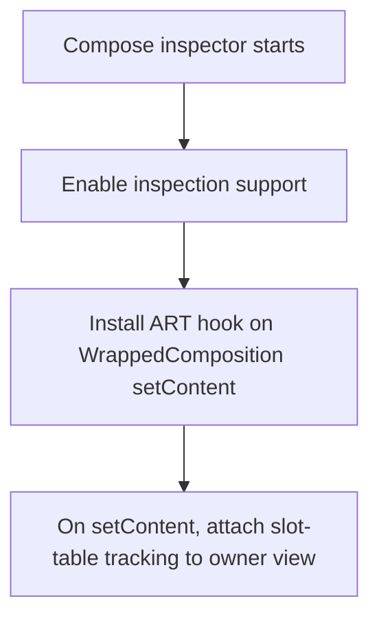

Implementation concepts:
- `artTooling.registerEntryHook(...)` on composition entry points
- owner view gets slot-table marker/tag storage
- storage uses weak references for lifecycle safety (`WeakHashMap<CompositionData,...>` pattern)

Evidence:
- **Verified in source**: `androidx-main/.../ComposeLayoutInspector.kt` and `.../framework/ViewExtensions.kt`
- **Inferred from implementation flow**: hook install order relative to already-alive compositions depends on app lifecycle timing.

### 9.3 Hot reload/bootstrap support

Compose inspector can trigger runtime pathways to ensure existing compositions become visible to ins

``pection:
- calls around HotReloader state save/restore paths
- ensures slot-table/composition data is populated for already-running content

Evidence:
- **Verified in source**: `androidx-main/.../ComposeLayoutInspector.kt` (HotReloader access paths)

### 9.4 Building virtual Compose tree

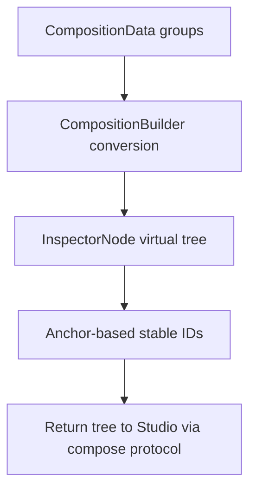

Because Compose nodes are virtual, this anchor-based mapping is critical for:
- click resolution
- parameter lookup
- recomposition counters
- stable identity across updates

Evidence:
- **Verified in source**: `androidx-main/.../inspector/CompositionBuilder.kt`, `.../inspector/InspectorNode.kt`, `.../LayoutInspectorTree.kt`

---

## 10) Sequence diagrams (API/data flow detail)

### 10.1 Attach and client choice

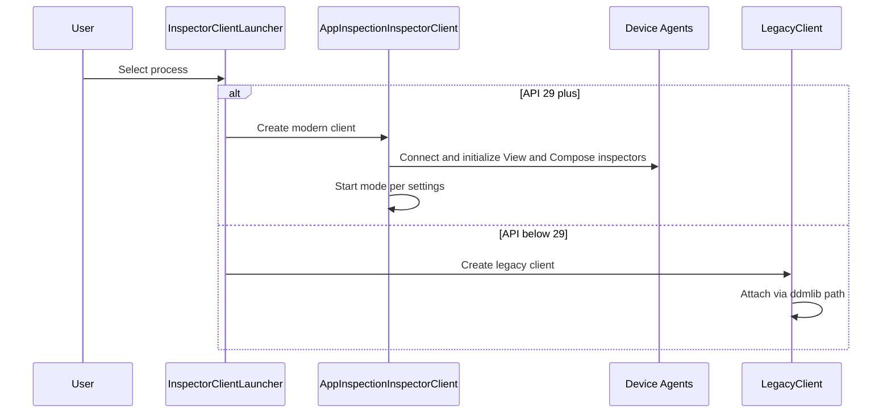

### 10.2 Live interactive cycle (modern)

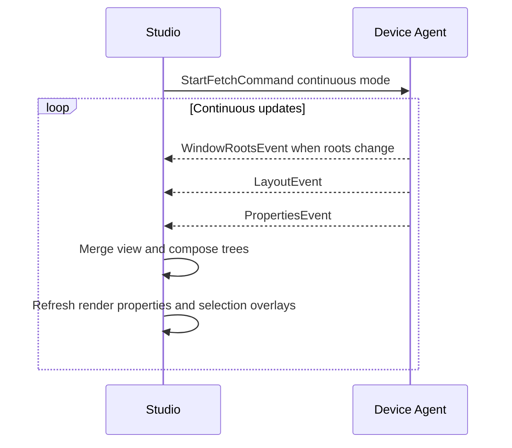

### 10.3 Snapshot save cycle

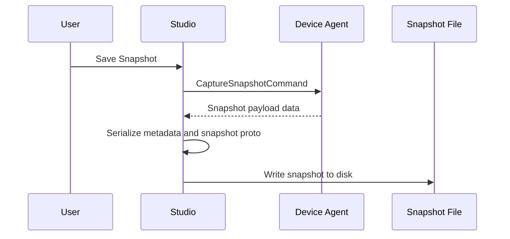

### 10.4 Studio click to highlight cycle

Covered in detail in **Section 6.1**; the same path is reused here in sequence context.

### 10.5 On-device click to Studio selection cycle

Covered in detail in **Section 6.3**; this section keeps the end-to-end runtime timeline without repeating the same diagram.

### 10.6 Compose injection lifecycle

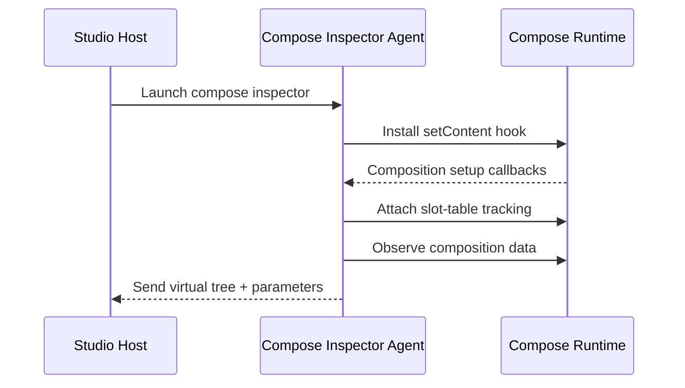

---

## 11) Android API-level and feature matrix

These API levels are practical lower bounds observed in current implementation paths; exact behavior varies by platform patch level, Compose runtime version, and fallback code path (legacy vs app inspection).

Evidence:
- **Verified in source**: host-side fallback/client selection and API-gated behavior in layout inspector pipeline classes.
- **Inferred from implementation flow**: practical runtime behavior on OEM images often differs from AOSP/emulator defaults.

| Feature | Min practical API | Notes |
|---|---:|---|
| Legacy DDM path | older/pre-29 | Host fallback path for old devices |
| WindowInspector root discovery | 29 | Used in modern view agent path |
| View inspector property APIs (`android.view.inspector.*`) | 29 | Companion/provider/property reader path |
| SKP-style rendering capture path | 29 | Q has workaround code; newer versions use direct path |
| PixelCopy bitmap path | 24+ | Used as bitmap screenshot path/fallback |
| Frame commit callback-based screenshot timing | modern path (29+) | Used to align screenshot capture with frame lifecycle |
| Compose inspector basic tree support | Compose runtime available (1.0+) | via AndroidX compose inspector agent |
| Compose state-read observation features | newer Compose runtime (commonly 1.5+) | depends on runtime APIs present |

---

## 12) Emulator verification notes (Android 16 / API 36)

Observed on running emulator:
- `ro.build.version.sdk = 36`
- `dumpsys window windows` returns active windows (as expected)
- `debug_view_attributes` setting currently `null` on this image

Interpretation:
- platform has modern APIs expected by App Inspection path
- no contradiction found vs modern LI architecture

Evidence:
- **Verified on device**: adb outputs captured during this analysis session.

---

## 13) Requested topics summarized

| Requested topic | Where to read |
|---|---|
| Click/input -> selection -> highlight (View + Compose) | Section 6 + Section 7 + Sequence references in Section 10 |
| Snapshot mode vs interactive mode | Section 8 + snapshot save sequence in Section 10.3 |
| Compose injection into Layout Inspector | Section 9 + Compose lifecycle in Section 10.6 |

---

## Appendix A) Practical extension points

If you plan to extend Layout Inspector behavior, these are the lowest-risk integration points:

1. **Host-side analysis/enrichment**
   - augment tree post-processing in Studio plugin side
   - add extra diagnostics panels from existing event stream

2. **Overlay behavior extension (embedded mode)**
   - use existing draw command concepts (`DrawInstruction`) for custom highlights
   - avoid forking platform APIs when possible

3. **Compose diagnostics extension**
   - build on anchor-based node identity and compose parameter/state-read data
   - keep version guards for runtime API differences

4. **Snapshot pipeline extension**
   - treat snapshot file as canonical, append your own metadata section externally
   - maintain backward compatibility with current proto contracts

---

## Appendix B) Key source locations (quick index)

- Studio host pipeline:
  - `tools/adt/idea/layout-inspector/src/com/android/tools/idea/layoutinspector/pipeline/`
- Legacy path:
  - `.../pipeline/legacy/LegacyClient.kt`
  - `.../pipeline/legacy/LegacyTreeLoader.kt`
- Modern appinspection path:
  - `.../pipeline/appinspection/AppInspectionInspectorClient.kt`
  - `.../pipeline/appinspection/view/ViewLayoutInspectorClient.kt`
  - `.../pipeline/appinspection/compose/ComposeLayoutInspectorClient.kt`
- Embedded mode / running devices:
  - `.../layoutinspector/runningdevices/`
- View agent (device side):
  - `tools/base/dynamic-layout-inspector/agent/appinspection/...`
- Compose agent (device side):
  - `androidx-main/frameworks/support/compose/ui/ui-inspection/...`
- Protocols:
  - `view_layout_inspection.proto`
  - `compose_layout_inspection.proto`
  - `skia.proto`
  - `snapshot.proto`

---

## 16) Final synthesis

Layout Inspector is a dual-agent system built around explicit protocol boundaries:

- legacy DDM fallback still exists for older targets;
- the App Inspection path is the default on modern devices;
- embedded and standalone UIs share core model logic but differ in rendering/integration;
- View and Compose are unified in the host model while coming from different device-side pipelines;
- click/highlight and snapshot/live behavior are clear state-machine flows.

For extension work, the most stable points are host-side model enrichment, protocol-compatible overlays, and snapshot post-processing that preserves existing proto contracts.

Recommended next actions:

1. Prototype custom highlight behavior in embedded mode first (Section 5 + Section 6) because it already supports bidirectional input/render flow.
2. Add snapshot-time enrichment metadata outside existing proto messages (Section 8 + Appendix A) to keep backward compatibility.
3. Gate Compose-specific features by runtime capability checks (Section 9 + Section 11) before enabling advanced diagnostics.
