> Based on [The Intelligent OS: Making AI agents more helpful for Android apps](https://android-developers.googleblog.com/2026/02/the-intelligent-os-making-ai-agents.html)(February 25, 2026). This report provides a deep-dive source code analysis of the two core AOSP frameworks behind Android's AI agent capabilities.

## Table of Contents

**I. The Big Picture**

1. [The Paradigm Shift](#1-the-paradigm-shift)
2. [Android's Dual-Path Agent Architecture](#2-androids-dual-path-agent-architecture)

**II. AppFunctions -- Structured Intelligence**

3. [AppFunctions Overview](#3-appfunctions-overview)
4. [AppFunctions Core API](#4-appfunctions-core-api)
5. [AppFunctions Server-Side Implementation](#5-appfunctions-server-side-implementation)
6. [AppFunctions Discovery System](#6-appfunctions-discovery-system)
7. [AppFunctions Access Control](#7-appfunctions-access-control)
8. [AppFunctions Feature Flags](#8-appfunctions-feature-flags)

**III. ComputerControl -- Universal UI Automation**

9. [ComputerControl Overview](#9-computercontrol-overview)
10. [ComputerControl Architecture](#10-computercontrol-architecture)
11. [Session Lifecycle](#11-session-lifecycle)
12. [Input Handling](#12-input-handling)
13. [Display Mirroring and Live View](#13-display-mirroring-and-live-view)
14. [Stability Tracking](#14-stability-tracking)
15. [IME and Text Input Integration](#15-ime-and-text-input-integration)
16. [Automated Package Tracking](#16-automated-package-tracking)
17. [ComputerControl Security Model](#17-computercontrol-security-model)
18. [ComputerControl Feature Flags](#18-computercontrol-feature-flags)

**IV. Comparative Analysis**

19. [AppFunctions vs ComputerControl](#19-appfunctions-vs-computercontrol)
20. [Security Model Comparison](#20-security-model-comparison)
21. [The Incremental Adoption Strategy](#21-the-incremental-adoption-strategy)

**V. Reference**

22. [Key Source File Reference](#22-key-source-file-reference)

---

# I. The Big Picture

## 1. The Paradigm Shift

The Android Developers Blog frames a fundamental transformation in mobile computing:

> *"User expectations for AI on their devices are fundamentally shifting how they interact with their apps."*

The traditional model -- users manually opening apps, navigating UIs, and completing tasks step by step -- is evolving toward **task delegation**. Users tell an AI agent what they want ("order my usual pizza", "coordinate a rideshare with coworkers"), and the agent handles the multi-step workflow across multiple apps.

This shift reframes success metrics from **"app opens"** to **"task completion."** Android's response is to build native OS-level support for AI agents through two complementary frameworks:

- **AppFunctions** -- Structured, API-based integration where apps explicitly expose capabilities
- **ComputerControl** -- Universal UI automation that works with any app, unmodified

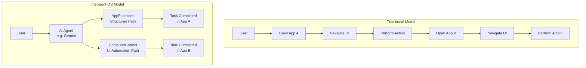

---

## 2. Android's Dual-Path Agent Architecture

Android provides AI agents with two independent, complementary pathways to interact with apps. They share no code-level integration (zero cross-references in the codebase) but serve the same higher-level goal.

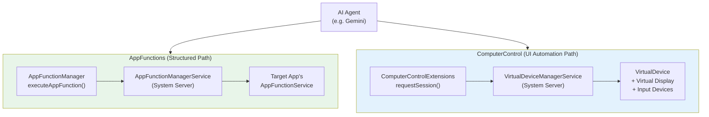

The blog describes this as:

- **AppFunctions**: *"Allows apps to expose data and functionality directly to AI agents and assistants"* -- self-describing functions that agents discover and execute, like an on-device MCP.
- **ComputerControl** (the blog's "UI automation framework"): *"The platform doing the heavy lifting, so developers can get agentic reach with zero code"* -- generic task execution on any installed app with user transparency built in.

---

# II. AppFunctions -- Structured Intelligence

## 3. AppFunctions Overview

The blog introduces AppFunctions with a real-world example: on the Galaxy S26, a user asks Gemini *"Show me pictures of my cat from Samsung Gallery."* The AI identifies the appropriate AppFunction, retrieves photos, and returns results within the Gemini interface -- without the user ever opening the Gallery app.

**AppFunctions** (`android.app.appfunctions`) enables apps to expose discrete, self-describing functions that AI agents can discover via AppSearch and execute programmatically. It is architecturally similar to WebMCP (Model Context Protocol) but runs entirely on-device.

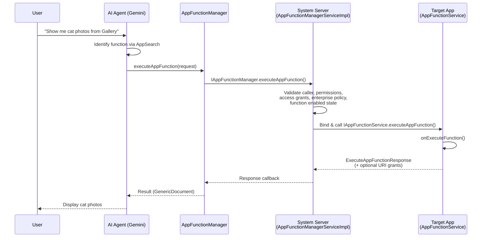

---

## 4. AppFunctions Core API

### Entry Point: `AppFunctionManager`

The main client-facing API, registered as `Context.APP_FUNCTION_SERVICE`:

| Method | Purpose |
|--------|---------|
| `executeAppFunction(request, executor, signal, receiver)` | Execute a function in another app |
| `isAppFunctionEnabled(functionId, targetPackage, ...)` | Check if a function is enabled |
| `setAppFunctionEnabled(functionId, state, ...)` | Toggle function state (own package only) |
| `getAccessRequestState(agent, target)` | Returns GRANTED/DENIED/UNREQUESTABLE |
| `getAccessFlags(agent, target)` / `updateAccessFlags(...)` | Manage access flag bitmask |
| `revokeSelfAccess(targetPackage)` | Agent self-revokes access |
| `createRequestAccessIntent(targetPackage)` | Intent for requesting access via UI |
| `getAccessHistoryContentUri()` | Content provider URI for audit trail |

### How Apps Expose Functions: `AppFunctionService`

Apps extend this abstract service to expose their functions:

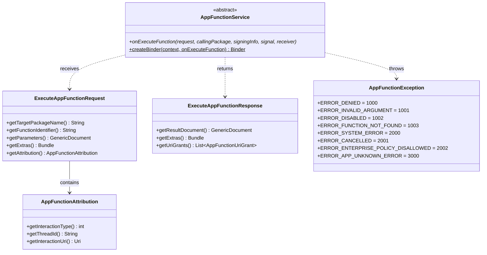

**Manifest declaration** (required by target apps):
```xml
<service android:name=".MyAppFunctionService"
         android:permission="android.permission.BIND_APP_FUNCTION_SERVICE">
    <intent-filter>
        <action android:name="android.app.appfunctions.AppFunctionService"/>
    </intent-filter>
</service>
```

### AIDL Interfaces

| Interface | Direction | Type | Purpose |
|-----------|-----------|------|---------|
| `IAppFunctionManager` | Client -> Server | Sync | System service binder interface |
| `IAppFunctionService` | Server -> App | Oneway | Execute function in target app |
| `IExecuteAppFunctionCallback` | App -> Server | Oneway | Result callback (success/error) |
| `IAppFunctionEnabledCallback` | Server -> Client | Oneway | Enabled state change notification |
| `ICancellationCallback` | Bidirectional | Oneway | Cancellation signal transport |

---

## 5. AppFunctions Server-Side Implementation

### Core Service Architecture

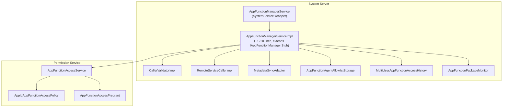

### Execution Pipeline

The `executeAppFunction()` method in `AppFunctionManagerServiceImpl` follows this pipeline:

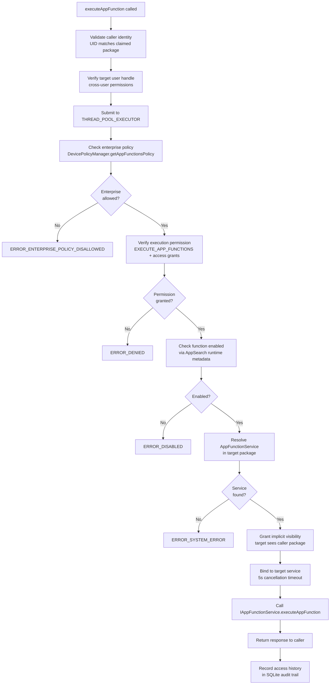

### Remote Service Calling

`RemoteServiceCallerImpl` manages the one-off service connection:
- Binds to target's `AppFunctionService` using `bindServiceAsUser()`
- Sets up cancellation signal with configurable timeout (default 5 seconds)
- Links to caller's binder death for auto-cancel if caller dies
- Unbinds after completion, cancellation timeout, or service disconnect

---

## 6. AppFunctions Discovery System

Functions are discovered through a **dual-metadata system** stored in AppSearch:

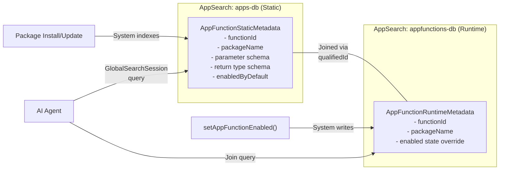

**Metadata synchronization** (`MetadataSyncAdapter`):
1. Triggered on user unlock and AppSearch observer changes
2. Queries both static and runtime AppSearch databases
3. Computes diff (added/removed functions)
4. Creates runtime metadata for new functions, removes for deleted ones
5. Sets AppSearch schema visibility per-package using signing certificates and `EXECUTE_APP_FUNCTIONS` permission

**Effective enabled state**: Runtime override takes precedence over static `enabledByDefault`.

---

## 7. AppFunctions Access Control

### Three-Layer Agent Allowlisting

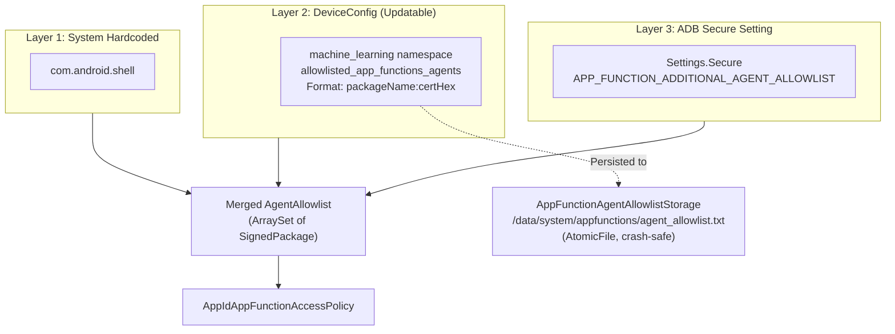

### Access Flag Bitmask System

Per agent-target pair, access is tracked via bitmask flags:

| Flag | Meaning |
|------|---------|
| `ACCESS_FLAG_PREGRANTED` | Pre-granted by system (XML in `etc/app-function-access-pregrants/`) |
| `ACCESS_FLAG_USER_GRANTED` | User explicitly granted via UI |
| `ACCESS_FLAG_USER_DENIED` | User explicitly denied via UI |
| `ACCESS_FLAG_OTHER_GRANTED` | Granted by shell, admin, or other mechanism |
| `ACCESS_FLAG_OTHER_DENIED` | Denied by shell, admin, or other mechanism |

**Priority**: USER flags override OTHER flags. If no DENIED flags present, `PREGRANTED` means granted.

### Audit Trail

Every execution is recorded in a per-user SQLite database (`appfunction_access.db`):

| Column | Source |
|--------|--------|
| `agent_package_name` | Calling agent |
| `target_package_name` | Target app |
| `interaction_type` | From `AppFunctionAttribution` (USER_QUERY, USER_SCHEDULED, OTHER) |
| `custom_interaction_type` | Custom type string (for INTERACTION_TYPE_OTHER) |
| `thread_id` | Groups related calls |
| `interaction_uri` | Deeplink to original interaction context |
| `access_time` | Wall clock timestamp |
| `access_duration` | Execution duration |

Cleanup: Scheduled every 24 hours, retaining 7 days of history.

---

## 8. AppFunctions Feature Flags

| Flag | Purpose | Namespace |
|------|---------|-----------|
| `enable_app_function_manager` | Core feature gate for the entire system service | `machine_learning` |
| `FLAG_APP_FUNCTION_ACCESS_API_ENABLED` | Gates the access control API (flags, pregrants, etc.) | `permissions` |

---

# III. ComputerControl -- Universal UI Automation

## 9. ComputerControl Overview

The blog introduces the second pathway:

> *"A UI automation framework for AI agents and assistants to intelligently execute generic tasks on users' installed apps, with user transparency and control built in."*

> *"The platform doing the heavy lifting, so developers can get agentic reach with zero code."*

**ComputerControl** (`android.companion.virtual.computercontrol`) is a framework-level feature that enables programmatic automation of Android applications running on a trusted virtual display. It is built on the **VirtualDeviceManager (VDM)** infrastructure and allows an authorized agent to:

- Launch applications on an isolated virtual display
- Inject input (taps, swipes, long presses, key events, text)
- Capture screenshots of the display content
- Mirror the display for user "live view" with interactive touch forwarding
- Monitor UI stability (detect when the display has settled)
- Hand over automated apps back to the user's default display

The blog highlights key user-facing aspects:
- Users monitor progress via **"notifications or 'live view'"** (implemented by `MirrorView` + `InteractiveMirrorDisplay`)
- Users **"can switch to manual control at any point"** (implemented by `handOverApplications()` and `MirrorView.setInteractive(true)`)
- Alerts precede **"sensitive tasks, such as making a purchase"**
- Currently in **early preview** on Galaxy S26 series and select Pixel 10 devices

---

## 10. ComputerControl Architecture

### Layered Architecture

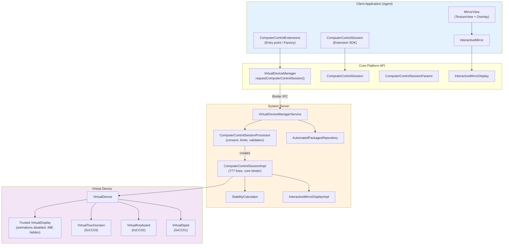

### Component Responsibilities

#### Client-Side (Extension SDK Library)

| Component | Responsibility |
|-----------|---------------|
| `ComputerControlExtensions` | Entry point / factory. Wraps `VirtualDeviceManager` APIs. Returns new instance per `getInstance()` call (or null if unavailable). |
| `ComputerControlSession` | Core session object. Input injection, screenshots, app launching, mirroring, stability. |
| `InteractiveMirror` | Wraps `InteractiveMirrorDisplay`. Converts `MotionEvent` to `VirtualTouchEvent`. |
| `MirrorView` | Ready-to-use `FrameLayout` with `TextureView` + touch overlay for live view. |
| `EventIdleTracker` | Generic idle-detection utility using Handler-based scheduling. |
| `StabilityHintCallbackTracker` | Deprecated stability mechanism via accessibility events + 500ms idle timer. |
| `input.KeyEvent` / `input.TouchEvent` | Immutable value classes for input events with Builder pattern. |
| `AutomatedPackageListener` | Interface for automated package change notifications. |

#### Server-Side (System Services)

| Component | Responsibility |
|-----------|---------------|
| `ComputerControlSessionProcessor` | Session creation, lifecycle, consent flow, policy enforcement. Max 5 concurrent sessions. |
| `ComputerControlSessionImpl` | Core session binder. Creates VirtualDevice + display + input devices. Handles all operations. |
| `StabilityCalculator` | Timeout-based stability detection (2000-3000ms depending on input type). |
| `InteractiveMirrorDisplayImpl` | Creates mirror virtual display + touchscreen for live view. |
| `AutomatedPackagesRepository` | Tracks automated packages per session, notifies launchers, intercepts launches. |

### Public API Surface

**Entry point**: `VirtualDeviceManager.requestComputerControlSession()` (requires `ACCESS_COMPUTER_CONTROL`)

**Session configuration** (`ComputerControlSessionParams`):

| Parameter | Description |
|-----------|-------------|
| `name` | Session name (required, unique per package) |
| `targetPackageNames` | Packages allowed for automation |
| `displayWidthPx / displayHeightPx` | Display dimensions in pixels |
| `displayDpi` | Display density |
| `displaySurface` | Optional Surface for rendering |
| `displayAlwaysUnlocked` | Whether display stays unlocked |

**Session operations** (`ComputerControlSession`):

| Category | Methods |
|----------|---------|
| **App Launch** | `launchApplication(packageName)`, `handOverApplications()` |
| **Screenshots** | `getScreenshot() -> Image` |
| **Gestures** | `tap(x, y)`, `swipe(fromX, fromY, toX, toY)`, `longPress(x, y)` |
| **Raw Input** | `sendTouchEvent(VirtualTouchEvent)`, `sendKeyEvent(VirtualKeyEvent)` *(deprecated)* |
| **Text** | `insertText(text, replaceExisting, commit)` |
| **Actions** | `performAction(actionCode)` (e.g., `ACTION_GO_BACK`) |
| **Mirroring** | `createInteractiveMirrorDisplay(width, height, surface)` |
| **Stability** | `setStabilityListener(executor, listener)`, `clearStabilityListener()` |
| **Lifecycle** | `close()`, `getVirtualDisplayId()` |

### AIDL IPC Interfaces

| Interface | Type | Purpose |
|-----------|------|---------|
| `IComputerControlSession` | Sync | Session operations (tap, swipe, launch, mirror, etc.) |
| `IComputerControlSessionCallback` | Oneway | Lifecycle events (pending, created, failed, closed) |
| `IComputerControlStabilityListener` | Oneway | Stability notification (`onSessionStable()`) |
| `IInteractiveMirrorDisplay` | Oneway | Mirror display operations (resize, touch, close) |
| `IAutomatedPackageListener` | Oneway | Package automation change notifications |

---

## 11. Session Lifecycle

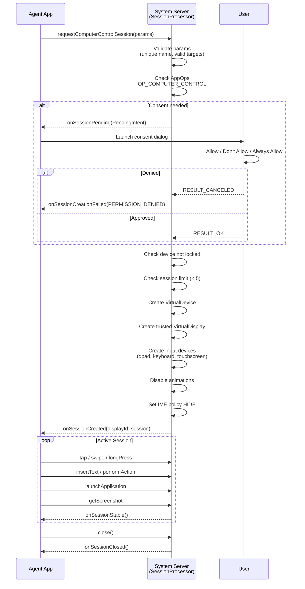

### Error Conditions

| Code | Constant | Condition |
|------|----------|-----------|
| 1 | `ERROR_SESSION_LIMIT_REACHED` | Already 5 concurrent sessions |
| 2 | `ERROR_DEVICE_LOCKED` | Device is currently locked |
| 3 | `ERROR_PERMISSION_DENIED` | User denied consent |

### Auto-Close Triggers
- Agent app process dies (via `DeathRecipient` / binder death)
- Explicit `close()` call
- System decides to terminate the session

### Server-Side Session Creation

**`ComputerControlSessionProcessor`**:
- Dedicated `ServiceThread` at `THREAD_PRIORITY_FOREGROUND` (lazy-initialized)
- Maximum 5 concurrent sessions (`MAXIMUM_CONCURRENT_SESSIONS`)
- Session name uniqueness enforced per-package
- Consent integration via `AppOpsManager.OP_COMPUTER_CONTROL`

**`ComputerControlSessionImpl`** (777 lines):
- Creates `VirtualDeviceParams` with `DEVICE_POLICY_CUSTOM` for activity blocking
- Trusted virtual display with focus-stealing disabled
- Three virtual input devices: Dpad (0xCC01), Keyboard (0xCC02), Touchscreen (0xCC03)
- Activity policy: strict mode (only target packages) or legacy mode (all except PermissionController)

---

## 12. Input Handling

### Input Device Architecture

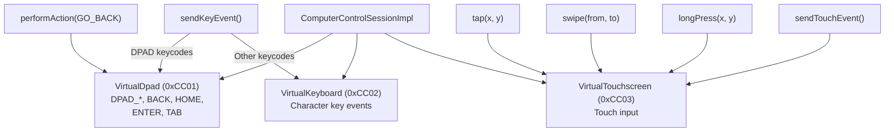

### High-Level Gesture Implementation

| Method | Implementation |
|--------|---------------|
| `tap(x, y)` | Immediate DOWN + UP at (x, y) |
| `swipe(from, to)` | DOWN + 11 MOVE steps (sine-eased interpolation, 50ms intervals) + UP (~550ms total) |
| `longPress(x, y)` | Stationary swipe: DOWN + N MOVE steps at same point. N = `ceil(1.5 * longPressTimeout / 50ms)` |

**Swipe interpolation**: Uses `Math.sin(fraction * PI/2)` for natural-feeling sine easing. Dispatched via `ScheduledExecutorService` with 50ms delays.

### Extension SDK Input Types

- **`TouchEvent`**: Immutable, builder pattern. pointerId (0-15), toolType (FINGER/PALM), action (DOWN/UP/MOVE/CANCEL), x, y, pressure (0-255), majorAxisSize. ACTION_CANCEL must pair with TOOL_TYPE_PALM.
- **`KeyEvent`**: Immutable, builder pattern. keyCode, action (DOWN/UP), eventTimeNanos.

---

## 13. Display Mirroring and Live View

The blog highlights that users can *"monitor a task's progress via notifications or 'live view'"* and *"switch to manual control at any point."* This is implemented through the interactive mirror display system.

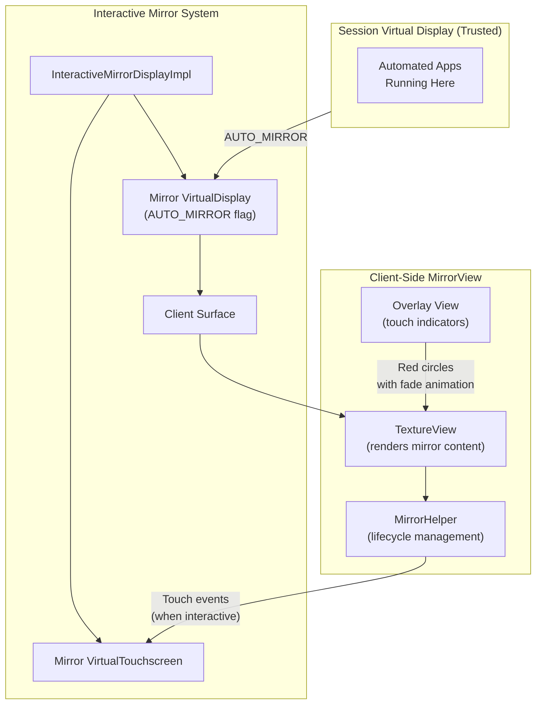

### Server-Side: `InteractiveMirrorDisplayImpl`
- Creates a mirror virtual display with `AUTO_MIRROR` flag linked to session display
- Associates a virtual touchscreen with the mirror display
- `resize(w, h)`: Resizes display, destroys and recreates touchscreen (no touchscreen resize API)
- `sendTouchEvent()`: Forwards to mirror touchscreen

### Client-Side: `MirrorView`
A ready-to-use `FrameLayout` providing the "live view" experience:
- `setComputerControlSession(session)` -- Binds/unbinds session for mirroring
- `setInteractive(boolean)` -- Enables touch-to-control forwarding (manual takeover)
- `setShowTouches(boolean)` -- Shows/hides touch indicator dots
- Handles coordinate translation with letterboxing/pillarboxing

---

## 14. Stability Tracking

ComputerControl provides two stability mechanisms to help agents wait for UI to settle:

### Platform-Level StabilityListener (Current)

Server-side `StabilityCalculator` uses timeout-based heuristics:

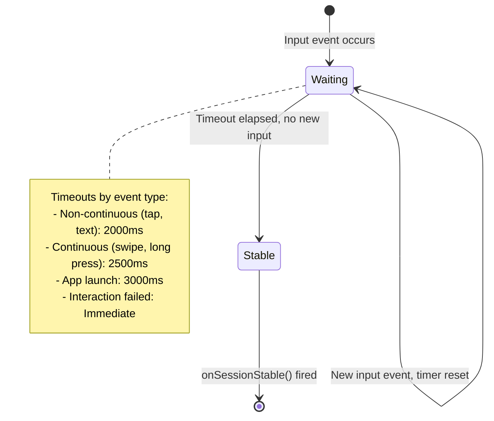

- Registered via `setStabilityListener(executor, listener)`
- Only one listener per session
- Each new input event resets the timer
- Marked as temporary implementation (TODO b/428957982)

### Deprecated StabilityHintCallback (Extension SDK)
- Uses `AccessibilityDisplayProxy` monitoring accessibility events on the virtual display
- `EventIdleTracker` with 500ms idle timeout
- One-shot callback pattern (must be re-registered)

---

## 15. IME and Text Input Integration

ComputerControl bypasses the normal on-screen keyboard for programmatic text entry:

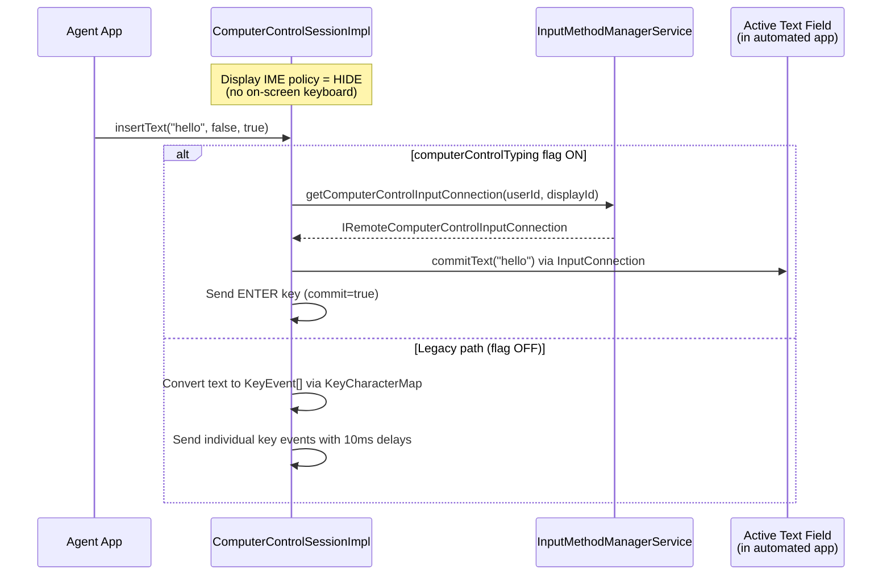

**How the InputConnection is established**:
1. When an app gains input focus on a CC display, `InputMethodManagerService.startInputOrWindowGainedFocus()` stores the `IRemoteComputerControlInputConnection` in `UserData.mComputerControlInputConnectionMap` keyed by displayId
2. The session impl retrieves it via `InputMethodManagerInternal.getComputerControlInputConnection()`
3. When the client disconnects, the entry is removed

---

## 16. Automated Package Tracking

The blog mentions users can *"monitor a task's progress via notifications."* This is powered by `AutomatedPackagesRepository`, which allows launchers (ROLE_HOME apps) to display indicators for automated packages.

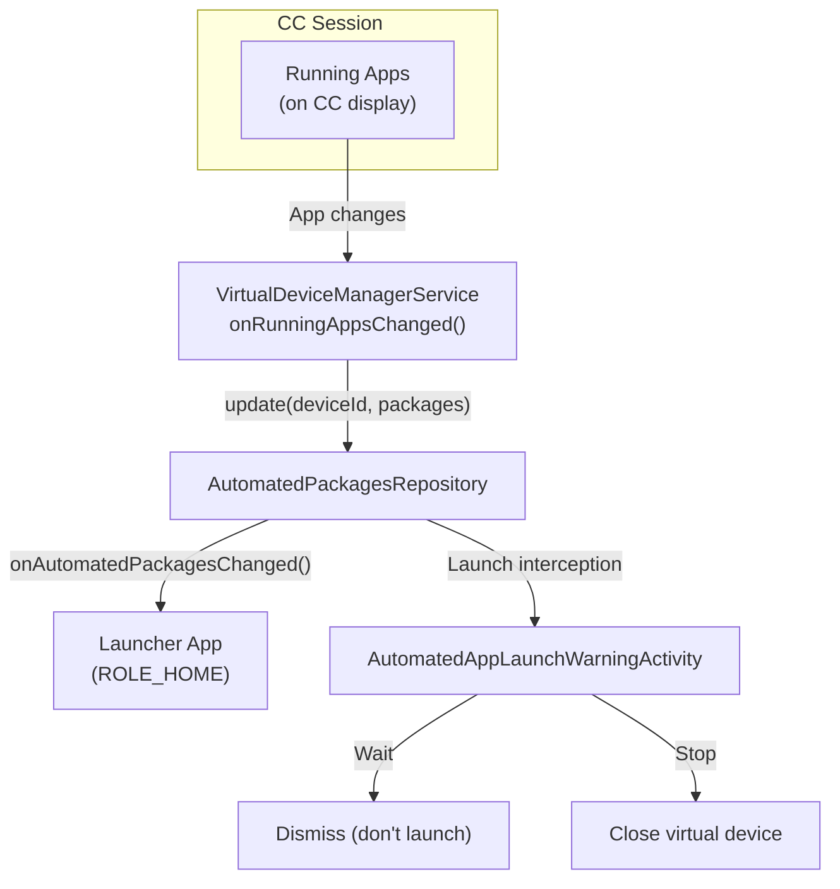

**Data model**:
- `mAutomatedPackages`: `ownerPackage -> userId -> Set<packageNames>` (aggregated across devices)
- `mDevicePackages`: `deviceId -> userId -> Set<packageNames>` (per-device)
- `mInterceptedLaunches`: Tracks packages where user already approved automated launch

---

## 17. ComputerControl Security Model

The blog emphasizes *"privacy and security at their core."* ComputerControl implements multiple security layers:

### Permission and Consent

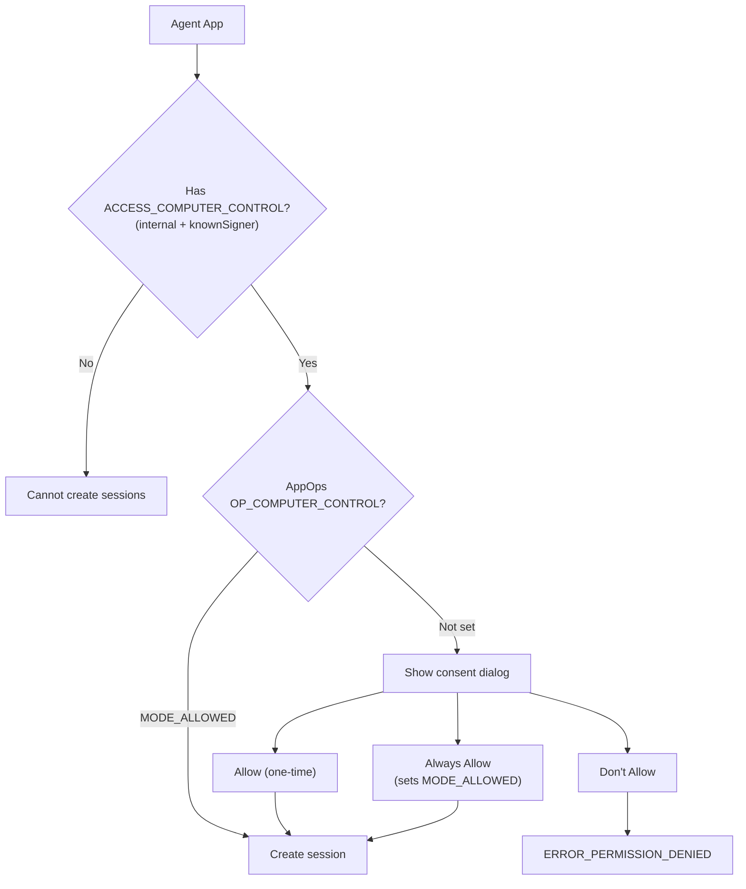

### Anti-Tampering Measures

| Measure | Implementation |
|---------|---------------|
| Touch filtering | All consent/warning activities use `FilterTouches` themes (anti-tapjacking) |
| HTML escaping | Agent app labels escaped via `Html.escapeHtml()` in consent dialogs |
| Activity blocking | Strict mode: only target packages allowed; PermissionController always blocked |
| Launch interception | Users warned when automated agents try to launch other apps |
| Device lock check | Sessions cannot be created when device is locked |
| Binder death monitoring | Sessions auto-close when agent process dies |
| Display isolation | Trusted virtual displays, animations disabled, IME hidden, focus stealing disabled |

### UI Components (VirtualDeviceManager Package)

| Component | Purpose |
|-----------|---------|
| `RequestComputerControlAccessActivity/Fragment` | Three-button consent dialog (Allow / Don't Allow / Always Allow) |
| `NotifyComputerControlBlockedActivity/Fragment` | Warning when an activity is blocked during CC session |
| `AutomatedAppLaunchWarningActivity` | Warning when automated agent launches another app (Wait / Stop) |

---

## 18. ComputerControl Feature Flags

All flags in `frameworks/base/core/java/android/companion/virtual/flags/flags.aconfig`:

| Flag | Purpose | Type |
|------|---------|------|
| `computer_control_access` | Core feature gate; also gates the `ACCESS_COMPUTER_CONTROL` permission | Feature gate |
| `computer_control_consent` | Gates user consent dialog flow for session creation | Bugfix |
| `computer_control_activity_policy_strict` | Enables strict activity allowlisting (only target packages) | Bugfix |
| `computer_control_typing` | Enables InputConnection-based text APIs (vs legacy KeyCharacterMap) | Bugfix |
| `automated_app_launch_interception` | Gates automated app launch warning dialog | Bugfix |

---

# IV. Comparative Analysis

## 19. AppFunctions vs ComputerControl

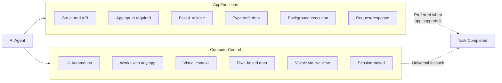

| Dimension | AppFunctions | ComputerControl |
|-----------|-------------|-----------------|
| **Approach** | Structured / API-based | UI-based / visual automation |
| **App Integration Required** | Yes (implement `AppFunctionService`) | No (works with any app unmodified) |
| **Data Exchange** | `GenericDocument` (typed key-value) | Screenshots (pixel data) + input injection |
| **Precision** | Exact (defined parameters and returns) | Approximate (depends on UI recognition) |
| **Performance** | Fast (direct function call) | Slower (display rendering + stability waits) |
| **Reliability** | High (stable API contract) | Variable (UI changes can break automation) |
| **App Coverage** | Only apps that opt in | Any app on the device |
| **User Visibility** | Invisible (background execution) | Visible via MirrorView / live view |
| **Interaction Model** | Request/response (one-shot) | Session-based (continuous) |
| **System Service** | `AppFunctionManagerService` | `VirtualDeviceManagerService` |
| **Permission** | `EXECUTE_APP_FUNCTIONS` | `ACCESS_COMPUTER_CONTROL` |
| **Protection Level** | Normal (with allowlist gating) | `internal\|knownSigner` (highest restriction) |

### When an AI Agent Would Use Each

| Scenario | Approach | Rationale |
|----------|----------|-----------|
| "Order my usual from DoorDash" | AppFunctions (if available) | Structured reorder API is faster and more reliable |
| "Navigate this unfamiliar app and fill a form" | ComputerControl | No structured API available; needs visual context |
| "Get my bank balance" | AppFunctions | Structured data retrieval, no UI needed |
| "Complete a multi-step workflow across 3 apps" | ComputerControl | Complex visual workflow, cross-app navigation |
| "Show me what the agent is doing" | ComputerControl | MirrorView provides live visual feedback |

---

## 20. Security Model Comparison

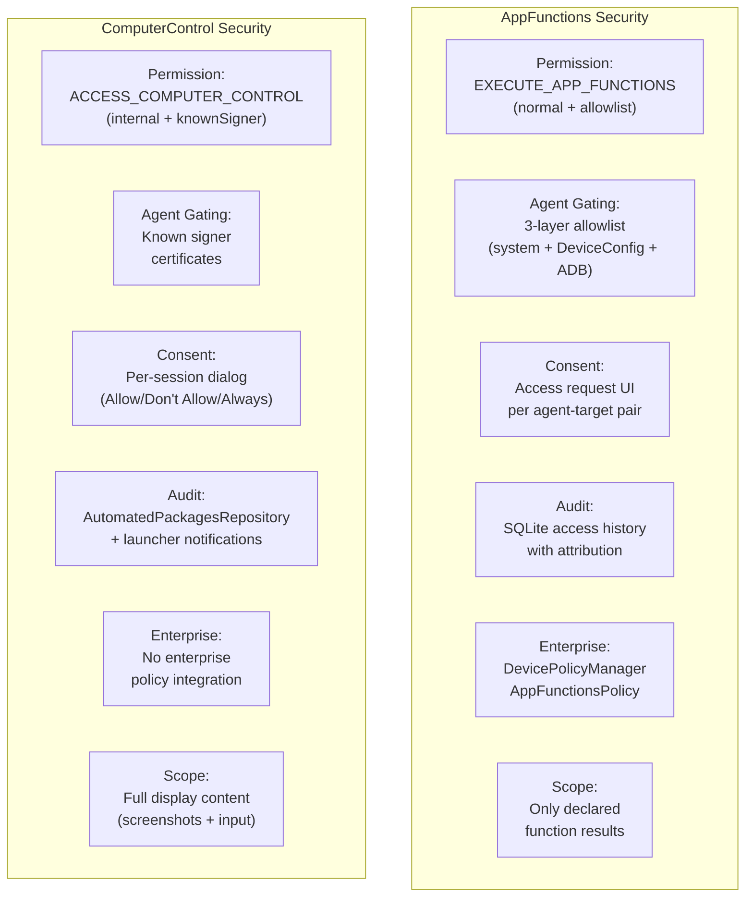

ComputerControl has a **stricter permission model** (`internal|knownSigner` vs normal with allowlist) because it has broader access -- it can see and interact with any UI content, whereas AppFunctions only exposes what apps explicitly declare.

---

## 21. The Incremental Adoption Strategy

The blog outlines a roadmap: Android 17 will *"broaden these capabilities to reach even more users, developers, and device manufacturers."* The dual-path architecture enables an incremental adoption strategy:

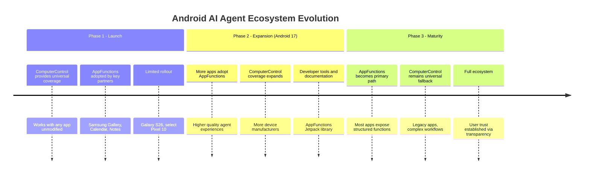

**Key insight**: The ecosystem can start with ComputerControl for broad "zero code" coverage, then progressively shift to AppFunctions as more apps integrate. This mirrors the blog's framing:

- **AppFunctions** = *"expose data and functionality directly"* (preferred, high-quality path)
- **ComputerControl** = *"platform doing the heavy lifting... zero code"* (universal fallback)

Both are unified by a commitment to **user sovereignty**: AppFunctions via access management UI and audit trails, ComputerControl via consent dialogs, live view, and manual takeover.

---

# V. Reference

## 22. Key Source File Reference

### AppFunctions Core API (`frameworks/base/core/java/android/app/appfunctions/`)

| File | Description |
|------|-------------|
| `AppFunctionManager.java` | Client API entry point (system service) |
| `AppFunctionService.java` | Abstract service apps extend to expose functions |
| `ExecuteAppFunctionRequest.java` | Request model (target, function ID, parameters) |
| `ExecuteAppFunctionResponse.java` | Response model (result document, URI grants) |
| `AppFunctionException.java` | Structured error codes and categories |
| `AppFunctionAttribution.java` | Interaction attribution for audit |
| `AppFunctionRuntimeMetadata.java` | Runtime enabled/disabled state in AppSearch |
| `AppFunctionStaticMetadataHelper.java` | Static metadata constants and helpers |
| `AppFunctionManagerConfiguration.java` | Feature support check |
| `AppFunctionUriGrant.java` | Temporary URI permission grants |
| `GenericDocumentWrapper.java` | Large document binder transport |
| `IAppFunctionManager.aidl` | System server AIDL interface |
| `IAppFunctionService.aidl` | App service AIDL interface |
| `flags/flags.aconfig` | Feature flags |

### AppFunctions Server (`frameworks/base/services/appfunctions/java/.../appfunctions/`)

| File | Description |
|------|-------------|
| `AppFunctionManagerService.java` | SystemService wrapper |
| `AppFunctionManagerServiceImpl.java` | Core implementation (~1220 lines) |
| `CallerValidatorImpl.java` | Caller identity and permission validation |
| `AppFunctionAgentAllowlistStorage.java` | Three-layer agent allowlist management |
| `MetadataSyncAdapter.java` | AppSearch metadata synchronization |
| `RemoteServiceCallerImpl.java` | Remote service binding and execution |
| `AppFunctionSQLiteAccessHistory.java` | SQLite audit trail |
| `MultiUserAppFunctionAccessHistory.java` | Multi-user history management |
| `AppFunctionPackageMonitor.java` | Package data clear monitoring |

### AppFunctions Permission (`frameworks/base/services/permission/java/.../appfunction/`)

| File | Description |
|------|-------------|
| `AppIdAppFunctionAccessPolicy.kt` | Core access control with bitmask flags |
| `AppFunctionAccessService.kt` | Bridge between service and policy |
| `AppFunctionAccessPregrant.kt` | XML-based pre-grant rules for system apps |

### ComputerControl Extension SDK (`frameworks/base/libs/computercontrol/`)

| File | Description |
|------|-------------|
| `src/.../ComputerControlExtensions.java` | Entry point / factory |
| `src/.../ComputerControlSession.java` | Core session class (extension SDK) |
| `src/.../InteractiveMirror.java` | Mirror display wrapper |
| `src/.../view/MirrorView.java` | Ready-to-use mirror view (live view) |
| `src/.../EventIdleTracker.java` | Idle detection utility |
| `src/.../StabilityHintCallbackTracker.java` | Deprecated stability via accessibility |
| `src/.../AutomatedPackageListener.java` | Package automation listener |
| `src/.../input/KeyEvent.java` | Key event value class |
| `src/.../input/TouchEvent.java` | Touch event value class |
| `Android.bp` | Build config (system_ext shared lib) |
| `computercontrol.extension.xml` | Permission config |

### ComputerControl Core API (`frameworks/base/core/java/android/companion/virtual/computercontrol/`)

| File | Description |
|------|-------------|
| `ComputerControlSession.java` | Platform session API |
| `ComputerControlSessionParams.java` | Session configuration (Parcelable) |
| `InteractiveMirrorDisplay.java` | Mirror display API |
| `AutomatedPackageListener.java` | Package listener interface |
| `IComputerControlSession.aidl` | Session operations IPC |
| `IComputerControlSessionCallback.aidl` | Session lifecycle callbacks |
| `IComputerControlStabilityListener.aidl` | Stability notifications |
| `IInteractiveMirrorDisplay.aidl` | Mirror display IPC |
| `IAutomatedPackageListener.aidl` | Package listener IPC |

### ComputerControl Server (`frameworks/base/services/companion/java/.../computercontrol/`)

| File | Description |
|------|-------------|
| `ComputerControlSessionProcessor.java` | Session creation/lifecycle management |
| `ComputerControlSessionImpl.java` | Core session binder (777 lines) |
| `StabilityCalculator.java` | Timeout-based stability detection |
| `InteractiveMirrorDisplayImpl.java` | Mirror display + touchscreen |
| `AutomatedPackagesRepository.java` | Automated package tracking |

### VirtualDevice Integration

| File | Description |
|------|-------------|
| `services/companion/.../VirtualDeviceManagerService.java` | System service; owns SessionProcessor + Repository |
| `services/companion/.../VirtualDeviceImpl.java` | VirtualDevice implementation |
| `core/.../VirtualDeviceManager.java` | Public entry point for CC sessions |
| `core/.../IVirtualDeviceManager.aidl` | VDM service AIDL |

### InputMethod Integration

| File | Description |
|------|-------------|
| `services/core/.../InputMethodManagerService.java` | Stores CC input connections per display |
| `services/core/.../UserData.java` | `mComputerControlInputConnectionMap` storage |
| `core/.../IRemoteComputerControlInputConnection.aidl` | CC text input IPC |

### UI Components (`frameworks/base/packages/VirtualDeviceManager/`)

| File | Description |
|------|-------------|
| `RequestComputerControlAccessActivity.java` | Consent dialog activity |
| `RequestComputerControlAccessFragment.java` | Consent dialog UI (3 buttons) |
| `NotifyComputerControlBlockedActivity.java` | Blocked activity notification |
| `AutomatedAppLaunchWarningActivity.java` | Automated launch warning |

### Feature Flags

| File | Description |
|------|-------------|
| `core/.../companion/virtual/flags/flags.aconfig` | ComputerControl feature flags |
| `core/.../app/appfunctions/flags/flags.aconfig` | AppFunctions feature flags |
| `core/res/AndroidManifest.xml` | `ACCESS_COMPUTER_CONTROL` permission declaration |