## Table of Contents

1. [Executive Summary](#1-executive-summary)
2. [Architecture Overview](#2-architecture-overview)
3. [Split APK Types](#3-split-apk-types)
4. [Manifest Structure](#4-manifest-structure)
5. [Parsing Infrastructure](#5-parsing-infrastructure)
6. [Installation Flow](#6-installation-flow)
7. [Runtime Loading](#7-runtime-loading)
8. [Dependency Tree System](#8-dependency-tree-system)
9. [Android App Bundle (AAB) and Split APKs](#9-android-app-bundle-aab-and-split-apks)
10. [On-Disk Storage](#10-on-disk-storage)
11. [Key Source Files Reference](#11-key-source-files-reference)

---

## 1. Executive Summary

Split APKs allow an Android application to be delivered as multiple APK files instead of a single monolithic APK. Introduced in Android L (API 21), this mechanism enables:

- **Reduced download sizes** via config splits (density, ABI, language-specific resources)
- **Modular features** via feature splits (on-demand delivery of app modules)
- **Incremental updates** by updating individual splits without replacing the entire app

The system comprises three major subsystems:
1. **Parsing** - Manifest analysis, validation, and dependency tree construction
2. **Installation** - Session-based install with staging, sealing, validation, and commit
3. **Runtime** - ClassLoader hierarchy, resource loading, and component dispatch

---

## 2. Architecture Overview

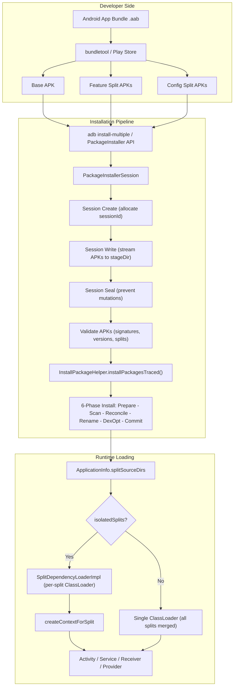

---

## 3. Split APK Types

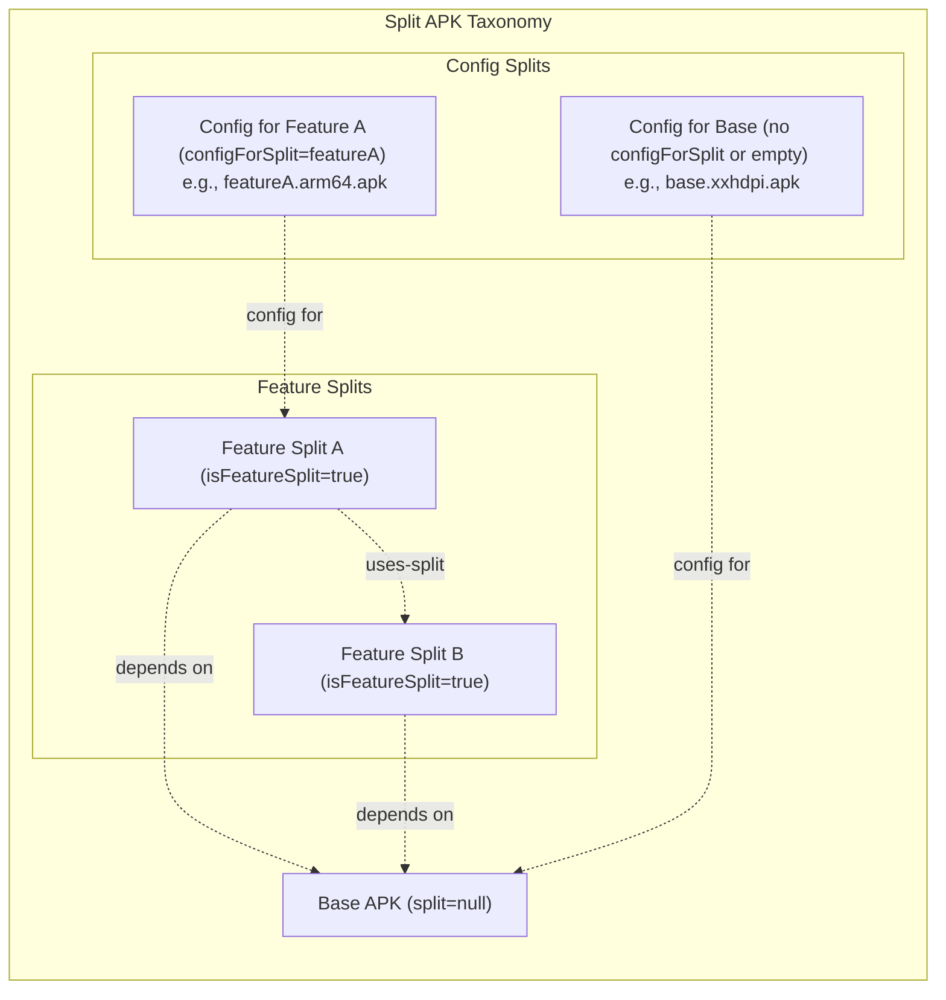

### 3.1 Base APK
- The **mandatory** APK with `split` attribute absent or null in `<manifest>`
- Contains the core application code, resources, and AndroidManifest.xml
- All other splits depend on it (directly or transitively)
- Identified by `ApkLite.getSplitName() == null`

### 3.2 Feature Splits
- Declared with `android:isFeatureSplit="true"` in `<manifest>`
- Contains additional code (activities, services, etc.) and resources
- Can declare dependencies on other feature splits via `<uses-split android:name="...">`
- If no `<uses-split>` is declared, implicitly depends on the base APK
- Can define their own `<application>` tag with components
- Components declared in feature splits get `ComponentInfo.splitName` set to the split name

### 3.3 Config Splits
- Non-feature splits with `configForSplit` attribute (e.g., `configForSplit="featureA"`)
- Contain configuration-specific resources (screen density, ABI, locale)
- Are treated as **leaves** in the dependency tree
- Cannot have their own dependencies
- Cannot be feature splits (validated in `SplitDependencyLoader.createDependenciesFromPackage()`)

### 3.4 Required Splits
- Base APK can declare `android:isSplitRequired="true"`
- Can also specify `requiredSplitTypes` (e.g., density, abi, language)
- Installation fails with `INSTALL_FAILED_MISSING_SPLIT` if required splits are missing
- Validated in `PackageInstallerSession.validateApkInstallLocked()` (method at line 4465, required split check at line 4700)

---

## 4. Manifest Structure

### 4.1 Key Manifest Attributes

| Attribute | Location | Description |
|-----------|----------|-------------|
| `split` | `<manifest>` | Split name (null for base APK) |
| `android:isFeatureSplit` | `<manifest>` | Marks this as a feature split |
| `configForSplit` | `<manifest>` | Name of the split this is a config for |
| `android:isSplitRequired` | `<manifest>` | Base APK requires splits to be present |
| `android:requiredSplitTypes` | `<manifest>` | Comma-separated types of required splits (e.g., density, abi, language) |
| `android:splitTypes` | `<manifest>` | Comma-separated types this split satisfies |
| `android:isolatedSplits` | `<manifest>` | Enable isolated split loading |
| `android:hasCode` | `<application>` | Whether split contains DEX code |
| `android:classLoader` | `<application>` | Custom ClassLoader for this split |

### 4.2 Uses-Split Declaration

```xml
<!-- In a feature split's AndroidManifest.xml -->
<manifest xmlns:android="http://schemas.android.com/apk/res/android"
    package="com.example.app"
    split="featureB"
    android:isFeatureSplit="true">

    <!-- Declares dependency on featureA -->
    <uses-split android:name="featureA" />

    <application android:hasCode="true">
        <activity android:name=".FeatureBActivity" />
    </application>
</manifest>
```

### 4.3 Config Split Declaration

```xml
<!-- Config split for density resources of featureA -->
<manifest xmlns:android="http://schemas.android.com/apk/res/android"
    package="com.example.app"
    split="featureA.config.xxhdpi"
    configForSplit="featureA">
</manifest>
```

### 4.4 Parsing Flow - parsePackageSplitNames

Source: `ApkLiteParseUtils.java:900`

```java
// Extracts package name and split name from <manifest> tag
public static ParseResult<Pair<String, String>> parsePackageSplitNames(
        ParseInput input, XmlResourceParser parser) {
    // Reads "package" attribute for package name
    // Reads "split" attribute for split name
    // Returns Pair<packageName, splitName>
}
```

---

## 5. Parsing Infrastructure

### 5.1 Two-Phase Parsing

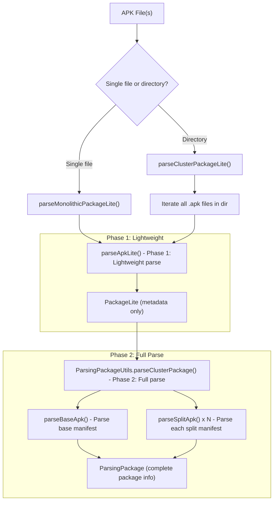

### 5.2 Phase 1: Lightweight Parsing (ApkLiteParseUtils)

**Entry Point**: `ApkLiteParseUtils.parsePackageLite()` (line 115)

- If path is a **directory**: calls `parseClusterPackageLite()` (line 180)
  - Iterates all `.apk` files
  - Calls `parseApkLite()` on each file
  - Validates **package name consistency** across all APKs
  - Validates **version code consistency** across all APKs
  - Rejects **duplicate split names**
  - Base APK identified by `splitName == null` (removed from map via `apks.remove(null)`)
  - Sorts splits by name using `SplitNameComparator`
  - Composes `PackageLite` with all split metadata

- If path is a **single file**: calls `parseMonolithicPackageLite()` (line 127)
  - Single APK, no splits

**Key data extracted per APK** (ApkLite fields):
- `splitName`, `packageName`, `versionCode`
- `isFeatureSplit`, `configForSplit`, `usesSplitName`
- `isSplitRequired`, `requiredSplitTypes`, `splitTypes`
- `signingDetails`, `targetSdkVersion`, `minSdkVersion`

### 5.3 Phase 2: Full Parsing (ParsingPackageUtils)

**Entry Point**: `ParsingPackageUtils.parseClusterPackage()` (line ~370)

```java
// 1. Build dependency tree (if isolated splits)
SparseArray<int[]> splitDependencies =
    SplitAssetDependencyLoader.createDependenciesFromPackage(lite);

// 2. Choose asset loader
if (lite has isolatedSplits && dependencies exist) {
    assetLoader = new SplitAssetDependencyLoader(lite, splitDependencies, flags);
} else {
    assetLoader = new DefaultSplitAssetLoader(lite, flags);
}

// 3. Parse base APK
parseBaseApk(input, baseApk, codePath, assetLoader, flags, ...);

// 4. Register splits metadata
pkg.asSplit(splitNames, splitApkPaths, splitRevisionCodes, splitDependencies);

// 5. Parse each split APK
for (int i = 0; i < splitCount; i++) {
    parseSplitApk(input, pkg, i, assetLoader.getSplitAssetManager(i), flags);
}
```

### 5.4 Split APK Parsing Details (parseSplitApplication)

Source: `ParsingPackageUtils.java:841`

Split APKs can declare these components in their `<application>` tag:
- `<activity>` and `<receiver>` (via `ParsedActivityUtils`)
- `<service>` (via `ParsedServiceUtils`)
- `<provider>` (via `ParsedProviderUtils`)
- `<activity-alias>`

**Critical**: The `defaultSplitName` (line 865) is set from `pkg.getSplitNames()[splitIndex]` and passed to all component parsers. This ensures every component declared in a split has its `splitName` field set correctly for runtime dispatch.

### 5.5 SplitAssetLoader Implementations

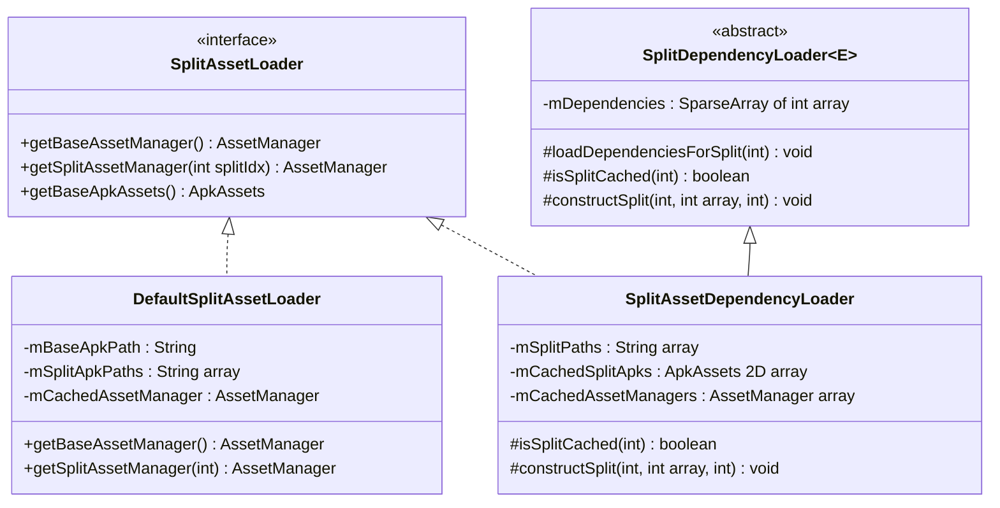

- **DefaultSplitAssetLoader**: Loads ALL APKs (base + all splits) into a single `AssetManager`. Used when `isolatedSplits` is disabled. Every call to `getSplitAssetManager()` returns the same shared instance.

- **SplitAssetDependencyLoader**: Creates per-split `AssetManager` instances that only include the split's dependency chain. Used when `isolatedSplits` is enabled. Each split gets an `AssetManager` containing: parent's assets + split's own assets + config split assets.

---

## 6. Installation Flow

### 6.1 End-to-End Installation Sequence

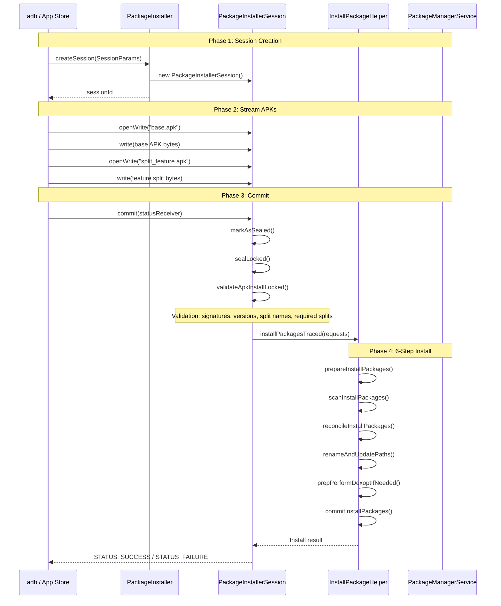

### 6.2 Session Modes

#### MODE_FULL_INSTALL
- Complete replacement of all APKs
- **Must include a base APK** (`stagedSplits.contains(null)` validated at line 4691)
- All existing splits are replaced
- If `isSplitRequired`, validates required split types are present (line 4700)
- Creates `PackageLite` from staged files only

#### MODE_INHERIT_EXISTING
- Partial update - add, replace, or remove individual splits
- Requires an existing installation (`pkgInfo != null`, line 4483-4486)
- **Inherits** base APK if not overridden (line 4736-4738)
- **Inherits** existing splits if not overridden or removed (line 4750-4764)
- Validates signatures match existing installation (line 4730)
- Validates package name and version code consistency

### 6.3 Split Validation (validateApkInstallLocked)

Source: `PackageInstallerSession.java:4465`

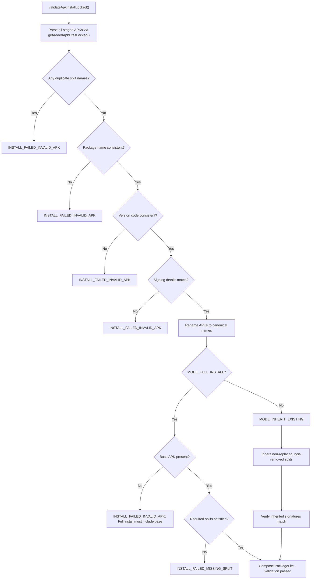

### 6.4 Split Removal

Splits can be removed during `MODE_INHERIT_EXISTING` installs:

1. Client writes a **remove marker file** (filename = `splitName` + `REMOVE_MARKER_EXTENSION`)
2. During validation, `getRemovedFilesLocked()` collects these markers
3. Removed splits are excluded from inheritance (line 4754-4756)
4. Validates that the split being removed actually exists in the current install (line 4600-4605)

### 6.5 APK Naming Convention

Source: `ApkLiteParseUtils.splitNameToFileName()` (line 328)

After validation, APKs are renamed to a canonical format:
- Base APK: `base.apk`
- Split APK: `split_<splitName>.apk` (e.g., `split_featureA.apk`)

### 6.6 6-Phase Install Process (InstallPackageHelper)

Source: `InstallPackageHelper.installPackagesTraced()` (line 1027)

| Phase | Method | Description |
|-------|--------|-------------|
| 1. Prepare | `prepareInstallPackages()` | Validate install request, check permissions |
| 2. Scan | `scanInstallPackages()` | Full APK parsing, extract package info |
| 3. Reconcile | `reconcileInstallPackages()` | Resolve conflicts, check signatures, verify compatibility |
| 4. Rename | `renameAndUpdatePaths()` | Move files to final location |
| 5. DexOpt | `prepPerformDexoptIfNeeded()` | Ahead-of-time compile DEX bytecode |
| 6. Commit | `commitInstallPackages()` | Update package database, send broadcasts (called via `doPostDexopt` callback) |

---

## 7. Runtime Loading

### 7.1 Two Loading Modes

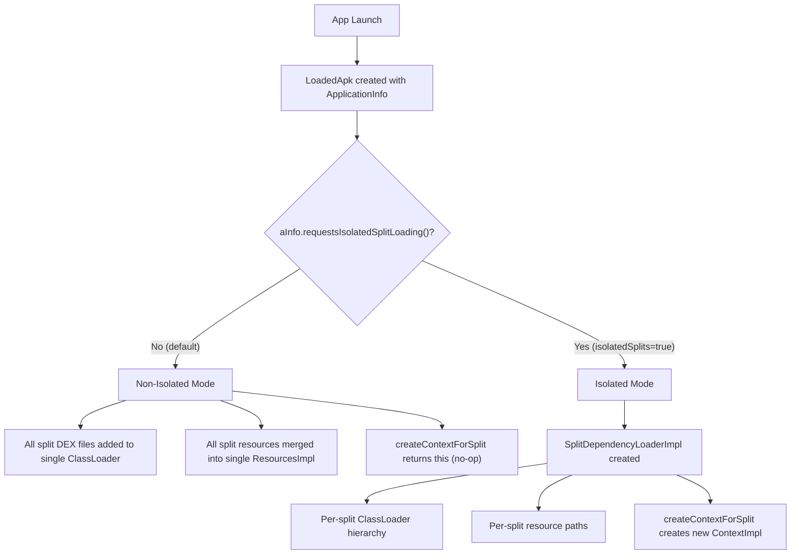

### 7.2 Non-Isolated Loading (Default)

When `android:isolatedSplits` is **not** set (the default):

- `LoadedApk` initializes `mSplitLoader = null` (no dependency loader)
- **All** split APK paths from `ApplicationInfo.splitSourceDirs` are added to the base ClassLoader's classpath
- Resources from all splits are merged into a single `ResourcesImpl`
- `createContextForSplit()` returns `this` (no-op) since all code/resources already available
- `getSplitClassLoader()` returns the single `mClassLoader`

Source: `LoadedApk.java` lines 454, 523-525, 757-761

### 7.3 Isolated Split Loading

When `android:isolatedSplits="true"` is declared in the base APK:

- `LoadedApk` creates `mSplitLoader = new SplitDependencyLoaderImpl(aInfo.splitDependencies)` (line 455)
- Each split gets its **own ClassLoader** with parent = the ClassLoader of its dependency
- Each split gets its **own resource path set** = parent's resources + split's resources + config splits

### 7.4 ClassLoader Hierarchy

Source: `LoadedApk.SplitDependencyLoaderImpl.constructSplit()` (line 695)

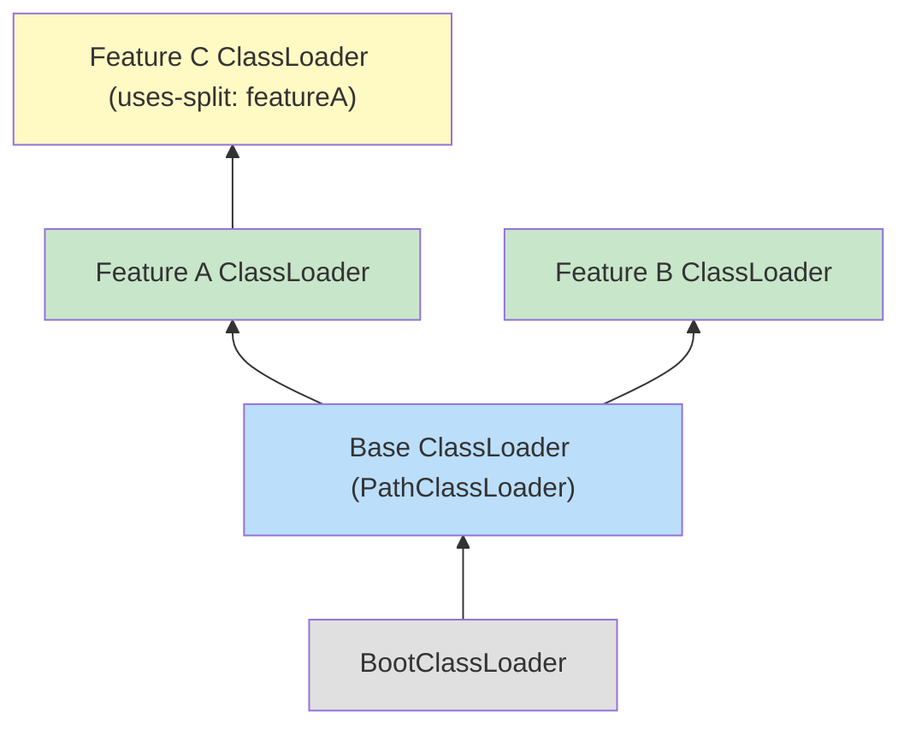

**Construction algorithm** (simplified):

```java
void constructSplit(int splitIdx, int[] configSplitIndices, int parentSplitIdx) {
    if (splitIdx == 0) {
        // Base: use the app's main ClassLoader
        mCachedClassLoaders[0] = mClassLoader;
        mCachedResourcePaths[0] = [config split paths for base];
        return;
    }

    // Get parent's ClassLoader (always valid at this point)
    ClassLoader parent = mCachedClassLoaders[parentSplitIdx];

    // Create new ClassLoader with parent chain
    mCachedClassLoaders[splitIdx] = ApplicationLoaders.getDefault().getClassLoader(
        mSplitAppDirs[splitIdx - 1],  // DEX path for this split
        targetSdkVersion,
        false, null, null,
        parent,                         // Parent ClassLoader
        mSplitClassLoaderNames[splitIdx - 1]  // Custom classloader name
    );

    // Resource paths = parent's paths + this split's path + config split paths
    mCachedResourcePaths[splitIdx] = [
        ...mCachedResourcePaths[parentSplitIdx],
        mSplitResDirs[splitIdx - 1],
        ...config split resource dirs
    ];
}
```

### 7.5 Component Dispatch with Splits

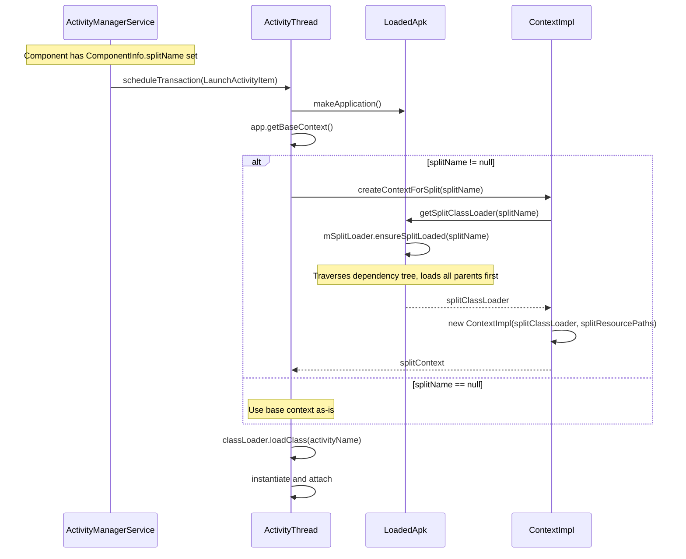

### 7.6 How Each Component Type Handles Splits

#### Activities
Source: `ContextImpl.createActivityContext()` (line 3618) called from `ActivityThread.performLaunchActivity()` (line 4335)

Unlike other components, Activity split handling happens inside `ContextImpl.createActivityContext()` rather than in `ActivityThread` directly:

```java
// ContextImpl.java line 3626
if (packageInfo.getApplicationInfo().requestsIsolatedSplitLoading()) {
    classLoader = packageInfo.getSplitClassLoader(activityInfo.splitName);
    splitDirs = packageInfo.getSplitPaths(activityInfo.splitName);
}
```

The Activity is instantiated using the split's ClassLoader and given a Context with the split's resources. The split-aware ClassLoader and resource paths are wired into the `ContextImpl` before it is passed to the Activity.

#### Services
Source: `ActivityThread.java` - `handleCreateService()` (line 5505)

```java
// Line 5518
if (data.info.splitName != null) {
    cl = packageInfo.getSplitClassLoader(data.info.splitName);
}
// Line 5527
if (data.info.splitName != null) {
    context = (ContextImpl) context.createContextForSplit(data.info.splitName);
}
```

#### Broadcast Receivers
Source: `ActivityThread.java` - `handleReceiver()` (line 5244, split handling at line 5261)

```java
if (data.info.splitName != null) {
    context = (ContextImpl) context.createContextForSplit(data.info.splitName);
}
java.lang.ClassLoader cl = context.getClassLoader();
receiver = packageInfo.getAppFactory().instantiateReceiver(cl, data.info.name, data.intent);
```

#### Content Providers
Source: `ActivityThread.java` (around line 8939)

```java
if (info.splitName != null) {
    c = c.createContextForSplit(info.splitName);
}
```

### 7.7 createContextForSplit Implementation

Source: `ContextImpl.java:2962`

```java
public Context createContextForSplit(String splitName) throws NameNotFoundException {
    if (!mPackageInfo.getApplicationInfo().requestsIsolatedSplitLoading()) {
        return this;  // No-op if isolated splits not enabled
    }

    final ClassLoader classLoader = mPackageInfo.getSplitClassLoader(splitName);
    final String[] paths = mPackageInfo.getSplitPaths(splitName);

    // Create new ContextImpl with split-specific ClassLoader
    final ContextImpl context = new ContextImpl(this, mMainThread, mPackageInfo, mParams,
            ..., splitName, ..., classLoader, null, ...);

    // Create Resources with split-specific resource paths
    context.setResources(ResourcesManager.getInstance().getResources(
            mToken, mPackageInfo.getResDir(), paths, ...));

    return context;
}
```

---

## 8. Dependency Tree System

### 8.1 Data Structure

The dependency tree is stored as `SparseArray<int[]>` where:
- **Key**: Split index (0 = base, 1+ = splits offset by 1)
- **Value**: Array of dependencies where:
  - `[0]` = Parent split index (feature dependency via `<uses-split>`, or -1 for base)
  - `[1..N]` = Config split indices (leaf dependencies via `configForSplit`)

### 8.2 Tree Construction

Source: `SplitDependencyLoader.createDependenciesFromPackage()` (line 161)

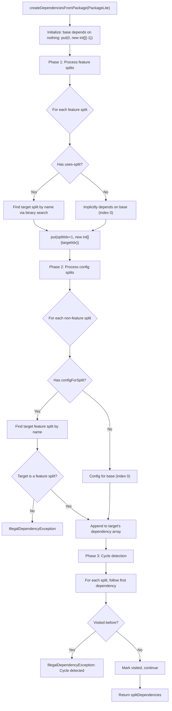

### 8.3 Dependency Tree Example

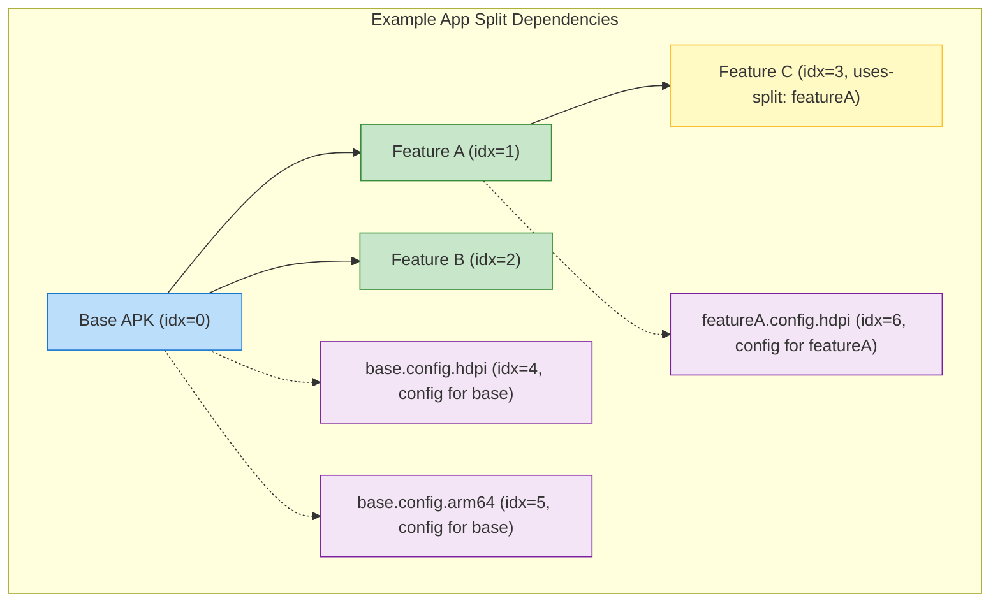

**Resulting `SparseArray<int[]>`:**

| Key (splitIdx) | Value (deps) | Meaning |
|----------------|-------------|---------|
| 0 (base) | [-1, 4, 5] | No parent; config splits: base.hdpi, base.arm64 |
| 1 (featureA) | [0, 6] | Parent: base; config split: featureA.hdpi |
| 2 (featureB) | [0] | Parent: base; no config splits |
| 3 (featureC) | [1] | Parent: featureA; no config splits |

### 8.4 Dependency Loading Algorithm

Source: `SplitDependencyLoader.loadDependenciesForSplit()` (line 61)

```
loadDependenciesForSplit(splitIdx=3):  // Loading Feature C
  1. Check: is split 3 cached? No -> continue
  2. Build linear dependency chain (leaf to root):
     - Start: [3]  (Feature C)
     - Follow deps[0]: split 3 depends on split 1 (Feature A)
     - Is split 1 cached? No -> add: [3, 1]
     - Follow deps[0]: split 1 depends on split 0 (Base)
     - Is split 0 cached? No -> add: [3, 1, 0]
     - Split 0 deps[0] = -1 -> stop
  3. Visit right-to-left (root to leaf):
     - constructSplit(0, configSplits=[4,5], parentIdx=-1)  // Build Base
     - constructSplit(1, configSplits=[6], parentIdx=0)      // Build Feature A
     - constructSplit(3, configSplits=[], parentIdx=1)        // Build Feature C
```

---

## 9. Android App Bundle (AAB) and Split APKs

### 9.1 Relationship Overview

The Android App Bundle (`.aab`) and Split APKs are two sides of the same coin. The AAB is the **publishing format** that developers upload; Split APKs are the **delivery format** that devices receive and install. The AOSP framework only knows about Split APKs -- it has no concept of AABs at runtime.

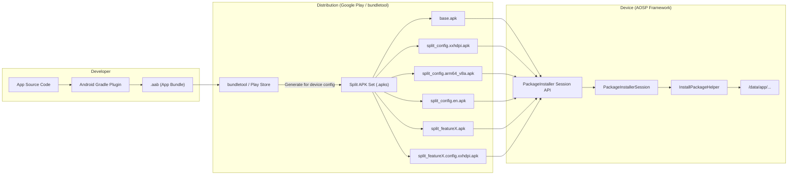

### 9.2 AAB Structure vs Split APK Structure

An AAB is essentially a structured ZIP containing **modules**, each of which maps to one or more split APKs when delivered to a device.

```mermaid
graph TB
    subgraph "Android App Bundle (.aab)"
        direction TB
        BASE_MOD["base/ module"]
        BASE_MOD --> B_MANIFEST["manifest/AndroidManifest.xml"]
        BASE_MOD --> B_DEX["dex/classes.dex"]
        BASE_MOD --> B_RES["res/ (all densities, all languages)"]
        BASE_MOD --> B_NATIVE["lib/ (all ABIs)"]
        BASE_MOD --> B_ASSETS["assets/"]

        FEAT_MOD["featureX/ module"]
        FEAT_MOD --> F_MANIFEST["manifest/AndroidManifest.xml"]
        FEAT_MOD --> F_DEX["dex/classes.dex"]
        FEAT_MOD --> F_RES["res/"]

        BUNDLE_META["BundleConfig.pb"]
    end

    subgraph "Generated Split APKs (for a specific device)"
        direction TB
        S_BASE["base.apk (code + default resources)"]
        S_CFG_D["split_config.xxhdpi.apk (density resources)"]
        S_CFG_A["split_config.arm64_v8a.apk (native libs)"]
        S_CFG_L["split_config.en.apk (language strings)"]
        S_FEAT["split_featureX.apk (feature code + default res)"]
        S_FEAT_D["split_featureX.config.xxhdpi.apk (feature density)"]
    end

    BASE_MOD ==>|"bundletool generates"| S_BASE
    BASE_MOD ==>|"split by density"| S_CFG_D
    BASE_MOD ==>|"split by ABI"| S_CFG_A
    BASE_MOD ==>|"split by language"| S_CFG_L
    FEAT_MOD ==>|"becomes feature split"| S_FEAT
    FEAT_MOD ==>|"split by density"| S_FEAT_D
```

| Concept | AAB (Publishing) | Split APK (Device) |
|---------|-----------------|-------------------|
| Format | Protocol Buffer (.pb) resources | Standard APK (ZIP + binary XML) |
| Modules | `base/`, `featureX/` directories | `base.apk`, `split_featureX.apk` |
| Resources | All configurations bundled | Split by density/ABI/language |
| Native libs | All ABIs included | Only device-matching ABI |
| Signing | Upload key (re-signed by Play) | Final distribution key |
| Manifest | Proto format | Binary XML format |

### 9.3 How bundletool Generates Split APKs

The `bundletool` (external to AOSP) converts an AAB into split APKs. The key transformation rules that the AOSP framework expects:

#### Split Naming Convention

bundletool generates split names that follow the pattern the AOSP parser expects:

| Split Type | Generated `split` Attribute | Example Filename |
|-----------|---------------------------|-----------------|
| Base | *(none)* | `base.apk` |
| Feature | `featureX` | `split_featureX.apk` |
| Base config (density) | `config.xxhdpi` | `split_config.xxhdpi.apk` |
| Base config (ABI) | `config.arm64_v8a` | `split_config.arm64_v8a.apk` |
| Base config (language) | `config.en` | `split_config.en.apk` |
| Feature config | `featureX.config.xxhdpi` | `split_featureX.config.xxhdpi.apk` |

The AOSP framework canonicalizes filenames via `ApkLiteParseUtils.splitNameToFileName()` (line 328):
```java
final String fileName = apk.getSplitName() == null
    ? "base" : "split_" + apk.getSplitName();
return fileName + ".apk";
```

#### Manifest Attributes Generated by bundletool

For a **base APK**:
```xml
<manifest package="com.example.app"
    android:versionCode="42"
    android:isSplitRequired="true"
    android:requiredSplitTypes="density,abi,language"
    android:isolatedSplits="true">
```

For a **config split for the base** (e.g., density — `configForSplit` absent means it targets the base):
```xml
<manifest package="com.example.app"
    split="config.xxhdpi"
    android:splitTypes="density">
```

For a **config split for a feature** (e.g., density for featureA):
```xml
<manifest package="com.example.app"
    split="featureA.config.xxhdpi"
    configForSplit="featureA"
    android:splitTypes="density">
```

For a **feature split**:
```xml
<manifest package="com.example.app"
    split="featureX"
    android:isFeatureSplit="true">
    <uses-split android:name="featureY" />  <!-- if depends on another feature -->
    <application android:hasCode="true">
        <activity android:name=".FeatureActivity" />
    </application>
</manifest>
```

For a **feature's config split**:
```xml
<manifest package="com.example.app"
    split="featureX.config.xxhdpi"
    configForSplit="featureX"
    android:splitTypes="density">
</manifest>
```

### 9.4 requiredSplitTypes and splitTypes -- The AAB Contract

The `requiredSplitTypes` / `splitTypes` mechanism is the formal contract between AAB-generated APKs and the AOSP installation validator.

Source: `attrs_manifest.xml` (lines 1304-1318)

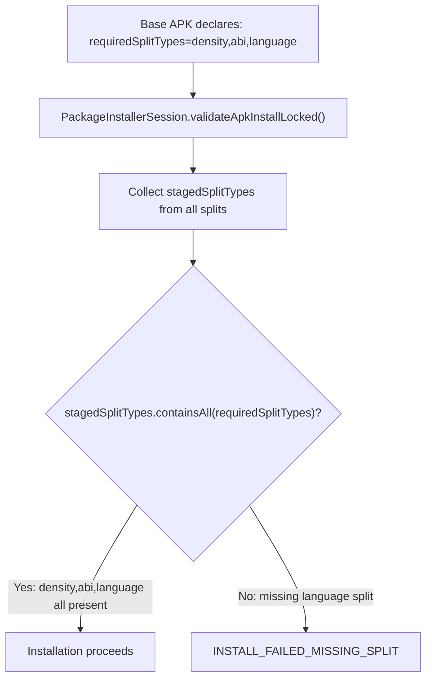

**How it works:**

1. **Base APK** declares `android:requiredSplitTypes="density,abi,language"` -- types that **must** be present
2. **Each config split** declares `android:splitTypes="density"` (or `"abi"`, `"language"`) -- types it **provides**
3. During installation, `PackageInstallerSession.validateApkInstallLocked()` (line 4700) verifies:
   ```java
   if (baseApk.isSplitRequired() && (stagedSplits.size() <= 1
           || !stagedSplitTypes.containsAll(requiredSplitTypes))) {
       throw new PackageManagerException(INSTALL_FAILED_MISSING_SPLIT,
               "Missing split for " + mPackageName);
   }
   ```

This prevents installation of an AAB-based app without the required resource splits, which would cause runtime crashes from missing resources.

### 9.5 AAB Dynamic Feature Modules and Feature Splits

AAB dynamic feature modules map directly to AOSP feature splits:

| AAB Dynamic Feature | AOSP Feature Split |
|---------------------|-------------------|
| `build.gradle`: `plugins { id 'com.android.dynamic-feature' }` | Manifest: `android:isFeatureSplit="true"` |
| Gradle `dependencies { implementation project(':base') }` | Manifest: `<uses-split android:name="base_feature"/>` or implicit base dependency |
| On-demand delivery via Play Core `SplitInstallManager` | Installed via `PackageInstaller` session with `MODE_INHERIT_EXISTING` |
| Instant-enabled module | Feature split delivered to Instant App runtime |

**On-demand delivery flow:**

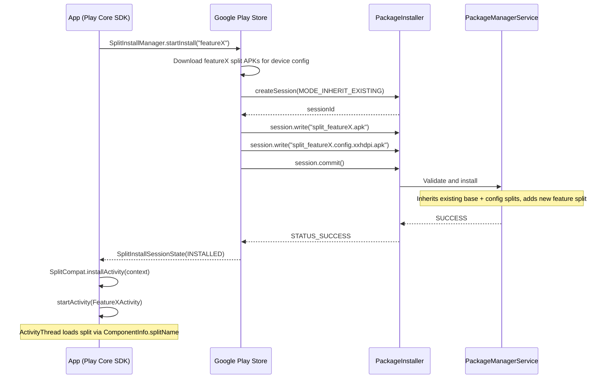

**Key difference**: The on-demand delivery and `SplitInstallManager` API are part of Google Play Services / Play Core SDK, **not** part of AOSP. AOSP only provides the underlying `PackageInstaller` session API that Play uses. The framework handles the incremental split installation via `MODE_INHERIT_EXISTING`.

### 9.6 aapt2's Role in the Build Pipeline

`aapt2` (in AOSP) supports the AAB workflow through two key features:

**1. Proto format output for bundletool** (`aapt2 link --proto-format`):

Source: `frameworks/base/tools/aapt2/cmd/Link.h` (line 233-236)
```
--proto-format    Generates compiled resources in Protobuf format.
                  Suitable as input to the bundle tool for generating an App Bundle.
```

The Gradle plugin invokes `aapt2 link --proto-format` to produce proto-format resource tables that bundletool packages into the AAB.

**2. Resource table splitting** (`aapt2 link --split`):

Source: `frameworks/base/tools/aapt2/cmd/Link.h` (line 318-322)
```
--split  Split resources matching a set of configs out to a Split APK.
         Syntax: path/to/output.apk:<config>[,<config>[...]]
```

The `TableSplitter` class (`frameworks/base/tools/aapt2/split/TableSplitter.h`) splits resource tables based on `SplitConstraints` (configuration filters like density, locale). This is used both directly and by bundletool to generate config splits.

### 9.7 End-to-End: From Source Code to Running on Device

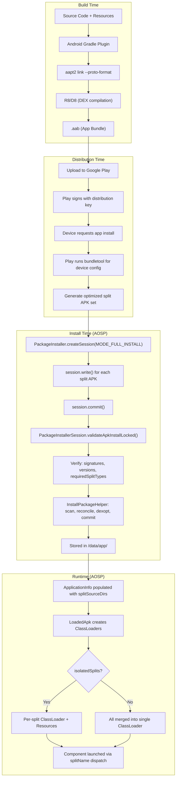

### 9.8 What AOSP Knows vs What It Does Not

| Aspect | AOSP Framework Handles | External to AOSP (Play / bundletool) |
|--------|----------------------|--------------------------------------|
| **Format** | Split APKs (standard APK format) | AAB (protobuf + ZIP) |
| **Parsing** | `ApkLiteParseUtils`, `ParsingPackageUtils` | bundletool AAB parser |
| **Splitting logic** | aapt2 `TableSplitter` (resource splitting) | bundletool config split generation |
| **Dependency tree** | `SplitDependencyLoader.createDependenciesFromPackage()` | bundletool module dependency resolution |
| **Installation** | `PackageInstallerSession`, `InstallPackageHelper` | Play Store orchestration |
| **Validation** | Signature, version, requiredSplitTypes | AAB format validation, upload checks |
| **On-demand delivery** | `MODE_INHERIT_EXISTING` session API | `SplitInstallManager` (Play Core SDK) |
| **ClassLoading** | `LoadedApk.SplitDependencyLoaderImpl` | N/A (framework-only) |
| **SplitCompat** | N/A (not in AOSP) | Play Core SDK emulates split loading for older APIs |

The AOSP framework is intentionally **agnostic** to AABs. It provides the low-level primitives (session-based install, split validation, isolated classloading) that any distribution system -- Google Play, alternative stores, or `adb` -- can use to deliver and install split APKs.

---

## 10. On-Disk Storage

### 10.1 Installed Package Directory Structure

```
/data/app/~~<random>/com.example.app-<random>/
    base.apk                        # Base APK
    split_featureA.apk              # Feature split A
    split_featureB.apk              # Feature split B
    split_featureA.config.hdpi.apk  # Config split for featureA
    split_config.arm64_v8a.apk      # ABI config split for base
    split_config.en.apk             # Language config split for base
    lib/
        arm64/                      # ISA-specific subdirectory
            libnative.so            # Extracted native libraries
    oat/
        arm64/                      # ISA-specific subdirectory
            base.odex               # Ahead-of-time compiled base
            base.vdex               # Verified DEX for base
            split_featureA.odex     # AOT compiled feature A
            split_featureA.vdex     # Verified DEX for feature A
```

#### How the Final Path Is Constructed

Source: `PackageManagerServiceUtils.java` - `getNextCodePath()` (line 1139)

The two-level random directory structure is built using `SecureRandom` and Base64 encoding:

```java
// PackageManagerServiceUtils.java:1139-1169
public static File getNextCodePath(File targetDir, String packageName) {
    SecureRandom random = new SecureRandom();
    byte[] bytes = new byte[16];

    // First level: ~~<random>
    File firstLevelDir;
    do {
        random.nextBytes(bytes);
        String firstLevelDirName = RANDOM_DIR_PREFIX   // "~~"
                + Base64.encodeToString(bytes, Base64.URL_SAFE | Base64.NO_WRAP);
        firstLevelDir = new File(targetDir, firstLevelDirName);
    } while (firstLevelDir.exists());

    // Second level: <packageName>-<random>
    random.nextBytes(bytes);
    String dirName = packageName + RANDOM_CODEPATH_PREFIX  // '-'
            + Base64.encodeToString(bytes, Base64.URL_SAFE | Base64.NO_WRAP);
    return new File(firstLevelDir, dirName);
}
```

The prefix constants are defined in `PackageManagerService.java` (lines 568-569):
```java
static final String RANDOM_DIR_PREFIX = "~~";
static final char RANDOM_CODEPATH_PREFIX = '-';
```

The target directory resolves to `/data/app` via `Environment.getDataAppDirectory()` (Environment.java:600).

### 10.2 Staging Directory Lifecycle

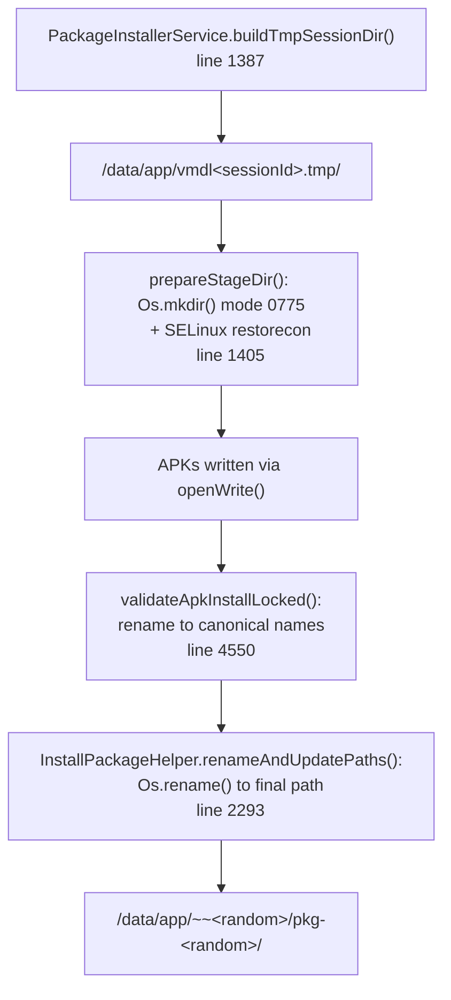

#### Stage 1: Staging Directory Creation

Source: `PackageInstallerService.java` - `buildTmpSessionDir()` (line 1387)

```java
// PackageInstallerService.java:1387-1389
private File buildTmpSessionDir(int sessionId, String volumeUuid) {
    final File sessionStagingDir = getTmpSessionDir(volumeUuid);  // /data/app
    return new File(sessionStagingDir, "vmdl" + sessionId + ".tmp");
}
```

The staging directory is prepared with `prepareStageDir()` (line 1405), which creates the directory with mode `0775` and applies SELinux context via `SELinux.restorecon()`.

#### Stage 2: APK File Rename to Canonical Names

Source: `PackageInstallerSession.java` - `validateApkInstallLocked()` (lines 4550-4571)

During validation, each APK is renamed to its canonical name using `splitNameToFileName()`:

```java
// PackageInstallerSession.java:4550-4571
final String targetName = ApkLiteParseUtils.splitNameToFileName(apk);
final File targetFile = new File(stageDir, targetName);
resolveAndStageFileLocked(sourceFile, targetFile, apk.getSplitName(), ...);
```

This produces:
- Base APK → `base.apk`
- Split APK → `split_<splitName>.apk`

The naming logic is in `ApkLiteParseUtils.splitNameToFileName()` (line 328):
```java
final String fileName = apk.getSplitName() == null ? "base" : "split_" + apk.getSplitName();
return fileName + APK_FILE_EXTENSION;
```

#### Stage 3: Atomic Rename to Final Path

Source: `InstallPackageHelper.java` - `renameAndUpdatePaths()` (lines 2293-2314)

The staging directory is atomically renamed to the final install path via `Os.rename()`:

```java
// InstallPackageHelper.java:2293-2314
final File targetDir = resolveTargetDir(request.getInstallFlags(), request.getCodeFile());
final File afterCodeFile = PackageManagerServiceUtils.getNextCodePath(
        targetDir, parsedPackage.getPackageName());
makeDirRecursive(afterCodeFile.getParentFile(), 0771);
Os.rename(beforeCodeFile.getAbsolutePath(), afterCodeFile.getAbsolutePath());
```

This is an atomic operation: the entire `vmdl<sessionId>.tmp/` directory becomes `~~<random>/<packageName>-<random>/` in a single filesystem rename.

### 10.3 Native Library Extraction

Source: `PackageAbiHelperImpl.java` - `derivePackageAbi()` (line 349)

For cluster installs (split APKs), native libraries are extracted into ISA-specific subdirectories:

```java
// PackageAbiHelperImpl.java:206-218
// Cluster install
nativeLibraryRootDir = new File(codeFile, LIB_DIR_NAME).getAbsolutePath();
nativeLibraryRootRequiresIsa = true;
nativeLibraryDir = new File(nativeLibraryRootDir,
        getPrimaryInstructionSet(abis)).getAbsolutePath();
```

The actual extraction is performed by `NativeLibraryHelper` (NativeLibraryHelper.java):

| Method | Line | Description |
|--------|------|-------------|
| `copyNativeBinaries()` | 216 | Calls native code to extract `.so` files from APK into target dir |
| `copyNativeBinariesForSupportedAbi()` | 338 | Finds best ABI, creates subdirs, copies libraries |
| `copyNativeBinariesWithOverride()` | 391 | Handles multi-arch vs single-arch extraction |

The directory constants are defined as:
```java
// NativeLibraryHelper.java:67-68
public static final String LIB_DIR_NAME = "lib";
public static final String LIB64_DIR_NAME = "lib64";
```

For multi-arch apps, both 32-bit and 64-bit libraries are extracted into separate ISA-specific subdirectories (e.g., `lib/arm64/`, `lib/arm/`).

### 10.4 DEX Optimization Output

Source: `DexOptHelper.java` - `dexoptPackageUsingArtService()` (line 350)

After installation, DEX bytecode is ahead-of-time compiled via the ART Service:

```java
// DexOptHelper.java:350-382
DexoptParams params = getDexoptParamsByInstallRequest(installRequest);
return getArtManagerLocal().dexoptPackage(snapshot, ps.getPackageName(), params);
```

The ART daemon (`artd`) produces `.odex` and `.vdex` files. Their location is determined by `AidlUtils.buildArtifactsPath()` (AidlUtils.java:36):

| Scenario | Output Path |
|----------|-------------|
| User-installed apps (`isInDalvikCache=false`) | `<packageDir>/oat/<isa>/<apkName>.{odex,vdex}` |
| System apps (`isInDalvikCache=true`) | `/data/dalvik-cache/<isa>/<encoded-path>.{odex,vdex}` |

The `oat/` directory and its ISA subdirectories are created by `Installer.createOatDirs()` (Installer.java:594), which delegates to `installd`:

```java
// Installer.java:594-603
public void createOatDirs(String packageName, String oatDir, List<String> oatSubDirs) {
    mInstalld.createOatDirs(packageName, oatDir, oatSubDirs);
}
```

During partial (inherit) installs, oat directories are pre-created for hard linking existing artifacts (`PackageInstallerSession.java:3874`).

### 10.5 Per-User Data Directories

Each installed package gets credential-encrypted (CE) and device-encrypted (DE) data directories per user:

```
/data/user/<userId>/<packageName>/          # CE storage (available after user unlock)
/data/user_de/<userId>/<packageName>/       # DE storage (available at boot)
```

Source: `Environment.java` (lines 92, 100):
```java
public static final String DIR_USER_CE = "user";       // /data/user/<userId>/
public static final String DIR_USER_DE = "user_de";    // /data/user_de/<userId>/
```

These directories are created by `AppDataHelper.prepareAppData()` (AppDataHelper.java:215), which calls through to `installd` via `Installer.createAppData()`. The CE/DE data directory inodes are stored in `PackageSetting` for quick access.

User storage directories are first set up by `UserDataPreparer.prepareUserData()` (UserDataPreparer.java:72) when a user is created, and per-app directories are created within them during package installation.

### 10.6 Package Metadata Persistence

Split APK metadata is persisted across reboots in `/data/system/packages.xml`.

Source: `Settings.java` (line 746):
```java
mSettingsFilename = new File(mSystemDir, "packages.xml");
```

#### What Is Stored

`Settings.writePackageLPr()` (line 3258) serializes each package with these key attributes:

| Attribute | Description |
|-----------|-------------|
| `name` | Package name (line 3262) |
| `codePath` | Full install path, e.g., `/data/app/~~abc/com.example-xyz` (line 3266) |
| `nativeLibraryPath` | Path to extracted native libraries (line 3269) |
| `primaryCpuAbi` | Primary ABI (line 3272) |
| `version` | Version code (line 3285) |

Split-specific metadata is written by `writeSplitVersionsLPr()` (line 4640):

```java
// Settings.java:4640-4654
private void writeSplitVersionsLPr(TypedXmlSerializer serializer,
        String[] splitNames, int[] splitRevisionCodes) throws IOException {
    for (int i = 0; i < libLength; i++) {
        serializer.startTag(null, TAG_SPLIT_VERSION);
        serializer.attribute(null, ATTR_NAME, splitNames[i]);
        serializer.attributeInt(null, ATTR_VERSION, splitRevisionCodes[i]);
        serializer.endTag(null, TAG_SPLIT_VERSION);
    }
}
```

#### Boot-Time Reconstruction

On boot, the system reads `codePath` from `packages.xml`, then re-parses the APK cluster directory using `ApkLiteParseUtils.parseClusterPackageLite()` to discover `base.apk` and all `split_*.apk` files. Split names, code paths, dependencies, and revision codes are all reconstructed from the on-disk APK manifests. `readSplitVersionsLPw()` (line 4612) reads persisted split revision codes to verify consistency.

### 10.7 ApplicationInfo Fields for Splits

Source: `ApplicationInfo.java`

| Field | Type | Description |
|-------|------|-------------|
| `splitNames` | `String[]` | Ordered array of split names (line 1001) |
| `splitSourceDirs` | `String[]` | Full paths to split APKs, indexed same as `splitNames` (line 1008) |
| `splitPublicSourceDirs` | `String[]` | Public resource paths for splits (line 1019) |
| `splitDependencies` | `SparseArray<int[]>` | Dependency tree (line 1044) |
| `splitClassLoaderNames` | `String[]` | Custom ClassLoader names per split (line 1565) |

### 10.8 Complete Installation Storage Overview

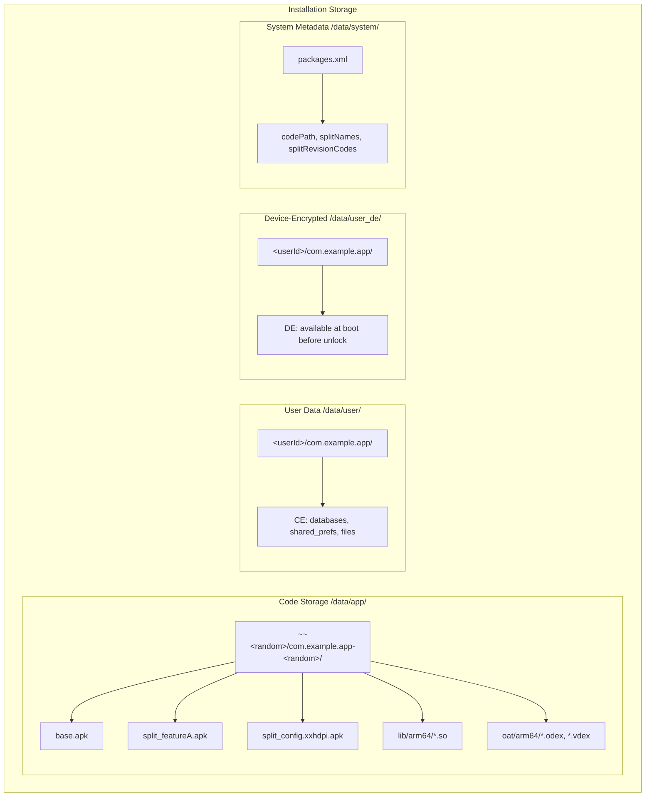

---

## 11. Key Source Files Reference

### Parsing Layer

| File | Path | Role |
|------|------|------|
| `ApkLiteParseUtils` | `frameworks/base/core/java/android/content/pm/parsing/ApkLiteParseUtils.java` | Lightweight APK parsing, cluster package discovery |
| `ApkLite` | `frameworks/base/core/java/android/content/pm/parsing/ApkLite.java` | Data class for lightweight APK metadata |
| `PackageLite` | `frameworks/base/core/java/android/content/pm/parsing/PackageLite.java` | Data class for package-level metadata (base + splits) |
| `ParsingPackageUtils` | `frameworks/base/core/java/com/android/internal/pm/pkg/parsing/ParsingPackageUtils.java` | Full package parsing, split manifest parsing |
| `SplitDependencyLoader` | `frameworks/base/core/java/android/content/pm/split/SplitDependencyLoader.java` | Abstract dependency tree traversal |

### Asset Loading Layer

| File | Path | Role |
|------|------|------|
| `SplitAssetLoader` | `frameworks/base/core/java/com/android/internal/pm/split/SplitAssetLoader.java` | Interface for split asset loading |
| `DefaultSplitAssetLoader` | `frameworks/base/core/java/com/android/internal/pm/split/DefaultSplitAssetLoader.java` | Loads all splits into single AssetManager |
| `SplitAssetDependencyLoader` | `frameworks/base/core/java/com/android/internal/pm/split/SplitAssetDependencyLoader.java` | Per-split AssetManager for isolated loading |

### Installation Layer

| File | Path | Role |
|------|------|------|
| `PackageInstallerSession` | `frameworks/base/services/core/java/com/android/server/pm/PackageInstallerSession.java` | Session management, APK validation, seal/commit |
| `InstallPackageHelper` | `frameworks/base/services/core/java/com/android/server/pm/InstallPackageHelper.java` | 6-phase install orchestrator |
| `PackageManagerShellCommand` | `frameworks/base/services/core/java/com/android/server/pm/PackageManagerShellCommand.java` | `pm install` / `adb install` CLI handler |
| `PackageManagerService` | `frameworks/base/services/core/java/com/android/server/pm/PackageManagerService.java` | Central package management service |

### Runtime Layer

| File | Path | Role |
|------|------|------|
| `LoadedApk` | `frameworks/base/core/java/android/app/LoadedApk.java` | ClassLoader creation, split dependency loading |
| `ActivityThread` | `frameworks/base/core/java/android/app/ActivityThread.java` | Component launching with split context |
| `ContextImpl` | `frameworks/base/core/java/android/app/ContextImpl.java` | `createContextForSplit()` implementation |
| `ApplicationInfo` | `frameworks/base/core/java/android/content/pm/ApplicationInfo.java` | Split metadata fields |
| `ComponentInfo` | `frameworks/base/core/java/android/content/pm/ComponentInfo.java` | `splitName` field for component dispatch |
| `ResourcesManager` | `frameworks/base/core/java/android/app/ResourcesManager.java` | Resource loading for split contexts |

---

*Report generated from AOSP source analysis. All file paths and line numbers reference the AOSP main branch.*
