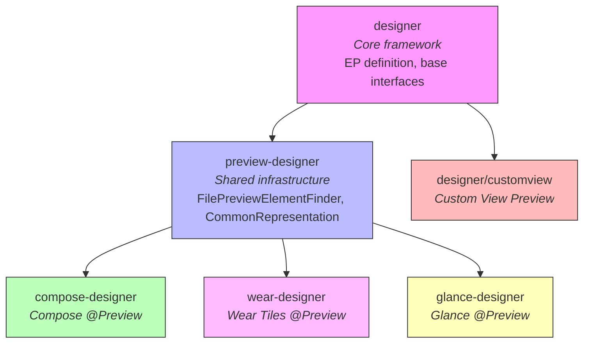
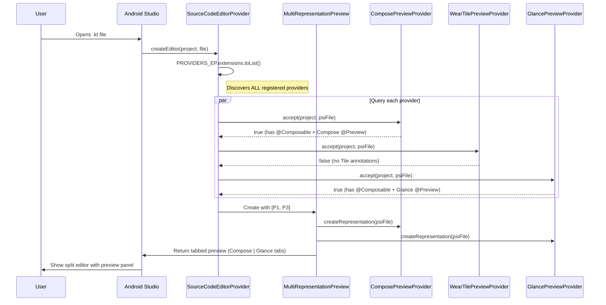
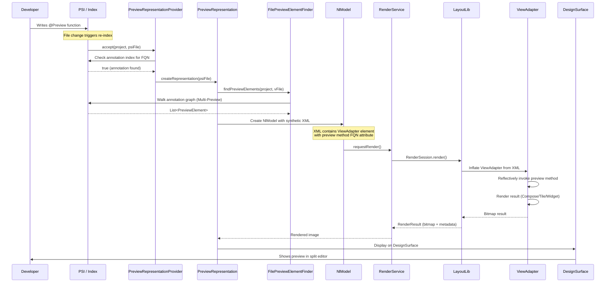
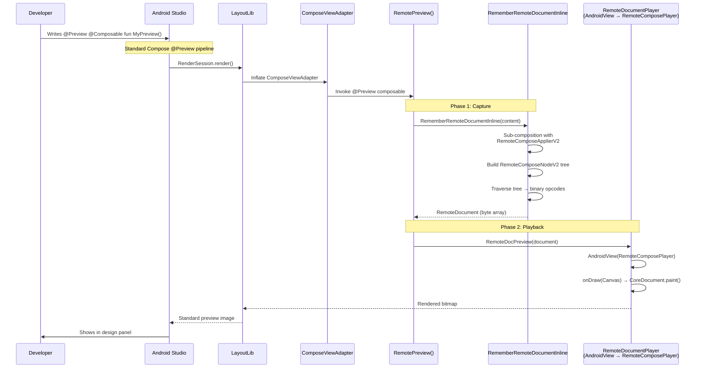

Android Studio's design panel is not a monolithic system. It is a pluggable framework where each UI technology (Compose, Wear Tiles, Glance AppWidgets, Custom Views) registers its own "designer module" via IntelliJ extension points.

This post uses Wear Tiles and Glance AppWidgets as case studies to show how new Compose-based platforms expand the designer and tooling infrastructure, on both the Android Studio (IDE) side and the AndroidX (library) side. A final section covers Remote Compose, which extends Compose preview without adding a designer module at all.

One thing worth stating up front: non-Google developers can add custom designers to Android Studio without modifying its source code. The extension point architecture is public, stable (unchanged since 2019), and Google's own designers use it the same way an external plugin would.

---

## Designer module organization (Android Studio side)

### Directory structure

All designer modules live under `studio-main/tools/adt/idea/`:

```
tools/adt/idea/
├── designer/                  # Core framework — extension points, base classes
│   ├── src/.../multirepresentation/
│   │   ├── PreviewRepresentationProvider.kt    # Master interface
│   │   ├── PreviewRepresentation.kt            # Representation interface
│   │   ├── MultiRepresentationPreview.kt       # Container that queries providers
│   │   └── sourcecode/
│   │       └── SourceCodeEditorProvider.kt     # Auto-discovery via EP
│   ├── customview/            # Custom View preview (sub-module)
│   └── resources/META-INF/designer.xml         # EP definition (line 72)
│
├── preview-designer/          # Shared preview infrastructure
│   └── src/.../preview/
│       ├── find/FilePreviewElementFinder.kt    # Annotation finder interface
│       └── representation/CommonRepresentationEditorFileType.kt
│
├── compose-designer/          # Compose @Preview
│   ├── src/.../ComposePreviewRepresentationProvider.kt
│   ├── src/.../AnnotationFilePreviewElementFinder.kt
│   └── resources/META-INF/compose-designer.xml
│
├── wear-designer/             # Wear Tiles @Preview
│   ├── src/.../WearTilePreviewRepresentationProvider.kt
│   ├── src/.../WearTilePreviewElementFinder.kt
│   └── resources/META-INF/wear-designer.xml
│
└── glance-designer/           # Glance @Preview
    ├── src/.../AppWidgetPreviewRepresentationProvider.kt
    ├── src/.../GlancePreviewElementFinder.kt
    └── resources/META-INF/glance-designer.xml
```

### Module dependency graph



### What each module provides

| Module | Role |
|--------|------|
| `designer` | Defines the `sourceCodePreviewRepresentationProvider` extension point, `PreviewRepresentationProvider` and `PreviewRepresentation` interfaces, `SourceCodeEditorProvider` (auto-discovery), `MultiRepresentationPreview` (container), `DesignSurface`, `NlModel` |
| `preview-designer` | Shared infrastructure: `FilePreviewElementFinder<T>`, `CommonRepresentationEditorFileType`, `InMemoryLayoutVirtualFile`, common toolbar actions, preview element model |
| `compose-designer` | `ComposePreviewRepresentationProvider`, `AnnotationFilePreviewElementFinder`, Compose-specific toolbar (interactive preview, animation inspector, UI check), run configurations |
| `wear-designer` | `WearTilePreviewRepresentationProvider`, `WearTilePreviewElementFinder`, Wear-specific lint inspections (signature validation, annotation checks) |
| `glance-designer` | `AppWidgetPreviewRepresentationProvider`, `AppWidgetPreviewElementFinder`, Glance-specific lint inspections |
| `designer/customview` | `CustomViewPreviewRepresentationProvider` for Android custom Views |

---

## Extension point architecture

### The master extension point

Defined in `designer.xml:70-74`:

```xml
<!-- Collects all the providers for source code preview representations -->
<extensionPoints>
  <extensionPoint
    qualifiedName="com.android.tools.idea.uibuilder.editor.multirepresentation.sourcecode.sourceCodePreviewRepresentationProvider"
    interface="com.android.tools.idea.uibuilder.editor.multirepresentation.PreviewRepresentationProvider" />
</extensionPoints>
```

All designer modules register against this single extension point. Any IntelliJ/AS plugin can register an implementation.

### `PreviewRepresentationProvider` Interface

Defined in `designer/src/.../PreviewRepresentationProvider.kt`:

```kotlin
interface PreviewRepresentationProvider {
  /** A name associated with the representation */
  val displayName: RepresentationName

  /** Tells a client if the corresponding PreviewRepresentation is applicable for the input file. */
  suspend fun accept(project: Project, psiFile: PsiFile): Boolean

  /** Creates a corresponding PreviewRepresentation for the input file. */
  suspend fun createRepresentation(psiFile: PsiFile): PreviewRepresentation
}
```

Three methods. Implement this interface, register it in `plugin.xml`, and AS calls your provider whenever a source file is opened.

### `PreviewRepresentation` Interface

Defined in `designer/src/.../PreviewRepresentation.kt`:

```kotlin
interface PreviewRepresentation : Disposable {
  /** JComponent to display in the preview panel */
  val component: JComponent

  /** Preferred initial visibility (HIDDEN, SPLIT, or FULL) */
  val preferredInitialVisibility: PreferredVisibility?

  // Lifecycle
  fun onActivate() {}
  fun onDeactivate() {}

  // State persistence
  fun setState(state: PreviewRepresentationState) {}
  fun getState(): PreviewRepresentationState? = null

  // Navigation
  val caretNavigationHandler: CaretNavigationHandler

  // Misc
  fun updateNotifications(parentEditor: FileEditor) {}
  fun registerShortcuts(applicableTo: JComponent) {}
  suspend fun hasPreviews(): Boolean = true
  fun hasPreviewsCached() = true
}
```

The one that matters is `component: JComponent`. You provide a Swing component, AS embeds it in the split editor. Whatever you put in that JComponent is what the user sees.

### Auto-discovery mechanism

`SourceCodeEditorProvider.kt:58-60,88`:

```kotlin
private const val EP_NAME =
  "com.android.tools.idea.uibuilder.editor.multirepresentation.sourcecode.sourceCodePreviewRepresentationProvider"
private val PROVIDERS_EP = ExtensionPointName.create<PreviewRepresentationProvider>(EP_NAME)

// In constructor:
constructor() : this(PROVIDERS_EP.extensions.toList())
```

When any source file is opened, `SourceCodeEditorProvider`:
1. Loads ALL registered `PreviewRepresentationProvider` implementations via `PROVIDERS_EP.extensions.toList()`
2. Calls `accept(project, psiFile)` on each
3. For those that return `true`, calls `createRepresentation(psiFile)`
4. Wraps the result in a `MultiRepresentationPreview` (tabbed container if multiple match)

### Flow: file opened → preview shown



---

## How each designer registers

### Registration pattern (4-part)

Every designer follows the same pattern:

| Part | Compose | Wear Tiles | Glance | Custom View |
|------|---------|------------|--------|-------------|
| **1. Plugin XML** | `compose-designer.xml` | `wear-designer.xml` | `glance-designer.xml` | `customview.xml` |
| **2. Provider class** | `ComposePreviewRepresentationProvider` | `WearTilePreviewRepresentationProvider` | `AppWidgetPreviewRepresentationProvider` | `CustomViewPreviewRepresentationProvider` |
| **3. Element finder** | `AnnotationFilePreviewElementFinder` | `WearTilePreviewElementFinder` | `AppWidgetPreviewElementFinder` | (class-based, not annotation) |
| **4. ViewAdapter** | `ComposeViewAdapter` | `TileServiceViewAdapter` | `GlanceAppWidgetViewAdapter` | (direct View inflation) |

### Part 1: Plugin XML registration

All use the same XML pattern, registering against the `sourceCodePreviewRepresentationProvider` EP:

**Compose** (`compose-designer.xml:154-156`):
```xml
<extensions defaultExtensionNs="com.android.tools.idea.uibuilder">
  <editor.multirepresentation.sourcecode.sourceCodePreviewRepresentationProvider
      implementation="com.android.tools.idea.compose.preview.ComposePreviewRepresentationProvider"/>
</extensions>
```

**Wear** (`wear-designer.xml:17-19`):
```xml
<extensions defaultExtensionNs="com.android.tools.idea.uibuilder.editor.multirepresentation.sourcecode">
  <sourceCodePreviewRepresentationProvider
      implementation="com.android.tools.idea.wear.preview.WearTilePreviewRepresentationProvider"/>
</extensions>
```

**Glance** (`glance-designer.xml:17-19`):
```xml
<extensions defaultExtensionNs="com.android.tools.idea.uibuilder.editor.multirepresentation.sourcecode">
  <sourceCodePreviewRepresentationProvider
      implementation="com.android.tools.idea.glance.preview.AppWidgetPreviewRepresentationProvider"/>
</extensions>
```

Note: The namespace differs slightly (Compose uses the shorter `com.android.tools.idea.uibuilder` prefix because it also registers other extensions), but both resolve to the same EP.

### Part 2: `accept()` logic

| Provider | File type check | Module check | Annotation/class check | Feature flag |
|----------|----------------|--------------|----------------------|--------------|
| **Compose** | `.isKotlinFileType()` | `usesCompose == true` OR `@Composable` class in index | `KotlinFullClassNameIndex[COMPOSABLE_ANNOTATION_FQ_NAME]` | None |
| **Wear Tiles** | `.isSourceFileType()` (Kt + Java) | `isAndroidModule()` | `hasPreviewElements()` → scans for methods with `TilePreviewData` return type + `@Preview` from `androidx.wear.tiles.tooling.preview` | `StudioFlags.WEAR_TILE_PREVIEW` |
| **Glance** | `.isKotlinFileType()` | `isAndroidModule()` | `hasPreviewElements()` → finds `@Composable` methods with `@Preview` from `androidx.glance.preview` | `StudioFlags.GLANCE_APP_WIDGET_PREVIEW` |

A few things to note: Compose has no feature flag and is always enabled, while Wear and Glance are gated behind `StudioFlags`. Wear Tiles is the only one that supports Java (`.isSourceFileType()`); Compose and Glance are Kotlin-only. All three `accept()` methods are `suspend`, so providers can do index lookups without blocking the EDT.

### Part 3: Annotation FQNs

| Designer | Annotation FQN | Short Name | Package |
|----------|---------------|------------|---------|
| **Compose** | `androidx.compose.ui.tooling.preview.Preview` | `Preview` | `compose/ui/ui-tooling-preview` |
| **Wear Tiles** | `androidx.wear.tiles.tooling.preview.Preview` | `Preview` | `wear/tiles/tiles-tooling-preview` |
| **Glance** | `androidx.glance.preview.Preview` | `Preview` | `glance/glance-preview` |

They all share the short name `Preview` and are disambiguated by FQN. The element finders scan Kotlin/Java annotation indices for these specific qualified names.

### Part 4: ViewAdapters (rendering bridge)

| Designer | ViewAdapter FQN | How it works |
|----------|----------------|--------------|
| **Compose** | `androidx.compose.ui.tooling.ComposeViewAdapter` | Synthetic XML → LayoutLib inflates → CVA creates Compose runtime → renders composable |
| **Wear Tiles** | `androidx.wear.tiles.tooling.TileServiceViewAdapter` | Invokes preview method → gets `TilePreviewData` → renders tile layout via schema renderer |
| **Glance** | `androidx.glance.appwidget.preview.GlanceAppWidgetViewAdapter` | Invokes preview composable → translates Glance tree → renders as RemoteViews/RemoteCompose |

The ViewAdapter pattern: AS generates synthetic XML with the adapter as root element, passes the FQN of the preview method as an attribute. LayoutLib inflates the XML, which instantiates the adapter View. The adapter then invokes the preview function and renders the result.

---

## AndroidX library side

### Annotation pattern

All three annotations follow the same structure:

```kotlin
@Retention(AnnotationRetention.BINARY)    // Survives compilation
@Target(AnnotationTarget.ANNOTATION_CLASS, AnnotationTarget.FUNCTION)  // Multi-Preview support
@Repeatable                               // Multiple previews per function
annotation class Preview(...)
```

- `BINARY` retention ensures the annotation is in compiled `.class` files (needed for index-based discovery)
- `ANNOTATION_CLASS` target enables Multi-Preview (annotating another annotation with `@Preview`)
- `FUNCTION` target is for direct usage on preview methods

### Annotation parameters

| Parameter | Compose | Wear Tiles | Glance |
|-----------|---------|------------|--------|
| `name` | Yes | Yes | No |
| `group` | Yes | Yes | No |
| `locale` | Yes | Yes | No |
| `widthDp` | Yes | No | Yes |
| `heightDp` | Yes | No | Yes |
| `apiLevel` | Yes | No | No |
| `fontScale` | Yes | Yes | No |
| `showSystemUi` | Yes | No | No |
| `showBackground` | Yes | No | No |
| `backgroundColor` | Yes | No | No |
| `uiMode` | Yes | No | No |
| `device` | Yes (general) | Yes (`WearDevice`) | No |
| `wallpaper` | Yes | No | No |

Wear Tiles has fewer parameters because tiles run on fixed device shapes (round watches). Glance only has `widthDp` and `heightDp` since that's all widget previews need.

### ViewAdapter pattern

Each library ships a separate tooling artifact containing a ViewAdapter, a custom `View` or `FrameLayout` subclass that:
1. Receives the preview method FQN via XML attributes
2. Reflectively invokes the method
3. Renders the result into itself

| Library | Adapter | Artifact |
|---------|---------|----------|
| Compose | `ComposeViewAdapter` | `compose/ui/ui-tooling` |
| Wear Tiles | `TileServiceViewAdapter` | `wear/tiles/tiles-tooling` |
| Glance | `GlanceAppWidgetViewAdapter` | `glance/glance-appwidget-preview` |

### Module structure

Each library separates preview support into lightweight artifacts:

```
compose/ui/
├── ui-tooling-preview/     # @Preview annotation only (tiny, no runtime deps)
├── ui-tooling/             # ComposeViewAdapter + runtime (heavier)
└── ui-tooling-data/        # Preview element data classes

wear/tiles/
├── tiles-tooling-preview/  # @Preview annotation only
└── tiles-tooling/          # TileServiceViewAdapter

glance/
├── glance-preview/         # @Preview annotation only
└── glance-appwidget-preview/  # GlanceAppWidgetViewAdapter
```

The `*-tooling-preview` artifacts are intentionally tiny. They contain only the annotation definition and are added as `compileOnly` dependencies so preview infrastructure stays out of production APKs.

---

## End-to-end flow



---

## Writing a custom designer plugin

External developers can register their own designer modules using the IntelliJ Platform Plugin SDK. Google's own Wear Tiles and Glance designers use the same extension point that third-party plugins would; the only difference is theirs ship bundled with AS while yours ships via JetBrains Marketplace or manual install.

Declare a dependency on `org.jetbrains.android` in your Gradle build to get compile-time access to the designer interfaces:

```gradle
plugins {
    id 'org.jetbrains.intellij' version '1.16.0'
}

intellij {
    version = '2024.1'
    plugins = ['org.jetbrains.android']
}
```

Then register your `PreviewRepresentationProvider` against the same extension point in `plugin.xml`:

```xml
<idea-plugin>
  <depends>org.jetbrains.android</depends>
  <depends>com.intellij.modules.androidstudio</depends>

  <extensions defaultExtensionNs="com.android.tools.idea.uibuilder.editor.multirepresentation.sourcecode">
    <sourceCodePreviewRepresentationProvider
        implementation="com.yourcompany.preview.CustomPreviewRepresentationProvider"/>
  </extensions>
</idea-plugin>
```

The interfaces have no `@ApiStatus.Internal` or `@RestrictTo` annotations and have been stable since 2019 (though not formally semver'd, so pin your plugin's compatibility range and test against AS Canary). The `org.jetbrains.android` plugin source is at [github.com/JetBrains/android](https://github.com/JetBrains/android).

---

## Remote Compose (no designer module, player-based preview)

Remote Compose takes a different approach from Wear Tiles and Glance. Instead of adding a designer module to Android Studio with its own `PreviewRepresentationProvider`, it handles preview support entirely from the library side. Nothing ships in AS.

### What Remote Compose is

A client/server UI serialization system (inception 2025, `@RestrictTo(LIBRARY_GROUP)`) that records Compose-like UI trees into a compact binary opcode stream (custom wire format, not protobuf). A lightweight player renders the stream on a remote device using direct `Canvas` drawing, without needing a full Compose runtime on the player side.

Two things use it today: Glance AppWidgets (Android 15+) translate the Glance DSL tree into RemoteCompose binary for widget rendering, and Wear Compose Remote Material3 uses remote Material3 components for watch faces and complications.

### Why no designer module?

Remote Compose reuses standard Compose `@Preview`. The preview function is a regular `@Composable` that captures its content into a binary document and plays it back, all within the same LayoutLib render pass. AS has no idea RemoteCompose is involved; it just sees a `@Composable` annotated with `@Preview`.

### Architecture: double-render within standard @Preview



The difference from Wear/Glance: standard Compose preview renders composables directly via LayoutLib. Remote Compose preview goes through Compose composition, then binary serialization, then player Canvas rendering, all within the same LayoutLib render pass. The preview shows what the remote player would actually show, not the Compose tree itself.

### Capture pipeline (V2)

```
RemotePreview(content)
  └── RememberRemoteDocumentInline(profile, content)
        ├── Creates RemoteRootNodeV2 as tree root
        ├── Sub-composition with custom RemoteComposeApplierV2
        │     (Compose AbstractApplier — builds node tree bottom-up)
        ├── @RemoteComposable functions emit ComposeNode calls
        │     → create RemoteComposeNodeV2 subtypes
        ├── Traverses tree: node.render(creationState, remoteCanvas)
        │     → emits binary opcodes via RemoteComposeWriter
        └── creationState.document.encodeToByteArray()
              → RemoteDocument passed to RemoteDocPreview()
```

### Player: `RemoteDocumentPlayer` → `AndroidView(RemoteComposePlayer)`

Source: `remote-player-compose/src/.../RemoteDocumentPlayer.kt`:

```kotlin
@Composable
fun RemoteDocumentPlayer(
    document: CoreDocument,
    documentWidth: Int,
    documentHeight: Int,
    modifier: Modifier = Modifier,
    ...
) {
    AndroidView(
        modifier = androidViewModifier,
        factory = { RemoteComposePlayer(it).apply { init(this) } },
        update = { remoteComposePlayer ->
            remoteComposePlayer.setTheme(playbackTheme)
            remoteComposePlayer.setDocument(remoteDoc)
            ...
        },
    )
}
```

`RemoteComposePlayer` (extends `FrameLayout`) → `RemoteComposeView` (custom View). On draw, it passes the Android Canvas to `AndroidRemoteContext`, which calls `CoreDocument.paint()` to walk the operation tree and emit Canvas draw calls. Animation runs through a Choreographer-driven loop with `needsRepaint()` and an RPN expression engine for player-side computation. Accessibility goes through `RemoteComposeDocumentAccessibility`, and theming is handled by light/dark filtering during playback.

### `@RemoteComposable` annotation

```kotlin
@Retention(AnnotationRetention.BINARY)
@ComposableTargetMarker(description = "RemoteCompose Composable")
@Target(FUNCTION, PROPERTY_GETTER, TYPE, TYPE_PARAMETER)
public annotation class RemoteComposable
```

Uses Compose's `@ComposableTargetMarker` for compile-time safety, so the compiler flags you if you accidentally mix standard composables with remote ones. Remote components mirror standard Compose: `RemoteBox`, `RemoteRow`, `RemoteColumn`, `RemoteText`, `RemoteImage`, `RemoteCanvas`.

### Module structure

```
compose/remote/
├── remote-core/                    # Binary protocol engine, opcodes, WireBuffer, layout compute
├── remote-creation-core/           # Java procedural API: RemoteComposeWriter, RcPaint, modifiers
├── remote-creation-compose/        # Kotlin Compose DSL: RemoteBox/Row/Column/Text + capture system
├── remote-creation/                # Multiplatform wrapper for creation APIs
├── remote-player-core/             # RemoteDocument (public API), AndroidRemoteContext, state mgmt
├── remote-player-view/             # RemoteComposePlayer (FrameLayout), RemoteComposeView — Canvas renderer
├── remote-player-compose/          # RemoteDocumentPlayer composable — wraps View player via AndroidView()
├── remote-player-compose-testutils/
├── remote-core-testutils/
└── remote-tooling-preview/         # RemotePreview(), RemoteDocPreview() — IDE preview integration
```

### Usage

```kotlin
// Pattern 1: Preview a @RemoteComposable composition (records + plays back)
@Preview @Composable
fun MyWidgetPreview() = RemotePreview {
    RemoteBox(modifier = RemoteModifier.fillMaxSize()) {
        RemoteText("Hello from RemoteCompose")
    }
}

// Pattern 2: Preview a pre-serialized binary document
@Preview @Composable
fun MyDocPreview() = RemoteDocPreview(RemoteDocument(byteArrayFromSomewhere))
```

### What this looks like in practice

Remote Compose extends preview without touching Android Studio at all. The recipe has three parts:

1. A wrapper composable (e.g. `RemotePreview()`) that captures content via a custom `AbstractApplier`
2. A player View (e.g. `RemoteComposePlayer`) that renders the captured content via `Canvas`
3. `AndroidView()` to embed the player within standard Compose `@Preview`

This is Approach B from the custom designers section in practice. You get the standard `@Preview` panel with no custom tooling, but you also skip all IDE-side work.

### Comparison: three extension strategies

| Aspect | Wear Tiles (Designer Module) | Glance (Designer Module) | Remote Compose (No Module) |
|--------|-------------------------------|--------------------------|---------------------------|
| **AS-side code** | `wear-designer/` module | `glance-designer/` module | None |
| **EP registration** | `WearTilePreviewRepresentationProvider` | `AppWidgetPreviewRepresentationProvider` | None (uses Compose's) |
| **Custom `@Preview`** | `androidx.wear.tiles.tooling.preview.Preview` | `androidx.glance.preview.Preview` | None (uses standard `@Preview`) |
| **Custom annotation** | N/A | N/A | `@RemoteComposable` (target marker, not preview) |
| **ViewAdapter** | `TileServiceViewAdapter` | `GlanceAppWidgetViewAdapter` | None (uses `ComposeViewAdapter`) |
| **Rendering** | Schema renderer (ProtoLayout) | RemoteViews / RemoteCompose | Binary capture → Canvas player |
| **Feature flag** | `StudioFlags.WEAR_TILE_PREVIEW` | `StudioFlags.GLANCE_APP_WIDGET_PREVIEW` | None |
| **Preview function type** | `fun preview(): TilePreviewData` | `@Composable fun preview()` | `@Composable fun preview()` |
| **Java support** | Yes | No | No |
| **Multi-Preview** | Yes (annotation graph walk) | Yes (annotation graph walk) | N/A (standard `@Preview` handles it) |
| **PC/host rendering** | Via LayoutLib only | Via LayoutLib only | Player can run anywhere (Canvas-based) |
| **Distribution** | Bundled with AS | Bundled with AS | Maven artifacts only |

---

## Source files reference

| File | Path | What it provides |
|------|------|-----------------|
| `designer.xml` | `studio-main/.../designer/resources/META-INF/designer.xml` | Master EP definition (line 72) |
| `PreviewRepresentationProvider.kt` | `studio-main/.../multirepresentation/PreviewRepresentationProvider.kt` | Core 3-method interface |
| `PreviewRepresentation.kt` | `studio-main/.../multirepresentation/PreviewRepresentation.kt` | Representation interface (component, lifecycle, navigation) |
| `SourceCodeEditorProvider.kt` | `studio-main/.../sourcecode/SourceCodeEditorProvider.kt` | Auto-discovery (line 58-60: EP name, line 88: extensions.toList()) |
| `MultiRepresentationPreview.kt` | `studio-main/.../multirepresentation/MultiRepresentationPreview.kt` | Container that queries providers, manages tabs |
| `compose-designer.xml` | `studio-main/.../compose-designer/resources/META-INF/compose-designer.xml` | Compose registration (line 155-156) |
| `wear-designer.xml` | `studio-main/.../wear-designer/resources/META-INF/wear-designer.xml` | Wear registration (line 18) |
| `glance-designer.xml` | `studio-main/.../glance-designer/resources/META-INF/glance-designer.xml` | Glance registration (line 18-19) |
| `ComposePreviewRepresentationProvider.kt` | `studio-main/.../compose/preview/ComposePreviewRepresentationProvider.kt` | Compose accept() + createRepresentation() |
| `WearTilePreviewRepresentationProvider.kt` | `studio-main/.../wear/preview/WearTilePreviewRepresentationProvider.kt` | Best reference for non-Compose designer |
| `AppWidgetPreviewRepresentationProvider.kt` | `studio-main/.../glance/preview/AppWidgetPreviewRepresentationProvider.kt` | Glance provider |
| `AnnotationFilePreviewElementFinder.kt` | `studio-main/.../compose/preview/AnnotationFilePreviewElementFinder.kt` | Compose annotation scanner |
| `WearTilePreviewElementFinder.kt` | `studio-main/.../wear/preview/WearTilePreviewElementFinder.kt` | Wear annotation scanner (supports Java + Kotlin) |
| `GlancePreviewElementFinder.kt` | `studio-main/.../glance/preview/GlancePreviewElementFinder.kt` | Glance annotation scanner |
| `FilePreviewElementFinder.kt` | `studio-main/.../preview/find/FilePreviewElementFinder.kt` | Base finder interface |
| Compose `@Preview` | `androidx-main/.../compose/ui/ui-tooling-preview/src/.../Preview.kt` | Compose annotation (13 params) |
| Wear `@Preview` | `androidx-main/.../wear/tiles/tiles-tooling-preview/src/.../Preview.kt` | Wear Tiles annotation (5 params) |
| Glance `@Preview` | `androidx-main/.../glance/glance-preview/src/.../Preview.kt` | Glance annotation (2 params) |
| `ComposeViewAdapter` | `androidx-main/.../compose/ui/ui-tooling/src/.../ComposeViewAdapter.android.kt` | Compose rendering bridge |
| `TileServiceViewAdapter` | `androidx-main/.../wear/tiles/tiles-tooling/src/.../TileServiceViewAdapter.kt` | Wear Tiles rendering bridge |
| `GlanceAppWidgetViewAdapter` | `androidx-main/.../glance/glance-appwidget-preview/src/.../GlanceAppWidgetViewAdapter.kt` | Glance rendering bridge |
| `RemotePreview.kt` | `androidx-main/.../compose/remote/remote-tooling-preview/src/.../RemotePreview.kt` | Remote Compose preview wrapper |
| `RemoteDocPreview.kt` | `androidx-main/.../compose/remote/remote-tooling-preview/src/.../RemoteDocPreview.kt` | Remote Compose document preview |
| `RemoteDocumentPlayer.kt` | `androidx-main/.../compose/remote/remote-player-compose/src/.../RemoteDocumentPlayer.kt` | Player composable (wraps `AndroidView(RemoteComposePlayer)`) |
| `RemoteComposable.kt` | `androidx-main/.../compose/remote/remote-creation-compose/src/.../RemoteComposable.kt` | `@RemoteComposable` target marker annotation |
