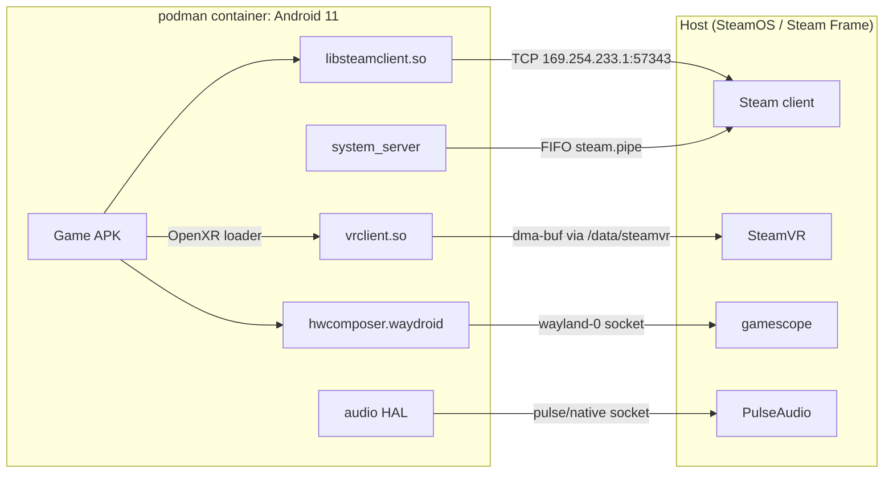
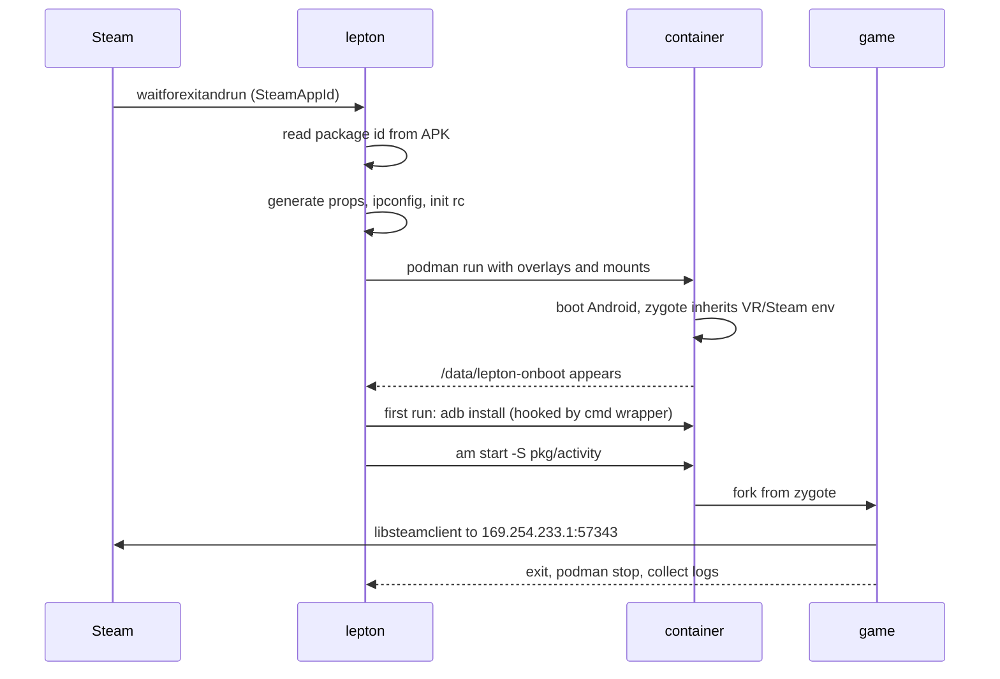
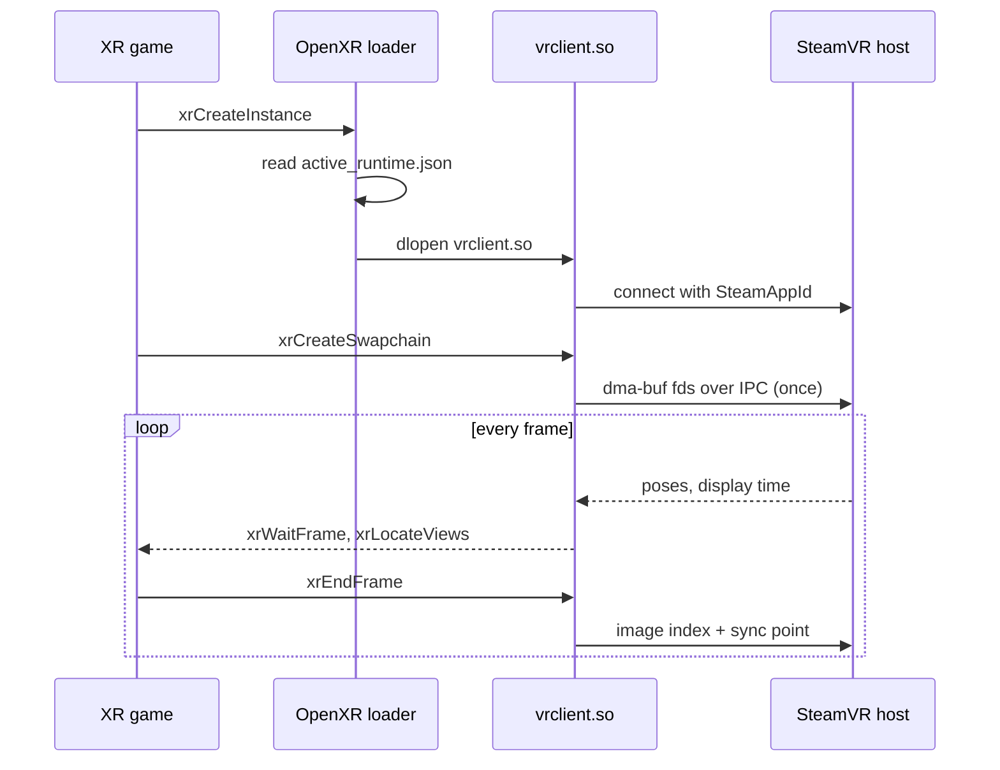
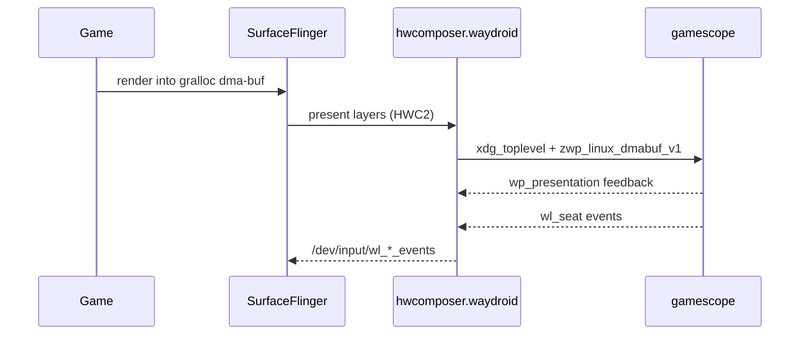

## Overview

Lepton is Valve's compatibility tool for running unmodified Android APKs as
Steam titles on Linux. It was released on Steam on 2026-08-04 for the Steam
Frame headset, and also runs on desktop SteamOS and Linux.

Lepton boots a Waydroid-derived Android 11 image in a rootless podman
container, bridges graphics, audio, input, and networking to the host, and
makes SteamVR the container's OpenXR runtime. Android VR games built for
Quest-class headsets render through the host compositor without a port.

This post describes the tool as shipped in v2.8.9 (tool) and v2.8.3 (image),
the builds from 2026-08-30, with earlier versions back to v2.7.7 noted where
they differ.

The README is a page long, so the analysis comes from the depot itself. The
launcher and its library are plain bash, and the overlay files are init
scripts and JSON, so those were read directly. The image was examined with
`strings` on the HAL binaries, `unzip` plus `strings` on the dex files inside
the framework jars, and the build and vendor property files. Changes between
releases were found by file timestamps, since Steam rewrites only the files
that changed, and then by diffing the dex strings of the jars that moved.
Provenance was settled by comparing the shipped HALs against the upstream
Waydroid repositories, as the last section of the Waydroid comparison shows.

Two things could not be checked directly.

- The `steamvr` host CLI and the `/usr/share/guestos/android` overlay live in
  the device OS, not the depot. Statements about them come from how the scripts
  use them.
- The Steam Frame link is inferred from a `deckard-steamvr-(main|rel)` package
  check in `liblepton/debug.sh`.

## The depot

| Path | What it is |
| --- | --- |
| `lepton`, `liblepton/` | The launcher and about 3,500 lines of bash: mounting, networking, properties, baking, Vulkan layers, debugging, plus a small `apk_extractor` tool |
| `images/rootfs/` | Android 11 system image, `lineage_lepton_arm64_only-userdebug`, arm64 only, test keys |
| `images/rootfs_overlay/` | A few files bind-mounted over the rootfs at launch |
| `sysbake/` | A pre-baked `/data` tree so first boot skips package scans and dexopt |
| `sysbake.xattrs` | The `user.*` xattrs of `sysbake/`, restored at launch because Steam depots cannot carry xattrs |
| `version.txt`, `images/version.txt` | Tool and image versions; since v2.8 a change to either invalidates app bakes |

`system/build.prop` still says `device/waydroid/waydroid`.

## Architecture



Every guest-to-host link is a bind-mounted socket, a FIFO, a shared dma-buf, or
TCP to one gateway address. The `lepton` script is not on any of these paths.
It runs at launch to generate files and start podman, then waits for the
container to exit.

### podman, not LXC

Waydroid runs Android under LXC with a Python session manager and a DBus
service on the host. Lepton replaces all of that with podman and bash.

Each launch context (`steamlaunch-<AppId>`, `dev`, `headless-*`) is its own
container, created around the Steam launch verb and destroyed after it. A lock
file and an ADB port offset (`5555+n`) let several run at once.

The container is rootless. `--userns=keep-id:uid=0,gid=0` makes Android's root
the unprivileged host user. Binder still comes from the kernel, but an overlay
init file mounts binderfs and renames `anbox-binder` and friends to the standard
names inside the container, so nothing on the host has to provision the nodes.

### The image is Waydroid's guest

It is built from Waydroid's tree as a `lepton_arm64_only` Lineage 18.1 device:
`vendor/waydroid.prop`, `hwcomposer.waydroid.so`, minigbm gralloc, plus a QTI
display and gralloc stack for Adreno that upstream lacks.

Waydroid's `base-patches-30` framework patches are compiled in. The markers
are all in the shipped binaries: `BoringdroidManager` and
`getPackageOverlayWindowingMode` in `framework.jar` and `services.jar`,
`back_window` and `decor_back_button` in `framework-res.apk`, and
`boring_config_navBarLayout` in `SystemUI.apk`. Those are the Boringdroid
freeform-window patches, and in Lepton they serve the flatscreen path.

Valve added exactly two patches on top, both in `services.jar`. Diffing the dex
strings across releases finds them.

- Since v2.7.14, system_server reads the host's `HTTP_PROXY` and `HTTPS_PROXY`,
  passed through zygote, into Android's proxy settings.
- Since v2.7.15, system_server intercepts web-URL `ACTION_VIEW` intents and
  writes `steam://openurl/<url>` into the host Steam client's command FIFO,
  mounted at `/lepton/steam.pipe`. The container has no browser, so this is how
  an EULA link ends up in the Steam overlay.

The v2.8.3 image's framework jars still carry their v2.7.15 timestamps
(`framework.jar` from 2026-08-01, `services.jar` from 2026-08-19), and Steam
only rewrites changed files, so neither patch has moved since.

## Launch-time composition

Lepton never touches the shipped image, so the depot stays byte-identical and
Steam-verifiable. Each launch composes its own view of the system out of mounts.

### Per-file bind mounts

Rather than layering the rootfs, `mounting.sh:78-91` walks
`images/rootfs_overlay/` and the host's `/usr/share/guestos/android/` and
bind-mounts every file in them, one by one, read-only, over the rootfs.

That is how `binder.rc`, the audio service override, the `cmd` wrapper, the
OpenXR runtime manifest, and Valve's Vulkan layer libraries get in.

### `/data` as overlayfs

`sysbake/` is the lowerdir. A per-context directory under the game's
compat-data path is the upperdir. Every launch starts from the same initialized
Android state, and the bake is never written to.

### Generated files

A few files are generated per launch and mounted over image paths:

| Generated file | Purpose |
| --- | --- |
| patched `init.zygote64.rc` | injects `VR_*`, `SteamAppId`, `Steam3Master`, Mesa tuning, and proxy variables into every app |
| `lepton_app_launch.rc` | runs the post-boot steps: bind layers, fix OBB, start the app |
| `/vendor/waydroid.prop` | the launch-specific properties |
| `public.libraries.txt` | extended to whitelist `libsteamclient.so` |
| `ipconfig.txt` | the per-container static IP |

### Stub mounts

Incompatible HAL services are switched off by mounting empty `.rc` files (and
an empty VINTF manifest) over their definitions, chosen by GPU mode. One image
serves Turnip, the Qualcomm Adreno blob, and software rendering
(`mounting.sh:367-388`).

### Content mounts

The rest is content: the APK, save data, the shader cache at `/data/shaders`,
the SteamVR runtime at `/data/steamvr/*`, the Wayland and Pulse sockets, and the
Steam pipe.

The Steam client's install directory and every Steam library root are mounted
read-write at their host paths, and since v2.8 so are the host's
`~/Documents`, `~/Videos`, and `~/Downloads`, which appear as the guest's
external storage.

### Launch sequence



The boot handshake is a file. `lepton_onboot.rc` writes `/data/lepton-onboot`
on `sys.boot_completed=1`, and the host waits for it in the upperdir while a
`podman wait` watchdog races it in case boot dies.

## SteamVR as the Android OpenXR runtime

The VR support comes down to one file. The overlay installs
`/vendor/etc/openxr/1/active_runtime.json`, the standard Khronos discovery path
on Android:

```json
{
  "runtime": {
    "name": "steamvr",
    "VALVE_runtime_is_steamvr": true,
    "library_path": "/data/steamvr/runtime/bin/androidarm64/vrclient.so"
  }
}
```

Android XR games bundle their own OpenXR loader. In Lepton it reads this file
and `dlopen`s SteamVR's arm64 `vrclient.so` instead of a Meta or Pico runtime.
The host SteamVR build is bind-mounted at `/data/steamvr/runtime`.

`vrclient.so` is a thin client. Compositor, tracking, and devices stay on the
host.

The patched zygote rc adds two more pieces of wiring.

- `VR_PATHREG_OVERRIDE` points at a shipped `openvrpaths.vrpath`, so the legacy
  OpenVR API resolves to the same runtime.
- `SteamAppId` is set in every process so, per the source comment,
  `CVRClient::SendConnectMessage()` can name the title to the host.

XR titles run with `lepton.headless=true`, which means no Wayland connection
and no visible SurfaceFlinger output. Android's display stack sits idle while
the game runs.

### How the swapchain reaches the host

The swapchain never goes through Android's display stack. The depot
establishes this much.

- `xrCreateSwapchain` is answered by `vrclient.so` inside the game process, so
  the swapchain images are Vulkan images created on the game's own `VkDevice`.
- The game talks to the GPU directly. `mounting.sh:434-441` mounts the host's
  `/dev/dri/renderD128` and `card0` into the container, and mounts `renderD128`
  a second time as `/dev/kgsl-3d0` for the Qualcomm blob path. The image ships
  no Vulkan ICD of its own; the driver comes from the host overlay. Game,
  `vrclient.so`, and the host compositor share one DRM device.
- The container is `--ipc=private` and `--pid=private` (`mounting.sh:176`), but
  the host's `/dev/shm` is bind-mounted read-write. Neither `/tmp` nor the
  host's `XDG_RUNTIME_DIR` is mounted, so SteamVR's IPC endpoint has to live in
  `/dev/shm`, the read-write runtime directory, or the read-write logs
  directory.
- Zygote passes two vrclient debugging knobs, `EnableFrameEndMarkers` and
  `DisableTimelineSemaphoreWait` (`mounting.sh:320-325`), so frame hand-off is
  synchronized with Vulkan timeline semaphores.

The Android `vrclient.so` itself was not available for inspection. The rest is
inference from those mounts, following the usual mechanism for sharing GPU
memory between processes.

1. On `xrCreateSwapchain`, `vrclient.so` allocates the images with exportable
   memory. On Android that is most likely `AHardwareBuffer`, which minigbm over
   GBM backs with dma-bufs.
2. It exports each image as a dma-buf file descriptor and sends the descriptors
   to the host `vrcompositor` over SteamVR's IPC channel with `SCM_RIGHTS`. A
   dma-buf descriptor is a kernel object tied to the DRM device, so it is valid
   across the container boundary. The host imports it once per swapchain, not
   per frame.
3. Per frame, `xrEndFrame` sends an image index and a sync point. The
   compositor waits on the semaphore and textures from the buffer the game
   rendered into, without copying pixels.

Strings in an Android `vrclient.so` for `SCM_RIGHTS`, `VK_KHR_external_memory_fd`,
`VK_EXT_external_memory_dma_buf`, or `AHardwareBuffer` would confirm step 2.



## Vulkan layer injection

Android's Vulkan loader has no manifests and no environment variables, only a
`settings`-based GPU debug mechanism meant for developers. A comment in `vulkan_layers.sh`
describes the problem and wishes for "the actual Linux loader's semantics".

| Layer | When | Purpose |
| --- | --- | --- |
| `fossilize` | always | records pipeline state for Steam's shader pre-compilation |
| `VALVE_fdm_injection` | `ENABLE_VULKAN_FDM_INJECTION_LAYER` | injects `VK_EXT_fragment_density_map` for foveated rendering |
| `VALVE_rpo` | `ENABLE_VULKAN_RPO_LAYER` | renderpass optimization |
| `khronos_validation` | `ENABLE_VULKAN_VALIDATION_LAYER` | validation |
| `GLES_RenderDoc` | `ENABLE_VULKAN_RENDERDOC_CAPTURE` | frame capture, needs a companion APK |

Activating a layer takes two steps.

1. The host bind-mounts each enabled `.so` into `/vendor/enabled_vulkan_layers/`,
   and a guest-side hook binds it into the game's own `lib/arm64/`. That is the
   one directory both the Vulkan loader and `libopenxr_loader.so` search.
2. Android's GPU debug settings are set:

```sh
settings put global gpu_debug_app $(getprop lepton.active_app_id)
settings put global enable_gpu_debug_layers 1
settings put global gpu_debug_layers VK_LAYER_fossilize:VK_LAYER_fdm_injection
```

Foveation also has an OpenXR half, an implicit API layer manifest named
`XrApiLayer_VALVE_fdm_injection.json` in the host overlay. The overlay walk
mounts it only when the Vulkan half is enabled (`mounting.sh:84`). One without the other either does nothing or
crashes the swapchain.

### The `cmd` wrapper

The guest-side hook is `rootfs_overlay/system/bin/cmd`, which shadows the real
`cmd` so every install path goes through it. It unmounts the layer binds before
`pm install` and restores them after, so a game update cannot trip over live
mounts in its own lib directory.

The same wrapper runs `pm compile -m speed-profile` at install time, fixes the
OBB directory, and copies `steam_appid.txt` and Unreal's `UECommandLine.txt`
next to the APK. It also grants every dangerous permission plus external
storage, with the reason given in the source: a single-app container has nobody
else's data to protect.

One typo: the `adb install` fallback saves the package name under
`letpon.active_app_id`, so it never sticks.

## Graphics, audio, input

### Graphics

SurfaceFlinger runs on Zink: `mesa.loader.driver.override=zink`, and
`properties.sh:94-97` forces `service.sf.present_timestamp=0` with the comment
"Our SurfaceFlinger is run using Zink. Thus, set this ourselves to avoid a
deadlock."

The default driver is Turnip (`ro.hardware.vulkan=freedreno`) with minigbm
gralloc. `LEPTON_USE_QCOM_DRIVER=true` switches to Qualcomm's Adreno blob
(`ro.hardware.vulkan=adreno`, ANGLE for GLES) with the QTI gralloc and display
stack, and `LEPTON_FORCE_SOFTWARE=true` uses SwiftShader. `_TU_DEBUG`, `ZINK_DEBUG`,
`MESA_SHADER_CACHE_MAX_SIZE`, and two dozen other Turnip and Zink variables pass
from the host environment into zygote. Because
gralloc buffers are dma-bufs, both display paths are zero-copy.

### Audio

Audio is Waydroid's Pulse bridge with one Valve change. `z_audio.rc` overrides
the HAL service to run as root, which under the rootless mapping means the host
user, so it can open the host socket. The comment reads "`# Lepton: We run this
as root:root which maps to the host user`". It also sets `ioprio rt 4` and high-performance task profiles.

### Input

Input takes a different path in each presentation mode.

In flatscreen mode, `hwcomposer.waydroid.so` binds `wl_seat` on the same
Wayland connection it presents through, and writes keyboard, pointer, touch,
and tablet events into InputFlinger through `/dev/input/wl_*_events`. There is
no uinput device and no host-side daemon in between.

In XR mode there is no seat at all. Controllers, poses, and haptics arrive
through the OpenXR action system in `vrclient.so`, which is SteamVR's input
stack.

Sensors are stubbed (`waydroid.stub_sensors_hal=1`). For XR that is the correct
choice, since tracking belongs to the OpenXR runtime rather than Android's
sensor HAL.

## Flatscreen: the HWC is a Wayland client

For flat games there is no screen-casting or nested display server. Android's
Hardware Composer HAL is itself a Wayland client of gamescope, and the host
window's input devices are Android's input devices.

This is Waydroid's design, shipped unmodified. The `hwcomposer.waydroid.so` in
the image reads the same 11 `persist.waydroid.*` properties as upstream source
and links the same protocols.



The Wayland protocols the HWC links are listed below.

| Protocol | For |
| --- | --- |
| `xdg_toplevel` | the Android display as a normal window |
| `zwp_linux_dmabuf_v1` | the compositor textures straight from the game's buffer |
| `wp_presentation` | real display timestamps for vsync pacing |
| `wp_viewporter`, `wp_fractional_scale_v1` | HiDPI and window scaling |
| `zwp_pointer_constraints_v1` | mouse capture |

The default display is `gamescope-0`. Waydroid's multi-window HALs are in the
image but dormant. Lepton runs one window per container.

## Steam integration and baking

The host's `androidarm64/libsteamclient.so` is bind-mounted into `/system/lib64`
and whitelisted in `public.libraries.txt`. `lepton.steamclient.path` tells the
game's `libsteam_api.so` where it is.

Save data lives on the host at `<compat-data>/internal/<package>`. Once the
app bake is done, `continue_boot_after_bake` replaces `/data/data/<package>`
inside the container with a symlink to that directory, so an APK reinstall
cannot wipe it.

### sysbake

`sysbake` boots the image once at build time, installs and dexopts, and captures
`/data` as the shipped tree. Two limits of Steam depots shape how it works.

- Depots cannot carry xattrs, but `installd` needs `user.inode_cache` and
  `user.serial` on `/data` directories. A 5 KB `sysbake.xattrs` ships instead,
  and `setfattr --restore` runs on every `start`, "in case someone interrupted the
  process".
- Bake freshness was an mtime check on `packages.xml`. v2.8 adds the APK sha256
  and a `compat_tool:<ver>,rootfs:<ver>` pair to the baked metadata, so a Lepton
  update forces a fresh install. An exit within 30 seconds of start also clears
  the bake.

If the bake is missing, the message is "Please verify the files of Lepton in
Settings->Properties->Installed files", which makes the depot itself the
recovery mechanism. Since v2.8 `sysbake`
refuses to run outside CI.

### Developer surface

Each container is published over mDNS as `_adb._tcp` with `device="Lepton"
model="Valve"`, so `adb` and Android Studio see a running Steam game as a
device. `gdb_server` maps host PIDs to container PIDs through
`/proc/<pid>/status`.

## What Lepton keeps from Waydroid

Waydroid is two halves: a guest image that runs Android on mainline Linux
graphics, and a host stack of LXC, a Python session manager, and a desktop
multi-window UX. Lepton keeps the first and replaces the second.

| Waydroid piece | In Lepton |
| --- | --- |
| Image recipe, framework patches | kept, as `lepton_arm64_only` |
| `hwcomposer.waydroid`, audio bridge, minigbm | kept unmodified |
| LXC + Python host tool | replaced by podman + bash |
| Multi-window UX, clipboard, notifications | dropped |
| Sensors, camera bridging | stubbed |
| ARM translation (libhoudini/libndk) | dropped |
| LXC bridge networking | replaced by pasta |

The reasons follow from what Steam needs.

- Steam's unit is one title with its own lifecycle and app ID, not a shared
  Android session, hence one container per launch.
- An OpenXR title never presents through SurfaceFlinger. Waydroid's whole
  display path is optional here.
- A Steam-shipped product needs deterministic content. A fixed rootfs plus a
  pre-baked `/data` gives that; a stateful first boot does not.

Compared against upstream `android_hardware_waydroid`, the shipped guest HALs
are stock. None of them contains a `lepton`, `valve`, or `steam` string. Valve's
own code is the launcher, `sysbake`, the OpenXR and OpenVR redirection, the FDM
and RPO layers and the layer system, the Steamworks bridge, and the overlay
contents.

### Checking that the HAL is stock

A rebuild is never byte-identical, so "unmodified" has to be shown by
comparing content rather than hashes. The shipped `hwcomposer.waydroid.so`
was compared against upstream `android_hardware_waydroid` at the
`lineage-18.1` tip (commit `d520fcb`, 2026-03-02):

- The set of `persist.waydroid.*` properties the binary reads is identical to
  the set the source reads, 11 of 11.
- Every Wayland protocol interface named in the binary is bound in the
  source, and the reverse holds.
- The binary's `DT_NEEDED` list matches the `shared_libs` in the upstream
  `Android.bp` entry for entry, down to the three `vendor.waydroid.window`
  versions.
- Of 58 `ALOG` message strings in the source, 54 are in the binary. The four
  that are not all sit behind `if (new ... == nullptr)` checks, which the
  compiler removes as dead code. Log strings in the binary that are not in the
  source all belong to the statically linked `libxkbcommon` and
  `libwayland_client`, which `Android.bp` lists as `static_libs`.
- There is no `lepton`, `valve`, or `steam` string anywhere in the file.

A patch of any size almost always adds or changes a log message, a property,
a protocol, or a dependency, so this is strong evidence of a stock build. It
does not rule out a silent logic change with no new strings. Two things would
close that gap: diffing symbol tables and disassembly against Waydroid's own
prebuilt `lineage-18.1` `waydroid_arm64` vendor image from SourceForge, which
comes from the same tree, or a public source tree for the image, which the
README says exists.

## Security model

The trust boundary is the container, not Android. Inside is one trust domain
for one game.

### At the boundary

- Rootless user namespaces, `--read-only --rootfs "$ROOTFS":O`,
  `--env-host=false`, and `/dev/kmsg` replaced by `/dev/null`.
- A subtractive seccomp profile: default allow, 22 syscalls blocked, namely
  `open_by_handle_at`, clock setting, and module loading plus kexec. An
  allowlist is impractical against Android's syscall surface.
- Networking since v2.8 is pasta on link-local `169.254.233.0/24`, with a static
  per-container IP kept as a podman label, IPv4-only, and `--map-gw` so
  `steamclient` reaches the host. There is no bridge device and no NAT rule.

### Inside

Android's own controls are switched off on purpose. SELinux policy is in the
image but a rootless container cannot load it. Permissions are granted
wholesale by the `cmd` wrapper. Camera, OTA dexopt, and network time are
disabled.

This division only holds because one game gets one container. If two apps
shared one, the disabled Android controls would matter again.

### Where the boundary was widened

- The steam.pipe mount (v2.7.15) is unconditional and writable, so anything in
  the guest can send `steam://` commands to the host client.
- v2.8 mounts the host's `~/Documents`, `~/Videos`, `~/Downloads`, and every
  Steam library read-write into the guest, on top of the blanket storage
  permission grants.

Both are deliberate trade-offs in favour of usability, and the second is the
largest so far.

## Smaller details

- v2.8 added two boot watchdogs, each self-labelled "(bug!)". One restarts
  CryptKeeper on a timeout. The other restarts any service logged as "Forcing
  bringing down service", except its name-extraction pipeline ends in
  `head -n0 >/dev/null`, so it always runs `am start -n ""`. The wait-for-match
  idiom was pasted where a capture belonged.
- `system/apex/` holds directories, not `.apex` images. There is no `apexd` in
  the container. `start_early_debug_container` relies on this: it symlinks
  `com.android.runtime` so `/system/bin/sh` runs before Android boots.
- `debug.sh` uses app ID 3029110, with a hidden dev app 3056000 and a test title
  3418470 installed as "Unreal VR Test 🐸".

## Licensing

`images/NOTICE.txt` and `vendor/etc/NOTICE.xml.gz` never mention Waydroid.
Upstream `android_hardware_waydroid` has no module-level NOTICE files, only
per-file headers, and AOSP's notice generation collects module files. Lepton
inherited the gap.

The harder question was `android_vendor_waydroid`, whose patches are in the
shipped framework and which is GPL-3.0 with a commercial dual license. The first
builds shipped no GPL-3 text, no attribution, and no source offer.

v2.7.14 added three files at the top of the depot. `LICENSE.md` is the index:

```
Copyright (c) 2025, Valve Corporation
All rights reserved.

Redistribution and use of Lepton in source and binary forms is governed
by a variety of licenses.

Refer to the contents of `LICENSE.lepton` for the license for the top level contents of the Lepton project and the compat tool.
Refer to the contents of `LICENSE.AOSP.image` for the license of the AOSP image.
```

`LICENSE.lepton` is the BSD-3-Clause text with Valve's copyright. And
`LICENSE.AOSP.image`, the one that matters for the image, reads in full:

```
The Lepton AOSP image uses source code from the following opensource projects with their own licenses:

* Android Opensource Project: https://source.android.com/docs/setup/about/licenses
* Waydroid device and hardware configurations:
    - https://github.com/waydroid/android_vendor_waydroid/tree/lineage-18.1/LICENSES
    - https://github.com/waydroid/android_hardware_waydroid http://www.apache.org/licenses/LICENSE-2.0
    - https://github.com/waydroid/android_device_waydroid_waydroid/tree/lineage-18.1 http://www.apache.org/licenses/LICENSE-2.0
* Boringdroid: https://github.com/boringdroid/boringdroid/blob/master/LICENSE

The AOSP image, as a product of the combination of these opensource projects, is released under a GPL-3.0 license.
```

Valve took the GPL path, then. The last bullet deserves attention on its own:
**Boringdroid is credited by name, with a link to its license**, next to the
three Waydroid repos. The credit matches the binaries. The freeform-window patch series that Waydroid
carries as `base-patches-30` came from Boringdroid, and its markers
(`BoringdroidManager`, `boring_config_navBarLayout`, `decor_back_button`) are
present in the shipped `framework.jar`, `services.jar`, and `SystemUI.apk`.

The README states the split in prose too: the root filesystem "is therefore
released under a GPL-3.0 license", while the compatibility tool "is released
under the MIT license". That second half is a slip; `LICENSE.lepton` is BSD-3-Clause.

Three things remain open as of v2.8.9. The GPL-3 text is not shipped, only
named and linked. No source repository URL appears anywhere, although the README
describes an `image` and `compat_tool` repository split. And the MIT/BSD
mislabel is unfixed.

It reads like a source release in progress. This is technical license analysis,
not legal advice.

## Closing

Most of Lepton is reused. Waydroid's guest image already ran Android on
mainline Linux graphics, and Lepton ships it with the community patches intact.

Valve's own code is comparatively small: podman orchestration in bash,
launch-time composition so the depot never changes, a pre-baked `/data`, a
layer system built on Android's GPU debug settings, and the OpenXR runtime
manifest that points every Android VR game at SteamVR.

The composition model is the part that transfers to other projects. Nothing in
the image is edited. Every host-specific or launch-specific difference is a
bind mount, a stub mount, or an overlayfs upper. That is why one image serves
three GPU stacks and two presentation modes, and why each Lepton update so far
has been a readable file-level diff.
