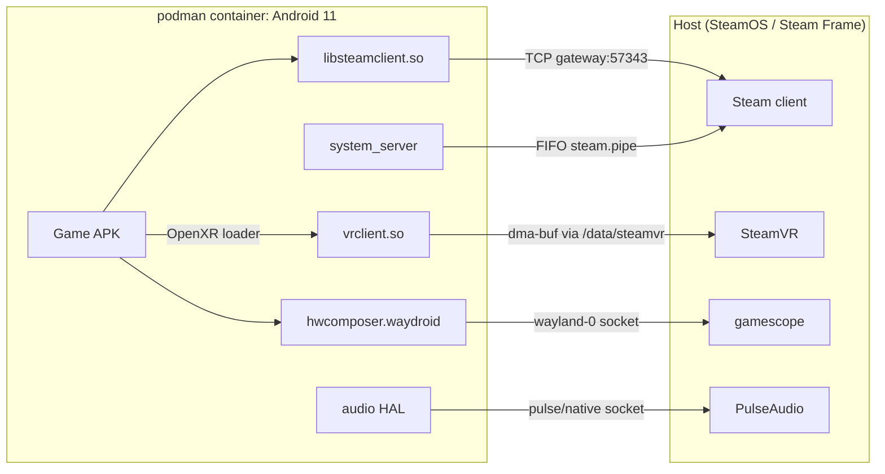
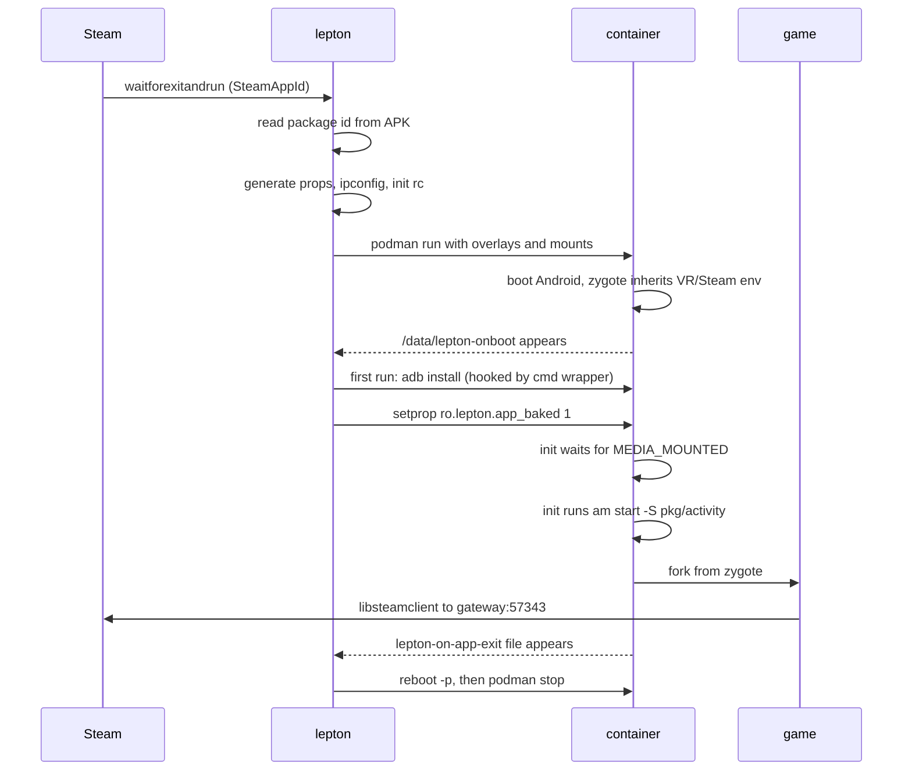
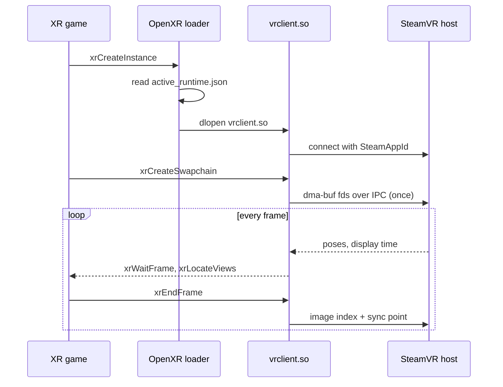
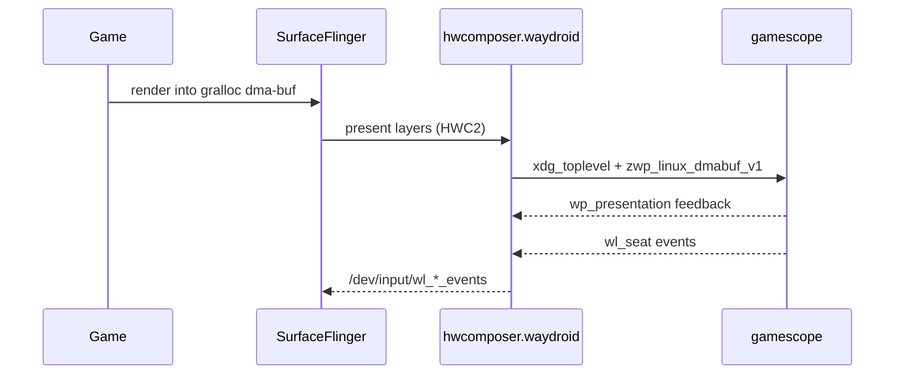

## Overview

Lepton is Valve's compatibility tool for running unmodified Android APKs as
Steam titles on Linux.

Lepton boots a Waydroid-derived Android 11 image in a rootless podman
container, bridges graphics, audio, input, and networking to the host, and
makes SteamVR the container's OpenXR runtime. Android VR games built for
Quest-class headsets render through the host compositor without a port.

This post was first written from the Steam depot alone, reading the bash
directly and the Android image through `strings`. Valve has since published
the source at `gitlab.steamos.cloud/frame-public/lepton`. Its public history
starts with a squashed v3.0.0 release commit dated 2026-09-11, and everything
below has been checked against v3.0.2 from 2026-09-17. Where the binaries
misled, the text now follows the source and says what changed.

Steam at the time of writing ships tool v2.8.14 on image v2.8.11. The compat
tool in v3.0.2 differs from it only in small ways, apart from support for an
Android 14 image that CI builds, bakes, and tests alongside the Android 11
one. Steam still ships Android 11, and this post describes that image.

Two pieces sit outside the repository. The `steamvr` host CLI and the
`/usr/share/guestos/android` overlay, which carries Mesa and Valve's Vulkan
layers, come from the device OS. Statements about them come from how the
scripts use them.

## The depot

| Path | What it is |
| --- | --- |
| `lepton`, `liblepton/` | The launcher and about 3,500 lines of bash: mounting, networking, properties, baking, Vulkan layers, debugging, plus a small `apk_extractor` tool |
| `images/rootfs/` | Android 11 system image, `lineage_lepton_arm64_only-userdebug`, arm64 only, test keys |
| `images/rootfs_overlay/` | A few files bind-mounted over the rootfs at launch |
| `sysbake/` | A pre-baked `/data` tree so first boot skips package scans and dexopt |
| `sysbake.xattrs` | The `user.*` xattrs of `sysbake/`, restored at launch because Steam depots cannot carry xattrs |
| `version.txt`, `images/version.txt` | Tool and image versions; since v2.8 a change to either invalidates app bakes |

In the repository, `compat_tool/` holds the launcher, its library, and the
overlay. `image/` holds the recipe for the root filesystem, and CI produces the
sysbake.
`system/build.prop` still says `device/waydroid/waydroid`, because the device
tree is Valve's fork of Waydroid's, kept at the same path.

## Architecture



Every guest-to-host link is a bind-mounted socket, a FIFO, a shared dma-buf, or
TCP to one gateway address. The `lepton` script is not on any of these paths.
It runs at launch to generate files and start podman, then waits for the
container to exit.

### podman, not LXC

Waydroid runs Android under LXC with a Python session manager and a DBus
service on the host. Lepton replaces all of that with podman and bash.

Each launch context (`steamlaunch-<AppId>`, `dev`, `headless-*`) is its own
container, created around the Steam launch verb and destroyed after it. A lock
file and an ADB port offset (`5555+n`) let several run at once.

The container is rootless. `--userns=keep-id:uid=0,gid=0` makes Android's root
the unprivileged host user. Binder still comes from the kernel, but an overlay
init file mounts binderfs and renames `anbox-binder` and friends to the standard
names inside the container, so nothing on the host has to provision the nodes.

### One Linux user, faked Android UIDs

Every process in the container runs as the same Linux user, the host user
mapped to root. Android still expects one UID per app and uses it to decide
which app is doing what, so Valve fakes the UIDs in libc.

A bionic patch replaces `getuid`, `setuid`, and the rest of the family. The
current IDs live in `PARENT_UID` and `PARENT_GID` environment variables, which
survive `execve`, and `setuid` only updates them. Once a process holds an app
UID, 10000 or above, it cannot change it again. Two more patches send the fake
UID along with every binder and hwbinder call, and installd is patched to
expect files owned by the host user.

The fake covers only libc. A TODO in the patch notes that a direct syscall,
or a read of `/proc/<pid>/status`, still reports 0. v3.0 adds `chown`, `setuid`,
`setgid`, and `setgroups` to the seccomp profile's fake-success group, so
those calls made directly now succeed without doing anything.

### The image is Waydroid's guest

It is built from Waydroid's LineageOS 18.1 tree as a `lepton_arm64_only`
product. The build pulls Waydroid's vendor repository unchanged and swaps in
Valve's forks of Waydroid's device and hardware repositories, which carry 36
and 6 Valve commits. Waydroid has no Adreno display stack, so Valve patches
Qualcomm's `sm8150` display code to build only its gralloc, on MSM DRM GEM
buffers instead of ION, with UBWC compression off.

Waydroid's own 177 patches are compiled in, including its freeform window
series. Its markers are in the shipped binaries: `BoringdroidManager`
in `framework.jar` and `services.jar`, `decor_back_button` in
`framework-res.apk`, and `boring_config_navBarLayout` in `SystemUI.apk`. The
Boringdroid SystemUI app itself is not shipped, since it is on the device
tree's removal list.

### Valve's patch set

The depot suggested Valve had added only two framework patches, because only
two changed between public releases. The source shows 101 patches on top of
Waydroid's for the Android 11 image.

- Forty are reverts, mostly of Waydroid's host integration. They take out the
  clipboard and power services, host hwbinder support, and the WayDroid service
  in the Lineage SDK. A few undo LineageOS and AOSP changes instead.
- The fake UIDs described above touch bionic, binder, installd, and init.
- About thirty system services are commented out of `SystemServer`, among them
  camera, backup, clipboard, accessibility, printing, Android's own VR manager,
  and boot-time dexopt. lmkd, tombstoned, bpfloader, and minijail are off, and
  adbd has no USB access.
- A new `LeptonProcessObserver` service reports the app's exit. If
  SurfaceFlinger or zygote fails, the container reboots, which ends the
  session.
- vold and MediaProvider accept `/storage/emulated/0` as a symlink, which the
  host-folder mounts depend on.
- Android 11's Vulkan loader is backported to Vulkan 1.3 and built against 1.3
  headers.
- Two patches hook into Steam, and they are the only ones that changed between
  public releases. Since v2.7.14 system_server reads the host's `HTTP_PROXY`
  and `HTTPS_PROXY`, passed through zygote, into Android's proxy settings.
  Since v2.7.15 it intercepts web-URL `ACTION_VIEW` intents and writes
  `steam://openurl/<url>` into the host Steam client's command FIFO at
  `/lepton/steam.pipe`. The container has no browser, so this is how an EULA
  link ends up in the Steam overlay.

## Launch-time composition

Lepton never touches the shipped image, so the depot stays byte-identical and
Steam-verifiable. Each launch composes its own view of the system out of mounts.

### Per-file bind mounts

Rather than layering the rootfs, `setup_mounts` in `mounting.sh` walks
`images/rootfs_overlay/` and the host's `/usr/share/guestos/android/` and
bind-mounts every file in them, one by one, read-only, over the rootfs.

That is how `binder.rc`, the audio service override, the `cmd` wrapper, the
OpenXR runtime manifest, and Valve's Vulkan layer libraries get in.

### `/data` as overlayfs

`sysbake/` is the lowerdir. A per-context directory under the game's
compat-data path is the upperdir. Every launch starts from the same initialized
Android state, and the bake is never written to.

### Generated files

A few files are generated per launch and mounted over image paths:

| Generated file | Purpose |
| --- | --- |
| patched `init.zygote64.rc` | injects `VR_*`, `SteamAppId`, `Steam3Master`, Mesa tuning, and proxy variables into every app |
| `lepton_app_launch.rc` | runs the post-boot steps: bind layers, fix OBB, start the app |
| `/vendor/waydroid.prop` | the launch-specific properties |
| `public.libraries.txt` | extended to whitelist `libsteamclient.so` |
| `ipconfig.txt` | the per-container static IP |

### Stub mounts

Incompatible HAL services are switched off by mounting empty `.rc` files (and
an empty VINTF manifest) over their definitions, chosen by GPU mode. One image
serves Turnip, the Qualcomm Adreno blob, and software rendering
(the `disable_*` helpers in `mounting.sh`).

### Content mounts

The rest is content: the APK, save data, the shader cache at `/data/shaders`,
the SteamVR runtime at `/data/steamvr/*`, the Wayland and Pulse sockets, and the
Steam pipe.

The Steam client's install directory and every Steam library root are mounted
read-write at their host paths. Since v2.8 the host's `~/Documents`, `~/Videos`,
and `~/Downloads` also appear in the guest's external storage. Through v2.8.11
they were bind-mounted straight onto `Documents`, `Movies`, and `Download`
there. v2.8.14 mounts them at their own host paths instead and leaves symlinks
in external storage pointing at those paths.

### Launch sequence



Both handshakes are files. `lepton_onboot.rc` writes `/data/lepton-onboot`
on `sys.boot_completed=1`, and the host waits for it in the upperdir while a
`podman wait` watchdog races it in case boot dies. The app itself is started
by init, from the generated `lepton_app_launch.rc`, once `ro.lepton.app_baked`
is set. Since v2.8.14 init first waits up to ten seconds for Android to log that
shared storage is mounted, so a game does not start before its external storage
exists. When the app exits, `LeptonProcessObserver` in system_server creates
`/data/lepton-on-app-exit`, and the host answers with Android's own `reboot -p`
followed by `podman stop`. The observer also creates the file if the app has
not started within `lepton.active_app_launch_timeout` seconds, 20 by default,
so a failed launch does not leave an empty container behind.

## SteamVR as the Android OpenXR runtime

The VR support comes down to one file. The overlay installs
`/vendor/etc/openxr/1/active_runtime.json`, the standard Khronos discovery path
on Android:

```json
{
  "runtime": {
    "name": "steamvr",
    "VALVE_runtime_is_steamvr": true,
    "library_path": "/data/steamvr/runtime/bin/androidarm64/vrclient.so"
  }
}
```

Android XR games bundle their own OpenXR loader. In Lepton it reads this file
and `dlopen`s SteamVR's arm64 `vrclient.so` instead of a Meta or Pico runtime.
The host SteamVR build is bind-mounted at `/data/steamvr/runtime`.

`vrclient.so` is a thin client. Compositor, tracking, and devices stay on the
host.

The patched zygote rc adds two more pieces of wiring.

- `VR_PATHREG_OVERRIDE` points at a shipped `openvrpaths.vrpath`, so the legacy
  OpenVR API resolves to the same runtime.
- `SteamAppId` is set in every process so, per the source comment,
  `CVRClient::SendConnectMessage()` can name the title to the host.

XR titles run with `lepton.headless=true`, which means no Wayland connection
and no visible SurfaceFlinger output. Android's display stack sits idle while
the game runs.

### How the swapchain reaches the host

The swapchain never goes through Android's display stack. The depot
establishes this much.

- `xrCreateSwapchain` is answered by `vrclient.so` inside the game process, so
  the swapchain images are Vulkan images created on the game's own `VkDevice`.
- The game talks to the GPU directly. `setup_podman_mounts` mounts the host's
  `/dev/dri/renderD128` and `card0` into the container, and mounts `renderD128`
  a second time as `/dev/kgsl-3d0` for the Qualcomm blob path. The image
  carries no hardware GPU driver. A device-tree commit drops Mesa from the
  build, and the driver comes from the host overlay. Game, `vrclient.so`, and the host
  compositor share one DRM device.
- The container is `--ipc=private` and `--pid=private` (`setup_podman_base`), but
  the host's `/dev/shm` is bind-mounted read-write. Neither `/tmp` nor the
  host's `XDG_RUNTIME_DIR` is mounted, so SteamVR's IPC endpoint has to live in
  `/dev/shm`, the read-write runtime directory, or the read-write logs
  directory.
- Zygote passes two vrclient debugging knobs, `EnableFrameEndMarkers` and
  `DisableTimelineSemaphoreWait` (`generate_zygote_launch_rc`), so frame hand-off is
  synchronized with Vulkan timeline semaphores.

The Android `vrclient.so` itself was not available for inspection. The rest is
inference from those mounts, following the usual mechanism for sharing GPU
memory between processes.

1. On `xrCreateSwapchain`, `vrclient.so` allocates the images with exportable
   memory. On Android that is most likely `AHardwareBuffer`, which minigbm over
   GBM backs with dma-bufs.
2. It exports each image as a dma-buf file descriptor and sends the descriptors
   to the host `vrcompositor` over SteamVR's IPC channel with `SCM_RIGHTS`. A
   dma-buf descriptor is a kernel object tied to the DRM device, so it is valid
   across the container boundary. The host imports it once per swapchain, not
   per frame.
3. Per frame, `xrEndFrame` sends an image index and a sync point. The
   compositor waits on the semaphore and textures from the buffer the game
   rendered into, without copying pixels.

Strings in an Android `vrclient.so` for `SCM_RIGHTS`, `VK_KHR_external_memory_fd`,
`VK_EXT_external_memory_dma_buf`, or `AHardwareBuffer` would confirm step 2.



## Vulkan layer injection

Android's Vulkan loader has no manifests and no environment variables, only a
`settings`-based GPU debug mechanism meant for developers. A comment in `vulkan_layers.sh`
describes the problem and wishes for "the actual Linux loader's semantics".
The loader itself is not stock either, since Valve backports Android 11's
`libvulkan` to Vulkan 1.3.

| Layer | When | Purpose |
| --- | --- | --- |
| `fossilize` | always | records pipeline state for Steam's shader pre-compilation |
| `VALVE_fdm_injection` | `ENABLE_VULKAN_FDM_INJECTION_LAYER` | injects `VK_EXT_fragment_density_map` for foveated rendering |
| `VALVE_rpo` | `ENABLE_VULKAN_RPO_LAYER` | renderpass optimization |
| `khronos_validation` | `ENABLE_VULKAN_VALIDATION_LAYER` | validation |
| `gfxreconstruct` | `ENABLE_VULKAN_GFXRECONSTRUCT_LAYER` | API-level capture and replay, added in v2.8.11 |
| `GLES_RenderDoc` | `ENABLE_VULKAN_RENDERDOC_CAPTURE` | frame capture, needs a companion APK |

Activating a layer takes two steps.

1. The host bind-mounts each enabled `.so` into `/vendor/enabled_vulkan_layers/`,
   and a guest-side hook binds it into the game's own `lib/arm64/`. That is the
   one directory both the Vulkan loader and `libopenxr_loader.so` search.
2. Android's GPU debug settings are set:

```sh
settings put global gpu_debug_app $(getprop lepton.active_app_id)
settings put global enable_gpu_debug_layers 1
settings put global gpu_debug_layers VK_LAYER_fossilize:VK_LAYER_fdm_injection
```

Foveation also has an OpenXR half, an implicit API layer manifest named
`XrApiLayer_VALVE_fdm_injection.json` in the host overlay. The overlay walk
mounts it only when the Vulkan half is enabled (a filter inside the overlay walk). One without the other either does nothing or
crashes the swapchain.

### The `cmd` wrapper

The guest-side hook is `rootfs_overlay/system/bin/cmd`. Two image patches make
room for it. One builds the real binary as `cmd_real` behind a one-line shell
`cmd`, so the overlay can replace that script. The other turns off adbd's
`abb_exec`, which would otherwise let `adb install` bypass `cmd`. The wrapper
unmounts the layer binds before `pm install` and restores them after, so a
game update cannot trip over live mounts in its own lib directory.

The same wrapper runs `pm compile -m speed-profile` at install time, fixes the
OBB directory, and copies `steam_appid.txt` and Unreal's `UECommandLine.txt`
next to the APK. It also grants every dangerous permission plus external
storage, with the reason given in the source: a single-app container has nobody
else's data to protect. A framework patch removes the check in
`grantRuntimePermission`, so even `MANAGE_EXTERNAL_STORAGE` can be granted
this way.

One typo, still in the public source: the `adb install` fallback saves the
package name under `letpon.active_app_id`, so it never sticks.

## Graphics, audio, input

### Graphics

SurfaceFlinger runs on Zink: `mesa.loader.driver.override=zink`, and
`properties.sh` forces `service.sf.present_timestamp=0` with the comment
"Our SurfaceFlinger is run using Zink. Thus, set this ourselves to avoid a
deadlock."

The default driver is Turnip (`ro.hardware.vulkan=freedreno`) with minigbm
gralloc. `LEPTON_USE_QCOM_DRIVER=true` switches to Qualcomm's Adreno blob
(`ro.hardware.vulkan=adreno`, ANGLE for GLES) with the QTI gralloc and display
stack, and `LEPTON_FORCE_SOFTWARE=true` uses SwiftShader. That branch used to
name a software driver for GLES only. v2.8.11 adds a Vulkan one and ships it in
the image: `vulkan.pastel.so`, selected by `ro.hardware.vulkan=pastel`. It is
16 MB of SwiftShader with an LLVM JIT that calls itself "Swiftshader Pastel",
built by a device-tree commit titled "Build vulkan swiftshader". The line that
selects it is commented "tests on gitlab", and CI runs its test suite in
software, so it is there for continuous integration rather than for headsets.
`_TU_DEBUG`, `ZINK_DEBUG`,
`MESA_SHADER_CACHE_MAX_SIZE`, and two dozen other Turnip and Zink variables pass
from the host environment into zygote. Because
gralloc buffers are dma-bufs, both display paths are zero-copy.

### Audio

Audio is Waydroid's Pulse bridge with retuned buffers. Valve's fork of the HAL sets
playback and capture periods of 480 frames at 48 kHz, 10 ms each, to match
PipeWire. Upstream used 1024-frame playback periods and 16 kHz capture. The
audio policy allows 48 kHz only.

`z_audio.rc` overrides the HAL service to run as root, which under the rootless
mapping means the host user, so it can open the host socket. The comment reads "`# Lepton: We run this
as root:root which maps to the host user`". It also sets `ioprio rt 4` and high-performance task profiles.

### Input

Input takes a different path in each presentation mode.

In flatscreen mode, `hwcomposer.waydroid.so` binds `wl_seat` on the same
Wayland connection it presents through, and writes keyboard, pointer, touch,
and tablet events into InputFlinger through `/dev/input/wl_*_events`. There is
no uinput device and no host-side daemon in between.

In XR mode there is no seat at all. Controllers, poses, and haptics arrive
through the OpenXR action system in `vrclient.so`, which is SteamVR's input
stack.

Sensors are stubbed (`waydroid.stub_sensors_hal=1`). For XR that is the correct
choice, since tracking belongs to the OpenXR runtime rather than Android's
sensor HAL.

## Flatscreen: the HWC is a Wayland client

For flat games there is no screen-casting or nested display server. Android's
Hardware Composer HAL is itself a Wayland client of gamescope, and the host
window's input devices are Android's input devices.

This is Waydroid's design, with four Valve patches in the HAL. It accepts
Qualcomm gralloc buffers, handles an unspecified pixel format, guards against a
null framebuffer handle during early boot, and starts its Wayland thread only
after display calibration, to avoid a deadlock in `wl_display_dispatch`.



The Wayland protocols the HWC links are listed below.

| Protocol | For |
| --- | --- |
| `xdg_toplevel` | the Android display as a normal window |
| `zwp_linux_dmabuf_v1` | the compositor textures straight from the game's buffer |
| `wp_presentation` | real display timestamps for vsync pacing |
| `wp_viewporter`, `wp_fractional_scale_v1` | HiDPI and window scaling |
| `zwp_pointer_constraints_v1` | mouse capture |

The default display is `gamescope-0`. Waydroid's multi-window HALs are in the
image but dormant. Lepton runs one window per container.

## Steam integration and baking

The host's `androidarm64/libsteamclient.so` is bind-mounted into `/system/lib64`
and whitelisted in `public.libraries.txt`. `lepton.steamclient.path` tells the
game's `libsteam_api.so` where it is.

Save data lives on the host at `<compat-data>/internal/<package>`. Once the
app bake is done, `continue_boot_after_bake` replaces `/data/data/<package>`
inside the container with a symlink to that directory, so an APK reinstall
cannot wipe it.

### sysbake

`sysbake` boots the image once at build time, installs and dexopts, and captures
`/data` as the shipped tree. Two limits of Steam depots shape how it works.

- Depots cannot carry xattrs, but `installd` needs `user.inode_cache` and
  `user.serial` on `/data` directories. A 5 KB `sysbake.xattrs` ships instead,
  and `setfattr --restore` runs on every `start`, "in case someone interrupted the
  process".
- Bake freshness was an mtime check on `packages.xml`. v2.8 adds the APK sha256
  and a `compat_tool:<ver>,rootfs:<ver>` pair to the baked metadata, so a Lepton
  update forces a fresh install. An exit within 30 seconds of start also clears
  the bake.

If the bake is missing, the message is "Please verify the files of Lepton in
Settings->Properties->Installed files", which makes the depot itself the
recovery mechanism. Since v2.8 `sysbake`
refuses to run outside CI.

### Developer surface

Each container is published over mDNS as `_adb._tcp` with `device="Lepton"
model="Valve"`, so `adb` and Android Studio see a running Steam game as a
device. `gdb_server` maps host PIDs to container PIDs through
`/proc/<pid>/status`.

## What Lepton keeps from Waydroid

Waydroid is two halves: a guest image that runs Android on mainline Linux
graphics, and a host stack of LXC, a Python session manager, and a desktop
multi-window UX. Lepton keeps the first and replaces the second.

| Waydroid piece | In Lepton |
| --- | --- |
| Image recipe, framework patches | kept, as `lepton_arm64_only` |
| `hwcomposer.waydroid`, audio bridge, minigbm | kept, with Valve patches |
| LXC + Python host tool | replaced by podman + bash |
| Multi-window UX, clipboard, notifications | dropped, their framework patches reverted |
| Sensors HAL | stubbed |
| ARM translation (libhoudini/libndk) | dropped |
| LXC bridge networking | replaced by pasta |

The reasons follow from what Steam needs.

- Steam's unit is one title with its own lifecycle and app ID, not a shared
  Android session, hence one container per launch.
- An OpenXR title never presents through SurfaceFlinger. Waydroid's whole
  display path is optional here.
- A Steam-shipped product needs deterministic content. A fixed rootfs plus a
  pre-baked `/data` gives that; a stateful first boot does not.

An earlier version of this post compared the shipped HALs against upstream
Waydroid source and concluded they were stock. The source shows otherwise, and
so do the binaries. The shipped `hwcomposer.waydroid.so` links
`android.hardware.graphics.mapper@4.0` and `libgralloctypes`, which only
Valve's build file adds. It also carries Valve's log messages, such as "cannot
create a wayland buffer for a null handle". The shipped audio policy lists
48 kHz only.

Valve's own code is therefore larger than the depot suggested. Besides the
launcher, `sysbake`, the OpenXR and OpenVR redirection, the FDM and RPO layers
and the layer system, the Steamworks bridge, and the overlay contents, it
includes the patch set over Waydroid's tree.

## Security model

The trust boundary is the container, not Android. Inside is one trust domain
for one game.

### At the boundary

- Rootless user namespaces, `--read-only --rootfs "$ROOTFS":O`,
  `--env-host=false`, and `/dev/kmsg` replaced by `/dev/null`.
- A subtractive seccomp profile, default allow, in three groups. Module
  loading, kexec, `_sysctl`, and `reboot` fail with `EPERM`, and
  `open_by_handle_at` with `ENOSYS`. The third group returns success without
  doing anything: setting the clock, the kernel keyring, swap, and
  `setpriority` and `nice`. That is 22 syscalls in v2.8.14. v3.0 adds the
  `chown` and `setuid` families to the fake-success group. An allowlist is
  impractical against Android's syscall surface.
- Networking since v2.8 is pasta, IPv4-only, with no bridge device and no NAT
  rule. Until v2.8.10 the container sat on a link-local `169.254.233.0/24`
  subnet. v2.8.11 gives it the host's own address instead, read from the host's
  default route, so that a game asking for its own IP gets one other machines
  can reach. The gateway of that subnet is mapped to the host by `--map-gw`,
  and that is the address `steamclient` connects to.

### Inside

Android's own controls are switched off on purpose. Waydroid's patches
already disable SELinux checks in installd, vold, the service managers, and
parts of the framework, and a rootless container could not load the policy
anyway. Every app shares one
Linux user, with UIDs faked in libc. Permissions are granted wholesale by the
`cmd` wrapper, and the framework check that would stop some of those grants is
patched out.

This division only holds because one game gets one container. If two apps
shared one, the disabled Android controls would matter again.

### Where the boundary was widened

- The steam.pipe mount (v2.7.15) is unconditional and writable, so anything in
  the guest can send `steam://` commands to the host client.
- v2.8 mounts the host's `~/Documents`, `~/Videos`, `~/Downloads`, and every
  Steam library read-write into the guest, on top of the blanket storage
  permission grants. Since v2.8.14 the three personal folders also sit at their
  real host paths inside the container, so a game can see the host user's home
  path.

Both are deliberate trade-offs in favour of usability, and the second is the
largest so far.

## Smaller details

- v2.8 added two boot watchdogs, each self-labelled "(bug!)". One restarts
  CryptKeeper on a timeout. The other restarts any service logged as "Forcing
  bringing down service", except its name-extraction pipeline ends in
  `head -n0 >/dev/null`, so it always runs `am start -n ""`. The wait-for-match
  idiom was pasted where a capture belonged. v3.0 rewrote the wait as a
  `grep -q` conditional but kept the broken capture.
- `system/apex/` holds directories, not `.apex` images. There is no `apexd` in
  the container. `start_early_debug_container` relies on this: it symlinks
  `com.android.runtime` so `/system/bin/sh` runs before Android boots.
- `debug.sh` uses app ID 3029110, with a hidden dev app 3056000 and a test title
  3418470 installed as "Unreal VR Test 🐸".

## Licensing

`images/NOTICE.txt` and `vendor/etc/NOTICE.xml.gz` never mention Waydroid.
Upstream `android_hardware_waydroid` has no module-level NOTICE files, only
per-file headers, and AOSP's notice generation collects module files. Lepton
inherited the gap.

The harder question was `android_vendor_waydroid`, whose patches are in the
shipped framework and which is GPL-3.0 with a commercial dual license. The first
builds shipped no GPL-3 text, no attribution, and no source offer.

v2.7.14 added license files to the depot: an index, a BSD-3-Clause
`LICENSE.lepton` for the tool, and `LICENSE.AOSP.image` for the image. The
README called the tool MIT, which did not match. The public repository has
settled that and moved the files. Its `LICENSE.md` now reads:

```
Copyright (c) 2026, Valve Corporation
All rights reserved.

Redistribution and use of Lepton in source and binary forms is governed
by a variety of licenses.

Refer to the contents of `LICENSES/compat_tool.md` for the license for the top level contents of the Lepton project and the compat tool.
Refer to the contents of `LICENSES/image.md` for the license of the AOSP image.
```

`LICENSES/compat_tool.md` is the MIT license text, so the README is now right.
`LICENSES/image.md`, the one that matters for the image, reads in full:

```
The Lepton AOSP image uses source code from the following opensource projects with their own licenses:

* Android Opensource Project: https://source.android.com/docs/setup/about/licenses
* Waydroid device and hardware configurations:
    - https://github.com/waydroid/android_vendor_waydroid/tree/lineage-18.1/LICENSES
    - https://github.com/waydroid/android_hardware_waydroid http://www.apache.org/licenses/LICENSE-2.0
    - https://github.com/waydroid/android_device_waydroid_waydroid/tree/lineage-18.1 http://www.apache.org/licenses/LICENSE-2.0
    - Lepton includes patches from Waydroid which originate from the Anbox, Halium or Hybris projects.
* Boringdroid: https://github.com/boringdroid/boringdroid/blob/master/LICENSE
* LineageOS: Licenses can be found in the individual repositories under: https://github.com/LineageOS

The AOSP image, as a product of the combination of these opensource projects, is released under a GPL-3.0 license.
The GPL-3.0 license text can be read here: https://www.gnu.org/licenses/gpl-3.0.html
```

Valve took the GPL path. Next to the three Waydroid repos,
**Boringdroid is credited by name, with a link to its license**. The credit
matches the build. Waydroid's freeform-window patch series, which came from
Boringdroid, is compiled into the image, and its markers
(`BoringdroidManager`, `boring_config_navBarLayout`, `decor_back_button`) are
in the shipped `framework.jar`, `services.jar`, and `SystemUI.apk`. Compared
with the depot's file, the repository adds the LineageOS line, the Anbox,
Halium, and Hybris line, and the link to the GPL-3.0 text.

Two commits made the moves, each saying in its subject line that it was an
attempt "to defeat gitlab license detection".

Two of the three gaps the depot left are closed. The source is public, and
the tool license matches the README. The GPL-3.0 text is still linked rather
than included. The README still points at `LICENSE.AOSP.image` and
`LICENSE.lepton`, which the repository no longer has, and Steam's v2.8.14 depot
still carries the old BSD file until the next release reaches it.

This is technical license analysis, not legal advice.

## Closing

Most of Lepton is reused. Waydroid's guest image already ran Android on
mainline Linux graphics, and Lepton keeps its patches. Valve then reverts
Waydroid's host integration, strips services, fakes Android's UIDs so one Linux
user can stand in for every app, and retunes the display and audio HALs.

The depot showed the rest from the start. It is podman orchestration in bash, launch-time composition so the depot never
changes, a pre-baked `/data`, a layer system built on Android's GPU debug
settings, and the OpenXR runtime manifest that points every Android VR game at
SteamVR. The
same compat tool already boots an Android 14 image in Valve's CI.

The composition model is the part that transfers to other projects. Nothing in
the image is edited. Every host-specific or launch-specific difference is a
bind mount, a stub mount, or an overlayfs upper. That is why one image serves
three GPU stacks and two presentation modes, and why each Lepton update so far
has been a readable file-level diff.
